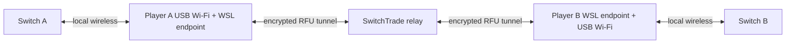

# SwitchTrade

> **Engineering safety:** Before changing, testing, packaging, installing, deploying, or recovering
> SwitchTrade, read [Mistakes to Avoid](docs/MISTAKES_TO_AVOID.md). It is the source of truth for
> prior failures and mandatory recurrence-prevention rules.

SwitchTrade brings the FireRed and LeafGreen Direct Connection trade experience online between two
Nintendo Switch consoles. Each player runs the native Windows app, connects a compatible USB Wi-Fi
adapter, joins the same two-person Trade Room, and follows the guided Switch connection steps.

The beta package includes the Windows client, an isolated WSL runtime, radio drivers and diagnostics,
the FireRed/LeafGreen protocol endpoint, and the connection to the hosted SwitchTrade relay.

## Requirements

- Windows 10 22H2 x64 (build 19045) or Windows 11 x64, with administrator access for initial setup
- current Microsoft Store WSL 2 (Setup can enable or update it)
- hardware virtualization support (Setup can enable the required Windows features)
- one supported USB Wi-Fi adapter per PC
- one Nintendo Switch console running FireRed or LeafGreen per player
- internet access for both PCs

The Realtek RTL8192EU (`0bda:818b`) is the current beta adapter. Other adapters shown as
**Experimental** in Settings can be selected and diagnosed, but are not yet qualified.

## Install

1. Download the latest beta ZIP from [GitHub Releases](https://github.com/mwl313/mwl-SwitchTrade/releases).
2. Extract the entire ZIP to a temporary folder.
3. Run `SwitchTradeSetup.exe` and choose **Install**.
4. Accept the requested WSL, USB/IP, and custom-kernel setup steps. Restart Windows if Setup asks,
   then sign in to let installation continue.
5. Finish Setup and open **SwitchTrade**. A Wi-Fi adapter may be added later.
6. In **Settings → Connection**, select the adapter and approve the one-time Windows authorization
   prompt. SwitchTrade resolves the device again after replug or reboot before using it.

The ZIP contents must stay together while Setup runs. After a successful installation, the extracted
folder and ZIP may be deleted. Daily use starts the installed native app and its isolated WSL service
as one product.

### WSL kernel note

SwitchTrade uses its tested custom WSL2 kernel. WSL kernel selection is a global Windows setting, so
Setup backs up the existing WSL configuration before applying SwitchTrade's kernel. Repair, Rollback,
and Uninstall preserve or restore that configuration through the guided Setup flow.

## Use

Both players install SwitchTrade and connect one USB Wi-Fi adapter.

1. One player chooses **Create a Trade Room** and shares the six-character code, or creates a public
   room.
2. The second player joins with **Join a Private Room** or **Browse Public Rooms**.
3. In Direct Connection, one trainer creates the in-game group and the other starts searching.
4. In SwitchTrade, the first trainer presses **I am the Group Leader** and the second presses
   **I am Joining**. SwitchTrade scans and connects the matching sessions.
5. When both Switch consoles enter the multiplayer room, walk to the trade chair and complete the
   normal trade flow.
6. Return to the trade menu or leave the room. SwitchTrade closes the radio session and online room
   in order.

If the adapter or local service needs attention, open **Settings**, refresh the device list, authorize
the selected adapter if requested, and run **Diagnostics**. Setup **Repair** replaces the installed
software; it is not required merely to authorize a newly added adapter.

## How it works



The Windows app manages the experience and starts a dedicated WSL distribution. The local endpoint
advertises or joins the FireRed/LeafGreen wireless room and translates its LDN, Pia, and RFU state.
The server authoritatively manages two-member rooms and forwards attempt-bound RFU envelopes between
the endpoints without decoding the game payload.

### ABC+D connection rework decision

The production connection path is being rebuilt around the normative
[ABC+D architecture](docs/80-abc-connection-architecture-20260829.md). The project will not perform a
clean-room rewrite and will not keep extending the existing orchestration with isolated patches.
Instead, it will build a new ABC+D coordinator while reusing a current component only when focused
tests and physical evidence prove that the component has one clear responsibility and a reliable,
idempotent lifecycle.

The current `LiveTransport` Switch-room join path, canonical `HostTransport + ldn.create_network()`
AP path, authority primitives, RFU envelope/transport, and feature-neutral `TunnelSim` are reuse
candidates. Connection/session orchestration, physical A/B readiness coordination, and distributed D
cleanup are replacement boundaries. Legacy APIs, role compatibility paths, and prototype AP engines
must not enter the new production path.

Implementation proceeds in this order:

1. Freeze the current behavior as characterization evidence; do not treat it as the new architecture.
2. Implement the shared P0 prerequisite and attempt-scoped radio-ownership gate.
3. Admit A and B components independently only after their direct harnesses pass their defined gates.
4. Implement C authority ordering, advertisement delivery, and the A_READY/B_READY activation barrier.
5. Implement two-sided, outcome-preserving D cleanup and recovery.
6. Wrap the admitted ABC+D lifecycle in one deterministic headless production service with one
   selected adapter per PC and no AI/agent runtime dependency.
7. Attach a minimal GUI and one Desktop support-log export, then remove the old orchestration and
   retired Debug menu paths.
8. Package and qualify the normal application with two PCs and two Switches before calling it a
   production beta.

Current status (2026-09-01): M0-M7 core implementation is substantially complete; standalone A/B
physical evidence is accepted on both PCs, hosted C/D qualification passes, and the focused
one-PC/two-adapter C+D campaign closed at the user-approved 10/10 result. Dual-adapter operation is
test-only. M8 headless production wrapping and application-session export are implemented in source.
The Switchless source dry-run passed production command/recovery regressions and hosted-relay C+D
normal/worker-death cases with verified cleanup, so minimal GUI rework is next. The immutable packaged
entry point, live GUI, and installed acceptance gates remain open; M10 packaging and final physical
acceptance begin only after those gates close. See the
[production wrapper and beta cutover decision](docs/94-production-wrapper-beta-cutover-20260831.md).

The detailed paragraphs below preserve historical checkpoint evidence. Where an older pending-status
sentence conflicts with the current decision above or `docs/FUTURE_TODO.md`, the newer source of truth
controls.

Milestones 0 and 1 are complete in source. Milestone 2 now has an isolated CLI-first P0
implementation: strict passive runtime/relay validation, exact Windows USB lease ownership, the full
ordered Linux module/TUN/RX gate, a long-lived WSL radio worker, identity-bound single launch, and
restart-safe cleanup. It is intentionally not connected to the legacy normal-room, diagnostics, or
desktop paths. PC A passed the installed cold P0 and verified cleanup using immutable qualification
runtime `abcd-m2-975e68b`. That result originally authorized Milestone 3; the later returned PC B P0
evidence was reviewed and accepted with verified cleanup.

Milestone 3 now has a source-complete and PC A physically proven direct A harness. It runs the exact A0-A9 station sequence
through one PID-preserving installed-runtime endpoint, selects only one exact FRLG room, records
association/CCMP/control-port/participant/data-plane checkpoints, holds locally for a bounded period,
and hands the validated advertisement to the harness in memory while persisting only its hash. It
does not reuse `LiveTransport` lifecycle orchestration and does not claim A10, C1, `A_READY`, B, C,
or a completed trade. PC A run `88f8e357-2e8c-4981-ad87-4cfaa1f93c31` passed A0-A9 and verified
cleanup; the later returned PC B Direct A evidence was also reviewed and accepted.

Milestone 4 now has a source-complete Direct B2-B10 harness and an installed immutable PC A
qualification runtime, `abcd-m4-9635a1f`. It owns one selected PHY, creates the AP/monitor/TAP
resources through run-local canonical `ldn.create_network()` mechanics, requires a real Switch
association and Nintendo control-port activity, and keeps functional and cleanup results separate.
Source regression passed 414 tests with three intentional skips; installed integrity and no-hardware
smoke passed. PC A run `12e6a535-4770-47ae-9fb3-8d06915af053` physically passed B2-B10 against a
real Switch in that final runtime, reached `B_CONTROL_READY`, exited through `factory_released`, and
verified LDN, radio, endpoint, and USB cleanup with no residue. The later returned PC B Direct B
evidence was reviewed and accepted with matching runtime integrity and cleanup. These local results
do not claim B1, `B_READY`, relay delivery, or a trade.

Milestone 5's functional exit gate is accepted at source checkpoint `162f779`. The separate P0- and
launch-bound `rfu-tunnel.v2` path passed local real-process tests and the deployed validation-relay
matrix for strict late-peer ordering, both role assignments, unpredictable bidirectional probes,
reconnect re-proof, exact advertisement-hash delivery, stale/gap/wrong-attempt rejection, active
attempt restart, and zero orphan authority state. This admits the C0/C1 components for Milestone 6;
it does not expose them through the normal app or diagnostics yet. The validation host runs one
launchd-supervised native uvicorn worker, so a complete reproducible native manifest or the reference
container remains a mandatory Milestone 9 production-cutover gate.

Milestone 6 is source-complete at `d2130fe`. The new C2 bridge binds one `A_READY` and `B_READY` per
current proof generation to the attempt, credential-derived seat, complementary role, launch
identity, advertisement hash, and relay-owned activation generation. It preserves byte-exact Pia
Reliable payloads behind a bounded 256-frame pre-barrier queue and requires current-generation
bidirectional RFU before `C_RFU_ACTIVE`. Local real-process smoke and the full `443 passed, 3 skipped`
audit suite passed. The source-identical deployed relay passed ten consecutive public C0-C2 smokes,
normal/reversed roles, delayed A/B, single-worker identity, and private zero-orphan metrics. The M6
software/deployed exit gate is accepted. This does not claim physical A/B, distributed D,
diagnostic/application cutover, or a trade.

Milestone 7 has authority checkpoint `d815562`, endpoint D2-D4 checkpoint `fdbdd12`, measured
local-control checkpoint `f52fe93` hardened at `62f93fa`, and diagnostic D7 checkpoint `f739f53`.
The v2-only D1/D5/D6 path freezes
the functional outcome before teardown, authenticates each side's launch-bound quiescence evidence,
waits for both seats, and preserves primary A/B/C failure across timeout or relay restart. The
endpoint now performs ordered native close tail, C2 drain/admission seal, observer/capture finalization,
tunnel stop, and run-owned LDN/socket/thread teardown. Local control now builds D5 only from the
persisted launch-bound endpoint report plus independent PID-generation and temporary-interface
measurements, verifies exact D6 evidence, then orders D7-D11 with stable WSL radio probes and the
existing run-owned USB lease. Commit `0d7549d` also puts the real cold-P0 cleanup behind the same
D8/D9 evidence before D10; PC A passed that installed-runtime path under a Korean profile with no
USB, interface, PHY, process, or recovery residue. The exact `ed382db` relay artifact passed renewed
two-role public smoke and operator-confirmed zero-orphan metrics. The complete software C2-to-D11
integration path passes. Commit `f739f53` connects one idempotent production-diagnostic owner to the
D7 Boolean contract and startup recovery, including terminal relay-room confirmation and retired
owner-credential recovery. A real one-PC public-relay run stopped the synthetic peer, closed the
private room, deleted its credential file, and repeated cleanup without residue; a second run proved
restart recovery after the close response but before local guard removal. Commit `9f30374` completes
the single-PC software D1-D11 restart/fault matrix, including missing, malformed, partial, timed-out,
response-loss, and relay-restart evidence. Both role assignments passed the public C2-to-D6 smoke;
the full audit is `500 passed, 3 skipped`. M7 remains open for PC B and Stop/End/Leave/Close action
semantics. Commit `9e1621d` additionally recovers a lost D11
response without repeating teardown and bounds injected D2/D3/D10 failures. Commit `153365c` uses
the installed P0 path to prove that endpoint residue blocks USB return and exact control-process
interruption recovers through verified D11. Commit `4e3e932` then passed a real Windows-reboot recovery on the
same durable run despite normal Windows USB bus renumbering, while retaining fail-closed attached
device ownership. This partial path is not advertised as a production capability.

The source now also contains a GUI-independent physical distributed harness for both real PCs and
Switches. It reuses the single P0 lease, Direct A/B components, admitted C2 tunnel, endpoint D2-D4,
measured D5, and D7-D11 release rather than adding a parallel connection stack. One-time invitations
bind source, release, role, action, and room without exposing bearer credentials in reports. The
automated suite passes `510 passed, 3 skipped`; installed `0.2.8-beta.1` normal/reversed role and
End/Close/Stop/Leave evidence is still required before Milestone 7 closes. The release also keeps the
operator-assisted harness below relay rate limits and safely recovers a run interrupted before an
authority attempt exists.

The [definitive TODO](docs/FUTURE_TODO.md) records implementation and qualification status. A passing
test for the previous behavior does not close an ABC+D gate unless it proves the gate's current
contract.

## Documentation

- [Technical Guide](docs/TECHNICAL_GUIDE.md)
- [FireRed/LeafGreen Communication Protocol](docs/FRLG_PROTOCOL.md)
- [Development History](docs/DEVELOPMENT_HISTORY.md)
- [ABC+D Connection Architecture](docs/80-abc-connection-architecture-20260829.md)
- [ABC+D Orchestration Rewrite Plan](docs/81-abcd-orchestration-rewrite-plan-20260829.md)
- [ABC+D Milestone 2 P0 Source Evidence](docs/84-abcd-milestone-2-p0-source-20260829.md)
- [ABC+D Milestone 2 Qualification Guide](docs/85-abcd-milestone-2-qualification-guide-20260829.md)
- [ABC+D Milestone 3 Direct A Qualification Evidence](docs/86-abcd-milestone-3-direct-a-20260829.md)
- [ABC+D Milestone 4 Direct B Qualification Evidence](docs/87-abcd-milestone-4-direct-b-20260829.md)
- [ABC+D Milestone 5 C0/C1 Source Checkpoint](docs/88-abcd-milestone-5-c0-c1-20260830.md)
- [ABC+D Milestone 6 C2 Source Checkpoint](docs/89-abcd-milestone-6-c2-20260830.md)
- [ABC+D Milestone 7 Distributed D Checkpoint](docs/90-abcd-milestone-7-authority-d-checkpoint-20260830.md)
- [ABC+D Milestone 7 Physical Harness](docs/91-abcd-milestone-7-physical-harness-20260830.md)
- [Single-PC Dual-Adapter Switchless C+D Qualification](docs/93-single-pc-dual-adapter-switchless-cd-suite-20260831.md)
- [ABC+D Production Wrapper and Beta Cutover](docs/94-production-wrapper-beta-cutover-20260831.md)
- [Definitive TODO](docs/FUTURE_TODO.md)
- [Known Issues](docs/KNOWN_ISSUES.md)
- [Relay deployment](relay/DEPLOYMENT.md)
- [Installer and package engineering](installer/README.md)

## Development

The repository contains the complete native client, local runtime, relay, installer, tests, and
protocol source for the beta. Start with the [Technical Guide](docs/TECHNICAL_GUIDE.md), then run:

```powershell
python -m unittest discover -s tests -p "test_*.py"
powershell -NoProfile -ExecutionPolicy Bypass -File .\apps\desktop\Publish.ps1
```

The bridge's Linux/sysfs suite and release-package workflow are documented in the Technical Guide.

Report reproducible problems through [GitHub Issues](https://github.com/mwl313/mwl-SwitchTrade/issues)
and attach the redacted support bundle generated by the app when appropriate.

## Credits

Created by **Min W. Lim**.

SwitchTrade builds on research and open-source work by
[tornadus/frlg-ldn-trade](https://github.com/tornadus/frlg-ldn-trade),
[kinnay/LDN](https://github.com/kinnay/LDN),
[kinnay/NintendoClients](https://github.com/kinnay/NintendoClients),
[pret/pokefirered](https://github.com/pret/pokefirered), and
[GB-Link](https://github.com/GB-Link). The installed app includes the same acknowledgements under
**Credits**.

Third-party components retain their own licenses. See
[THIRD-PARTY-NOTICES.txt](legal/THIRD-PARTY-NOTICES.txt) and [bridge/LICENSE](bridge/LICENSE).
