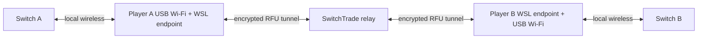

# SwitchTrade

SwitchTrade brings the FireRed and LeafGreen Direct Connection trade experience online between two
Nintendo Switch consoles. Each player runs the native Windows app, connects a compatible USB Wi-Fi
adapter, joins the same two-person Trade Room, and follows the guided Switch connection steps.

The beta package includes the Windows client, an isolated WSL runtime, radio drivers and diagnostics,
the FireRed/LeafGreen protocol endpoint, and the connection to the hosted SwitchTrade relay.

## Requirements

- 64-bit Windows 11 with administrator access for initial setup
- WSL2 and virtualization support (Setup can enable required Windows features)
- one supported USB Wi-Fi adapter per PC
- one Nintendo Switch console running FireRed or LeafGreen per player
- internet access for both PCs

The Realtek RTL8192EU (`0bda:818b`) is the current beta adapter. Other adapters shown as
**Experimental** in Settings can be selected and diagnosed, but are not yet qualified.

## Install

1. Download the latest beta ZIP from [GitHub Releases](https://github.com/mwl313/mwl-SwitchTrade/releases).
2. Extract the entire ZIP to a temporary folder.
3. Run `SwitchTradeSetup.exe` and choose **Install**.
4. Accept the requested WSL, USB/IP, and custom-kernel setup steps. Restart Windows if Setup asks,
   then sign in to let installation continue.
5. Select or defer the USB Wi-Fi adapter, finish Setup, and open **SwitchTrade**.

The ZIP contents must stay together while Setup runs. After a successful installation, the extracted
folder and ZIP may be deleted. Daily use starts the installed native app and its isolated WSL service
as one product.

### WSL kernel note

SwitchTrade uses its tested custom WSL2 kernel. WSL kernel selection is a global Windows setting, so
Setup backs up the existing WSL configuration before applying SwitchTrade's kernel. Repair, Rollback,
and Uninstall preserve or restore that configuration through the guided Setup flow.

## Use

Both players install SwitchTrade and connect one USB Wi-Fi adapter.

1. One player chooses **Create a Trade Room** and shares the six-character code, or creates a public
   room.
2. The second player joins with **Join a Private Room** or **Browse Public Rooms**.
3. Both players mark themselves ready.
4. Either player can choose to create the physical Direct Connection room on their Switch. The app
   gives the other player the matching join instructions.
5. When both Switch consoles enter the multiplayer room, walk to the trade chair and complete the
   normal trade flow.
6. Return to the trade menu or leave the room. SwitchTrade closes the radio session and online room
   in order.

If the adapter or local service needs attention, open **Settings**, refresh the device list, run
**Diagnostics**, or launch `SwitchTradeSetup.exe` and choose **Repair**.

## How it works



The Windows app manages the experience and starts a dedicated WSL distribution. The local endpoint
advertises or joins the FireRed/LeafGreen wireless room and translates its LDN, Pia, and RFU state.
The server authoritatively manages two-member rooms and forwards attempt-bound RFU envelopes between
the endpoints without decoding the game payload.

## Documentation

- [Technical Guide](docs/TECHNICAL_GUIDE.md)
- [FireRed/LeafGreen Communication Protocol](docs/FRLG_PROTOCOL.md)
- [Development History](docs/DEVELOPMENT_HISTORY.md)
- [Future TODO](docs/FUTURE_TODO.md)
- [Relay deployment](relay/DEPLOYMENT.md)
- [Installer and package engineering](installer/README.md)

## Development

The repository contains the complete native client, local runtime, relay, installer, tests, and
protocol source for the beta. Start with the [Technical Guide](docs/TECHNICAL_GUIDE.md), then run:

```powershell
python -m unittest discover -s tests -p "test_*.py"
powershell -NoProfile -ExecutionPolicy Bypass -File .\apps\desktop\Publish.ps1
```

The bridge's Linux/sysfs suite and release-package workflow are documented in the Technical Guide.

Report reproducible problems through [GitHub Issues](https://github.com/mwl313/mwl-SwitchTrade/issues)
and attach the redacted support bundle generated by the app when appropriate.

## Credits

Created by **Min W. Lim**.

SwitchTrade builds on research and open-source work by
[tornadus/frlg-ldn-trade](https://github.com/tornadus/frlg-ldn-trade),
[kinnay/LDN](https://github.com/kinnay/LDN),
[kinnay/NintendoClients](https://github.com/kinnay/NintendoClients),
[pret/pokefirered](https://github.com/pret/pokefirered), and
[GB-Link](https://github.com/GB-Link). The installed app includes the same acknowledgements under
**Credits**.

Third-party components retain their own licenses. See
[THIRD-PARTY-NOTICES.txt](legal/THIRD-PARTY-NOTICES.txt) and [bridge/LICENSE](bridge/LICENSE).
