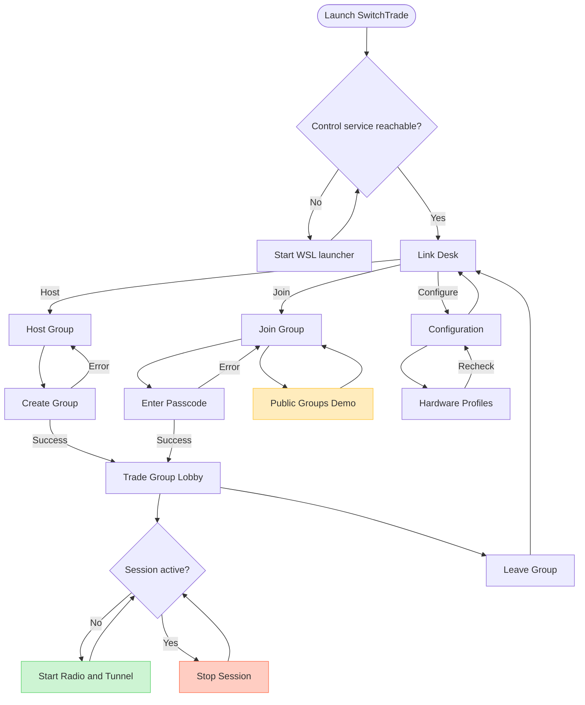
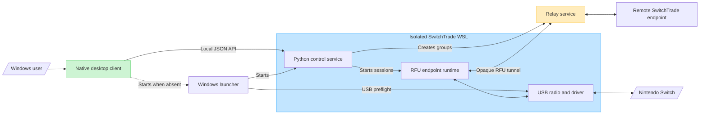

# Native UI flow and runtime structure — 2026-08-25

> Status: source of truth for the currently implemented native Windows UI.
> Maintenance rule: any change to user-visible screens, navigation, controls, status text, API calls,
> automatic startup, or shutdown behavior must update this document in the same commit.

This document describes implemented behavior, not planned behavior. Product priorities and unfinished
features remain in `docs/50-current-product-demo-todo-20260825.md`.

## UI flow

## Features by screen

| UI area | Implemented features |
|---|---|
| Global window | Native WPF controls, two-second control-service polling, status light, installed-service auto-start, and safe active-session shutdown |
| Link Desk | Entry points for hosting, joining, and configuration; identifies private groups as the beta path |
| Host Group | Group-name input, private/public visibility choice, relay-backed group creation, and API error display |
| Join Group | Uppercase private-passcode input, relay-backed joining, public-demo entry, and API error display |
| Public Groups | Static demonstration layout; the listed rooms are disabled and are not real matchmaking results |
| Configuration | Hardware USB IDs, qualification status, supported roles, control-service availability, recheck, and back navigation |
| Trade Group Lobby | Group name, passcode, host/guest endpoint role, readiness/error state, session start/stop, and leave-group action |
| Navigation and lifecycle | Back actions, Escape-to-main behavior, session stop before leaving an active lobby, and session stop before window close |

## Known UI gaps

- Public matchmaking and its room directory are not implemented.
- Selecting an adapter, running one-action repair, and exporting a support bundle are not exposed in
  the native UI.
- The lobby does not yet show its run ID, channel, detailed radio/relay stages, or full Switch
  instructions.
- Choosing public visibility creates a relay session but does not publish it to a real public service.

## Runtime structure and terminology

Use these terms consistently:

| Term | Exact meaning |
|---|---|
| Native desktop client | `SwitchTrade.exe`, a self-contained WPF UI and local API client |
| Windows launcher | Elevated PowerShell bootstrap that runs USB/WSL preflight and starts local services |
| Local control service | Python/FastAPI process on `127.0.0.1:8787`, currently running inside the isolated WSL distro |
| RFU endpoint runtime | Health-gated Python/Linux process that owns LDN, Pia, Reliable, radio, and tunnel behavior for one side |
| Relay service | Session broker and opaque WebSocket forwarder; local port `8788` is only the internal default, while production requires a reachable remote service |
| Backend offline | The desktop client cannot reach the local control service; it does not by itself prove that the relay or radio failed |

## Is the EXE the whole application?

No. `SwitchTrade.exe` is the native presentation and desktop-control layer. It also knows how to ask
the installed Windows launcher to start, but it does not contain the wireless driver, LDN/Pia/Reliable
runtime, health gate, or relay implementation.

The product is one installed system made from separable layers:

1. The EXE presents state and user actions.
2. The Windows launcher handles elevation, USB ownership, and WSL startup.
3. The local Python control service validates requests and manages groups and endpoint processes.
4. The WSL endpoint owns the adapter and translates local Switch communication into opaque RFU
   tunnel envelopes.
5. The relay connects two distant endpoint runtimes; it never needs to decode Pokémon or movement
   data.

This separation is intentional. Native UI changes do not require a kernel or driver change; new
qualified adapters do not require rebuilding the UI; and future Switch-to-Switch activities can reuse
the tunnel when their payloads remain inside the established RFU boundary.

## Files that require a documentation check

- `desktop/SwitchTrade.Desktop/MainWindow.xaml`
- `desktop/SwitchTrade.Desktop/MainWindow.xaml.cs`
- `desktop/SwitchTrade.Desktop/App.xaml.cs`
- `switchtrade/control.py`
- `installer/Launch-SwitchTrade.ps1`
