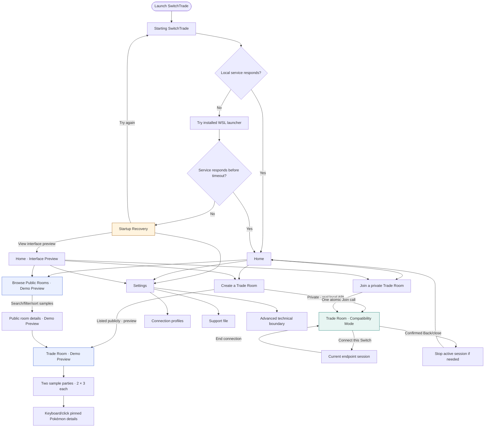
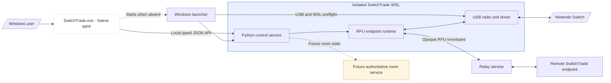

# Native UI flow and runtime structure — 2026-08-25

> Status: source of truth for the currently implemented native Windows UI.
> Maintenance rule: any change to user-visible screens, navigation, controls, status text, API calls,
> automatic startup, or shutdown behavior must update this document in the same change.

This document describes implemented behavior, not planned behavior. The approved first-pass redesign
is in `docs/56`; the second-pass audit and result are in `docs/63` and `docs/64`.
Release-blocking work that is not implemented remains in `docs/55`. The frozen backend contracts are
`docs/58`–`docs/61`.

## Current UI flow

## Features by screen

| UI area | Implemented behavior | Truth boundary |
|---|---|---|
| Global shell | Native WPF Fluent Light primitives with Linkline tokens, a 1240-by-860 default viewport and 960-by-700 minimum, fixed wordmark header, a white bordered Back action bar, readiness popover, Settings, per-screen scrolling, adaptive margins, keyboard navigation, restrained scene transitions, and live-region announcements | Back appearing never moves the wordmark; the action bar stays visually separate from scrolling canvas content; readiness is local setup status, not a claim that a partner or Switch is connected |
| Startup | Checks `127.0.0.1:8787`, attempts the installed hidden launcher, retries for a bounded period, and routes to Home or Recovery | The progress copy is presentation state, not invented per-stage telemetry |
| Startup Recovery | Try again, Settings, explicitly labeled interface preview, and expandable technical context | Preview does not start online, radio, or Switch behavior |
| Home | Three fixed-width rectangular actions for Create, Browse Public Rooms, and private code entry, plus Settings and an attention notice when in preview/recovery state | Public browsing is labeled as preview |
| Create a Trade Room | Always-visible room/trainer/game/language/offer/wanted/note fields, Private/Public radio selection, required-field validation, and real private-room creation through the existing local API | Room name, trainer name, game, and language are required; Game and Language default to `None`; Public creates a local Demo Preview only |
| Join a private Trade Room | Normalizes or pastes a shared code, locks editing while one atomic Join request is active, and enters the Trade Room on success | The compatibility API cannot yet provide authoritative presence/reconnect state |
| Browse Public Rooms | Interactive local search, field selector, availability/game/language filters, sorting, selection, empty state, and sample detail panel | Every public-room surface says `Public Rooms Preview` or `Demo Preview`; no network directory is queried |
| Settings tabs | Connection, Support, and Advanced remain visible as flat navigation tabs with a selected underline at every supported width; there is no compact dropdown or button-card replacement | Changing tabs does not alter room/session state |
| Settings · Connection | Reads profile-driven adapter compatibility, support state, summary, and technical details; permits recheck | It does not claim to select, repair, attach, or live-probe an adapter |
| Settings · Support | Requests the real local support-bundle endpoint and reports a friendly result | Requires the installed local service |
| Trade Room · real | Coordinator-owned room identity that survives Settings/navigation, code/invitation copy, role-specific Switch instructions, current endpoint start/stop, truthful recovery, owner-close/member-leave semantics, and safe app shutdown | Shared Ready, authoritative membership, role election, reconnect, and live parties remain unavailable in the compatibility API |
| Trade Room · demo | Two side-by-side parties at wide widths; compact layouts stack Partner above You. Each has six explicit slots, neutral initial placeholders, pointer tooltips, click/Enter selection, detailed stats, and Escape dismissal | All trainers, Pokémon, network quality, and party fields are sample data |

## Navigation and keyboard behavior

- Back is hidden when there is no safe history entry.
- The Back row remains reserved when Back is hidden, so the wordmark and content do not shift.
- Narrow scenes use a fixed 640-DIP column anchored to the left content edge under the wordmark and
  Back control. Wide Public/Trade Room scenes use the same left edge and expand rightward within the
  shared 1080-DIP content boundary.
- Combo boxes use the same fixed 44-DIP control height as adjacent fields. Create and real Trade Room
  action footers use a white bordered sticky action bar distinct from the scrolling canvas.
- `Alt+Left` and `Escape` go back; in Demo party details, `Escape` closes details first.
- `Ctrl+,` opens Settings and `F5` refreshes local service status.
- Leaving or closing a real Trade Room asks for confirmation and stops an active endpoint session.
- The UI never silently treats a local click as proof of remote readiness or membership.
- Buttons and party slots are keyboard focusable. Pokémon details are available through selection as
  well as hover, so required information is not hover-only.

## Implemented presentation foundation

- `Themes/Colors.Light.xaml`, `Tokens.xaml`, `Typography.xaml`, `Icons.xaml`, and the split
  `Controls.*.xaml` dictionaries own Fluent Light plus the restrained Linkline identity.
- `Themes/HighContrast.xaml` is loaded when Windows High Contrast is active; motion follows the
  Windows client-area animation preference and is suppressed in High Contrast.
- `Models/AppModels.cs` contains typed room, filter, party, move, stat, IV, EV, and trainer records.
- `Services/ControlApiClient.cs` is the typed local JSON API boundary and converts technical failures
  into user-facing messages.
- `Services/PublicRoomPreviewProvider.cs` is the sole source of labeled sample rooms and parties.
- `ViewModels/MainViewModel.cs` owns only shell navigation. Split screen view models own local state,
  while `State/ActiveTradeRoomCoordinator.cs` owns the real room/session independently of the route.
- `Views/Screens.xaml` is a template registry. Each screen and reusable component has its own XAML and
  code-behind file; `MainWindow.xaml` remains the persistent shell.

## Known product gaps (not represented as working UI)

- The frozen `room-control.v1` server-authoritative two-member Trade Room, shared online/ready state,
  ordered membership events,
  reconnect tokens, expiration, and conflict handling.
- Either-member room-creator claims independent of stable member identity and group ownership.
- A production public directory and real public room publication.
- Live adapter selection, automatic repair, and full per-stage control/relay/radio/session telemetry.
- The frozen `party-commit.v1` passive decoder party snapshots, checksum-valid live party presentation,
  and fail-closed committed-trade events.
- The frozen externally administered `privacy-statistics.v1` consent decision and server-side
  statistics implementation.
- Per owner direction, optional privacy/analytics settings are not presented in the client. Analytics
  remain disabled until the separately administered external consent workflow exists.
- Production relay deployment, authentication, and two-endpoint internet qualification.

The client intentionally contains no Privacy tab, analytics switch, or consent prompt. That workflow
is administered outside this client and remains disabled until separately implemented and approved.

## Runtime structure

## Layer terminology

| Term | Exact meaning |
|---|---|
| Native desktop client | `SwitchTrade.exe`, the WPF presentation and local-control client |
| Windows launcher | PowerShell bootstrap that performs Windows/USB/WSL startup work |
| Local control service | Python service bound to loopback at `127.0.0.1:8787` inside the isolated distro |
| RFU endpoint runtime | Health-gated Linux process that owns LDN, Pia, Reliable, radio, and tunnel behavior for one side |
| Relay service | Broker and opaque WebSocket forwarder between endpoint runtimes |
| Authoritative room service | Contracted server state for two members, readiness, role claims, reconnect, and room lifecycle; it does not yet exist in the current client/backend |
| Demo Preview | Local, labeled sample content that never claims a remote user or live service exists |

Technical terms such as endpoint, radio, tunnel, host, and guest may remain in source code or an
explicitly expanded Advanced/Technical details area. Ordinary product copy uses Home, Trade Room,
room code, Settings, you, partner, create the room, and find the room.

## Is the EXE the whole application?

No. The installed product is intended to feel like one app, but its responsibilities stay separated:

1. `SwitchTrade.exe` presents state and invokes the loopback API.
2. The Windows launcher handles elevation, USB ownership, and isolated WSL startup.
3. The Python control service validates requests and manages endpoint processes.
4. The WSL endpoint owns the adapter and transports local Switch communication.
5. A production remote service will provide authoritative rooms and opaque relay transport.

This boundary preserves driver and feature expandability: new qualified adapters stay profile-driven,
and future Switch-to-Switch activities can reuse the feature-neutral RFU transport without embedding
driver or protocol logic in WPF.

## Files that require this documentation check

- `apps/desktop/SwitchTrade.Desktop/App.xaml`
- `apps/desktop/SwitchTrade.Desktop/MainWindow.xaml`
- `apps/desktop/SwitchTrade.Desktop/MainWindow.xaml.cs`
- `apps/desktop/SwitchTrade.Desktop/Themes/*`
- `apps/desktop/SwitchTrade.Desktop/ViewModels/*`
- `apps/desktop/SwitchTrade.Desktop/Views/*`
- `apps/desktop/SwitchTrade.Desktop/Services/*`
- `switchtrade/control.py`
- `installer/Launch-SwitchTrade.ps1`
