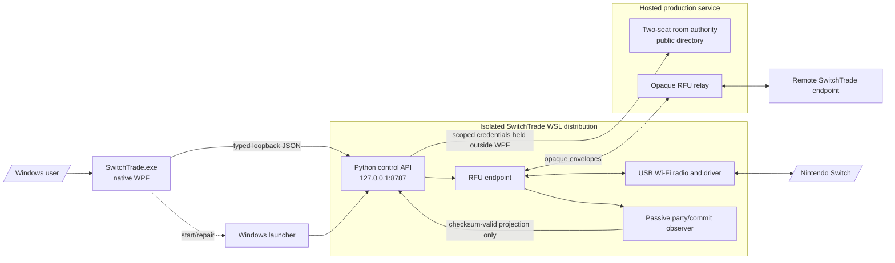

# Native UI flow and runtime structure — updated 2026-08-26

> Status: source of truth for the currently implemented native Windows UI.
> Maintenance rule: any change to a screen, navigation, user-visible state, local API call, startup,
> or shutdown behavior must update this document in the same change.

Visual Overhaul 3 implements the dark Stitch-derived direction from `docs/73` as native WPF. The
reference HTML is visual evidence only: the application contains no browser, WebView, Electron,
Tailwind, CDN, or hot-linked asset. The implementation report and captures are in `docs/74` and
`docs/assets/ui-overhaul-3/`.

The client intentionally contains no Privacy tab, analytics switch, consent prompt, or analytics
upload. Those concerns are outside the client by owner direction.

## Current user flow

```mermaid
flowchart TD
    launch([Launch SwitchTrade.exe]) --> startup[Starting SwitchTrade]
    startup --> probe{Local control service ready?}
    probe -->|No| launcher[Start isolated SwitchTrade WSL runtime]
    launcher --> retry{Bounded readiness retry}
    retry -->|No| recovery[Recovery]
    recovery -->|Try again| startup
    recovery --> settings[Settings]
    probe -->|Yes| home[Home]
    retry -->|Yes| home

    home --> create[Create a Trade Room]
    home --> privateJoin[Join a Private Room]
    home --> publicGate{Relay advertises public-directory.v1?}
    publicGate -->|Yes| publicRooms[Browse Public Rooms]
    publicGate -->|No| unavailable[Public action disabled with factual copy]
    home --> settings

    create -->|Private or Public| authority[Authoritative two-seat room]
    privateJoin -->|Atomic six-character join| authority
    publicRooms -->|Atomic opaque listing join| authority
    authority --> tradeRoom[Persistent Trade Room]
    tradeRoom --> ready[Both trainers ready]
    ready --> assign[Atomic creator/finder assignment]
    assign --> connect[WSL radio and opaque RFU connection]
    connect --> active[Trading room]
    active --> parties[Checksum-valid You and Partner parties]
    active --> commit[Trade verified only after commit evidence]
    tradeRoom -->|Confirmed close or leave| teardown[Safe endpoint and room teardown]
    teardown --> home

    settings --> connection[Connection]
    settings --> support[Support]
    settings --> advanced[Advanced]
```

## Features and truth boundaries by screen

| UI area | Implemented behavior | Truth boundary |
|---|---|---|
| Persistent shell | Native dark WPF shell, fixed wordmark, readiness, Settings, a permanently reserved Back row, 1080-DIP content boundary, 1240×860 default and 960×700 minimum | Back never moves the wordmark; Ready means the local control service is compatible, not that a partner or Switch is connected |
| Startup | Probes `127.0.0.1:8787`, starts the installed hidden launcher if needed, retries for a bounded interval | Does not invent per-stage progress not returned by the runtime |
| Recovery | Try again, Connection Settings when relevant, and actionable technical context | No interface-preview or synthetic success path |
| Home | One full-width Create action plus equal Browse Public Rooms and Join Private Room actions | Public browsing is enabled only when relay health advertises `public-directory.v1` |
| Create a Trade Room | Always-visible required room/trainer/game/language fields, Private/Public radio selection, optional offering/wanted/note fields, 7/5 wide layout, sticky create action | `None` is not a valid required game/language; both visibility choices call the real authoritative service |
| Join a Private Room | One accessible logical code control, paste support, uppercase normalization, removal of spaces/hyphens, exactly six ASCII alphanumeric characters | One atomic join call; no token or authority credential enters WPF |
| Browse Public Rooms | Real server directory, search, availability/game/language filters, sorting, master/detail layout, required local trainer name, refresh, empty/busy/error/full/stale states | Listings expose only sanitized metadata and opaque listing IDs; room code, credentials, IP, relay internals, and precise location are absent |
| Trade Room | Persistent room name/code/membership, partner presence, shared readiness, server-assigned creator/finder instructions, start/end, owner-close/member-leave, reconnect/recovery status, You/Partner party panels | Roles come from the authoritative attempt; UI never infers them from host/guest ownership |
| Party panels | You left and Partner right at wide sizes; Partner above You in compact mode; six explicit slots, keyboard/click selection, hover details, IV/EV/stats/moves/trainer provenance | Only complete checksum-valid observer snapshots are factual; unavailable data stays unavailable |
| Trade success | Announces a verified trade from an idempotent commit event | An offer, animation, save attempt, disconnect, error, or rollback never becomes “Trade verified” |
| Settings tabs | Connection, Support, and Advanced are stable navigation tabs | Tabs do not change room or endpoint state |
| Settings · Connection | Detected profiled USB devices, readable device/support labels, free supported/experimental selection, explicit experimental warning, quarantined blocking, profile matrix, read-only diagnostics | Experimental means unqualified; selection is not certification |
| Settings · Support | Creates a redacted support bundle and links to the real GitHub Issues page | Support data excludes room credentials, captures, passcodes, and raw Pokémon data |
| Settings · Advanced | Technical runtime boundary and compatibility details | Ordinary users are not required to understand WSL, RFU, AP/monitor, or tunnel roles |

## Visual and interaction foundation

- Dark tokens are centralized in `Themes/Colors.Dark.xaml`: deepest/base canvases, layered surfaces,
  high-contrast text, neon action green, blue information, You blue, Partner teal, and explicit error
  containers.
- Space Grotesk headings, Inter body text, and Space Mono labels/codes are embedded application
  resources. Their SIL OFL files are embedded and attributed in `legal/THIRD-PARTY-NOTICES.txt`.
- Layout uses a 4-DIP baseline, 24-DIP outer gutters, 16-DIP common gaps, one-DIP borders, 44-DIP
  minimum controls, modest radii, stable sticky action bars, and left-aligned content.
- Combo boxes have a native dark template for both the closed value and popup items. Normal, hover,
  focus, selected, and disabled states keep explicit foreground/background contrast. Long adapter
  names put the USB bus first and ellipsize instead of leaking record text outside the control.
- Windows High Contrast swaps to `Themes/HighContrast.xaml`. Keyboard focus is visible, required
  information is not hover-only, and scene transitions are disabled when Windows client-area
  animation is disabled or High Contrast is active.
- `Alt+Left` and `Escape` navigate back; temporary Pokémon details dismiss before navigation.
  `Ctrl+,` opens Settings and `F5` refreshes factual service state.

## Runtime structure

## Layer terminology

| Term | Exact meaning |
|---|---|
| Native desktop client | `SwitchTrade.exe`; presentation and typed loopback client only |
| Windows launcher | Bounded PowerShell bootstrap for installed WSL, USB ownership, and recovery |
| Local control service | Python API bound to loopback; owns credentials, process lifecycle, hardware and observer state |
| RFU endpoint | Linux runtime that owns LDN/Pia/Reliable/radio/tunnel behavior for one player |
| Room authority | Hosted two-member membership, readiness, roles, reconnect, public listing, close/expiry state |
| Relay | Hosted authenticated opaque RFU-envelope forwarder; it does not decode game payloads |
| Observer | Passive, fail-neutral party and committed-trade projection; trading never depends on it |

## Implementation boundaries

- `MainWindow.xaml` is the persistent shell; `Views/*` are native screens and reusable controls.
- `MainViewModel` owns navigation and factual readiness; `ActiveTradeRoomCoordinator` owns room and
  connection state independently of the visible route.
- `ControlApiClient` is the only WPF network boundary and talks only to the loopback control API.
- `switchtrade/control.py` owns relay credentials, capability discovery, hardware selection, process
  launch/teardown, readiness, and redacted projections.
- `relay/authority.py` owns durable room/public-directory state; `relay/server.py` exposes its
  authenticated HTTP/WebSocket boundary.
- Hardware and future game features remain profile- and contract-driven outside WPF, preserving
  driver and feature expansion without rebuilding the shell around chipset logic.

## Required documentation check

Review this file whenever changing `apps/desktop/SwitchTrade.Desktop/{MainWindow,Themes,Views,
ViewModels,Services,State}`, `switchtrade/control.py`, the room/public/party contracts, or installed
startup/shutdown behavior.
