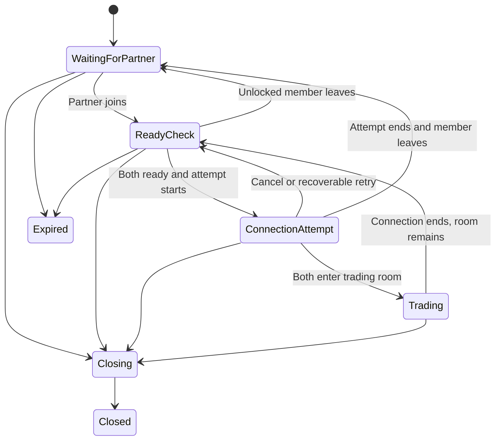
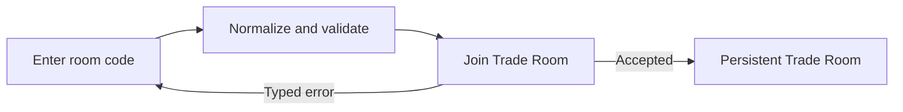
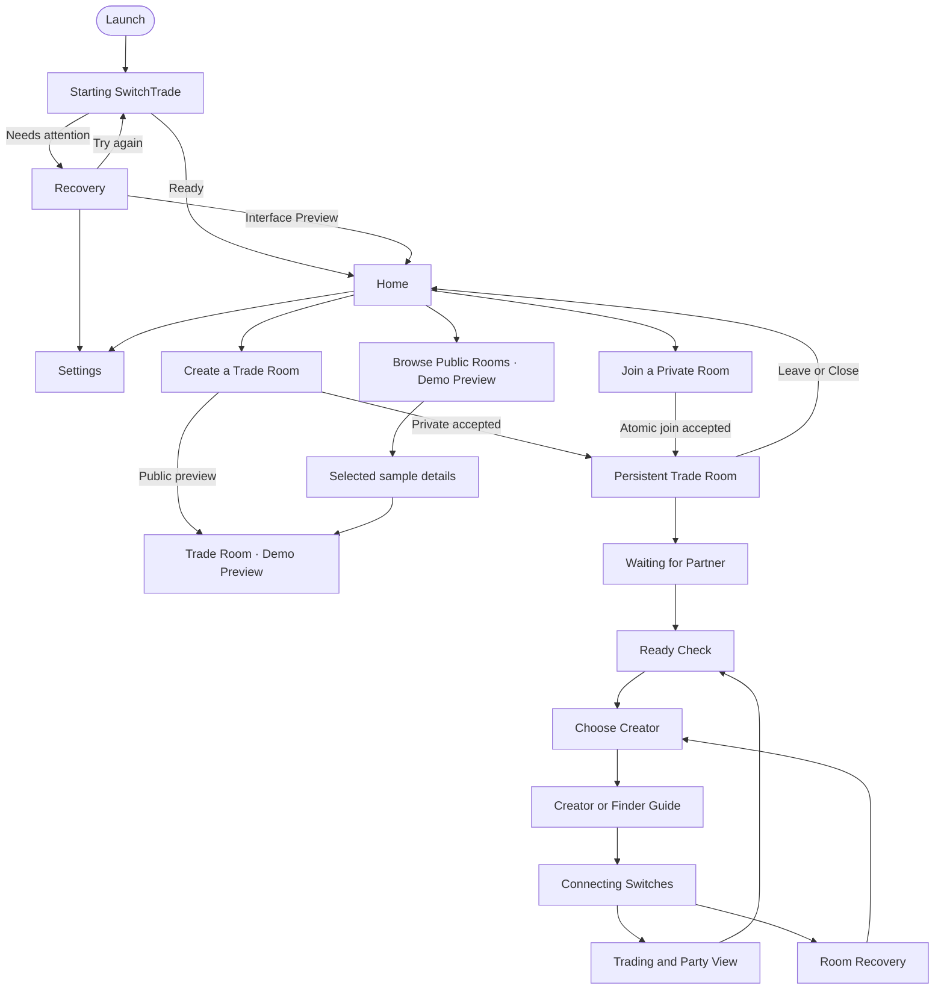

# SwitchTrade second native UI overhaul — Codex implementation handoff

> Date: 2026-08-25
> Repository: [`mwl313/mwl-SwitchTrade`](https://github.com/mwl313/mwl-SwitchTrade)
> Working branch: `production-beta`
> Audited commit: [`6943ff32e82b927b5928afe211c6ca314dbadf96`](https://github.com/mwl313/mwl-SwitchTrade/commit/6943ff32e82b927b5928afe211c6ca314dbadf96)
> Intended reader: Codex implementing the second native WPF UI overhaul
> Status: design and implementation handoff; it does not authorize installer work or backend-contract replacement

---

# 0. Codex execution directive

Read this document completely before changing code.

Then inspect the current `production-beta` checkout and confirm that `HEAD` is either the audited commit
above or a descendant containing the same WPF refactor and frozen contracts. Do not work from `main`,
the retired web prototype, screenshots, or the Emerald UI kit.

Before implementation, return the following to the owner:

1. the exact branch and commit being used;
2. a current-code-versus-this-handoff gap table;
3. the proposed file/class split;
4. the UI-only work separated from contract/backend integration work;
5. the contract-normalization items in section 5, with the recommended resolutions accepted or revised;
6. the ordered implementation phases and verification commands;
7. any owner decision that genuinely blocks a shippable result.

Wait for owner approval before making the large visual change. After approval, implement the approved
phases, build and test them, create representative native screenshots, and update `docs/54`, `docs/55`,
and the implementation report in the same change.

## 0.1 Scope

This overhaul is a deliberate second pass over an already-refactored WPF app. It must:

- preserve the frozen product and runtime boundaries;
- retain the current truthful Demo Preview behavior;
- preserve working private-room and local session compatibility paths until `/api/v1` replaces them;
- make the app visibly refined, cohesive, efficient, and native to Windows 11;
- add restrained, useful transitions and reactive controls;
- prepare every Trade Room state for `room-control.v1` and `party-commit.v1` without fabricating them;
- improve responsive behavior, keyboard use, High Contrast, reduced motion, focus, and screen-reader output;
- remain native WPF with no browser, Electron shell, UI server, or new state framework.

## 0.2 Explicit non-scope

Do not use this overhaul to:

- redesign RFU payloads, relay transport, hardware profiles, drivers, WSL topology, or frozen service contracts;
- implement installer packaging;
- make public matchmaking appear live;
- make fixture parties appear observed or verified;
- reintroduce the Emerald, pixel, Game Boy, faux-console, canvas, or web layout;
- add a generic dashboard, decorative sidebar, glass panels, gradient blobs, neon glow, or excessive cards;
- add Dark theme to the private-beta Gate 0 scope;
- add a Privacy tab or in-client analytics switch;
- add a UI framework or design-system NuGet dependency without a proven platform blocker and owner approval.

---

# 1. Executive verdict

The first refactor succeeded at architecture and truthfulness: `MainWindow` is now a shell, the old
Emerald presentation is retired, screens are backed by view models, local APIs are typed, public and
party fixtures are labeled, and ordinary copy largely hides implementation terminology.

The current UI is nevertheless a presentation baseline rather than a finished product. It still looks
like a competent WPF prototype because:

- the token system is shallow;
- native controls mix custom styling with default WPF/Aero presentation;
- all button reaction is implemented by dimming the whole control;
- layout is dominated by bordered rectangles and large stacked cards;
- the public-room toolbar is crowded and non-adaptive;
- the Trade Room does not yet have a designed state-stage system;
- motion, reduced motion, High Contrast resources, and focus restoration are not implemented;
- party data is stored as preformatted strings rather than typed fields with provenance;
- the global `ScrollViewer` prevents screens from controlling master-detail, sticky actions, and list virtualization cleanly.

The right second-pass strategy is not another visual rewrite or a new UI technology. Keep WPF, adopt
the built-in .NET 10 WPF Fluent Light theme as the native primitive layer, place a restrained Linkline
identity on top, split the giant screen dictionary into real views, and create a contract-driven Trade
Room stage host.

## 1.1 Outcome target

The finished app should feel like a small, focused Windows utility made specifically for connecting two
trainers—not a game emulator, an admin tool, a generic AI dashboard, or a themed website.

The visual personality should come from:

- exceptionally clean hierarchy;
- crisp typography;
- a single Linkline connection motif;
- the restrained blue/teal identity of You and Partner;
- carefully designed empty, waiting, recovery, and connected states;
- responsive controls that acknowledge hover, press, focus, progress, and success without spectacle;
- consistent spacing and deliberate negative space.

---

# 2. Source authority and repository evidence

## 2.1 Source priority

When sources disagree, use this order:

1. owner decisions in `docs/62` and section 4 of this handoff;
2. frozen contracts in `docs/58`–`docs/61`, after resolving the conflicts in section 5;
3. this handoff for final visual, interaction, layout, motion, and implementation decisions;
4. `docs/54` and `docs/57` for currently implemented behavior that must remain functional;
5. `docs/56` for prior requirements not superseded here;
6. current WPF source for implementation reality;
7. retired Emerald/web assets only as historical evidence, never design authority.

## 2.2 Files inspected

| Area | Current source |
|---|---|
| Persistent shell | `apps/desktop/SwitchTrade.Desktop/MainWindow.xaml` and `.xaml.cs` |
| App resources | `App.xaml` |
| Base tokens | `Themes/Tokens.xaml` |
| Current reusable styles | `Themes/Controls.xaml` |
| All screen templates | `Views/Screens.xaml` |
| Shell and every screen VM | `ViewModels/MainViewModel.cs` |
| VM base and commands | `ViewModels/ViewModelBase.cs` |
| Current presentation records | `Models/AppModels.cs` |
| Compatibility API | `Services/ControlApiClient.cs` |
| OS services/dialogs | `Services/DesktopServices.cs` |
| Explicit fixtures | `Services/PublicRoomPreviewProvider.cs` |
| DPI manifest | `app.manifest` |
| Runtime/flow baseline | `docs/54`, `docs/55`, `docs/57` |
| Frozen service contracts | `docs/58`, `docs/59`, `docs/60`, `docs/61` |

## 2.3 Verified implementation baseline

The audited WPF project currently has:

- `net10.0-windows` with `UseWPF=true`;
- one 1120×780 window with a 760×600 minimum;
- a 72-DIP wordmark/readiness header, a reserved 48-DIP Back row, and a global scroll viewer;
- 640-DIP narrow scenes and a 1000-DIP wide content boundary;
- Startup, Recovery, Home, Create, Private Join, Public Demo, Settings, real compatibility Trade Room,
  and Demo Party screens;
- three equal-width Home actions;
- real legacy private create/join and session start/stop calls;
- local sample public rooms and sample parties in one explicit provider;
- a 2-second compatibility-status poll;
- safe-close confirmation and best-effort session stop;
- no external UI package.

This commit is the correct baseline. The earlier concern that the refactor had not been pushed no longer
applies.

---

# 3. Binding owner decisions

The following are not optional design suggestions:

1. Product name and fixed wordmark: `SwitchTrade`.
2. Visual direction: modern native Windows **Linkline**.
3. The wordmark remains fixed in the white header.
4. Back remains in a reserved gray row below the header so its appearance never moves the wordmark.
5. Every scene shares one left content edge with consistent shell padding.
6. Narrow scenes use a consistent 640-DIP content width.
7. Public Rooms and Trade Room may expand rightward within the existing 1000-DIP content region.
8. Home has three equal-size actions:
   - `Create a Trade Room`
   - `Browse Public Rooms`
   - `Join a Private Room`
9. Join uses the same navigation-action component and geometry as the other two Home actions.
10. Create always shows all fields.
11. Private/Public is a radio choice, not a progressive reveal.
12. Room Name, Trainer Display Name, Game, and Language are required and visibly marked.
13. Game and Language default to `None`, which is invalid for submission.
14. There is no optional Privacy Settings section and no client Privacy tab.
15. Consent and analytics administration remain external; analytics are disabled without an active grant.
16. Public room browsing and public room creation remain visibly labeled `Demo Preview` until real.
17. Remote member, readiness, connection, party, and trade-success presentation comes only from
    authoritative snapshots/events.
18. Waiting, ready check, creator selection, guidance, connecting, recovery, and trading remain stages
    inside one persistent Trade Room shell.
19. Two parties are shown side by side as two 2×3 grids when valid snapshots exist.
20. Missing party data never means the connection failed and never blocks trading.
21. Light theme plus Windows High Contrast is the beta target; Dark theme remains later work.

---

# 4. Terminology and product voice

## 4.1 Required user-facing terms

| Use | Do not expose in ordinary UI |
|---|---|
| Home | Link Desk |
| Trade Room | Group, lobby object, session object |
| Room code | Passcode, token, credential |
| Settings | Configuration |
| Wi-Fi adapter | Hardware profile, USB ID |
| You / Partner | Member A/B unless in Technical Details |
| Create the room on your Switch | Host, parent, endpoint host |
| Find your partner’s room | Guest, child, endpoint guest |
| Connection | Radio and tunnel |
| Online service | Backend |
| Try again / Check again / Repair setup | Retry RPC, restart endpoint |
| Supported / Test-only | Certified / Experimental |

Use `Trade Room` only for the two-person SwitchTrade space. Use `room on your Switch` for the FireRed or
LeafGreen Direct Connection room.

## 4.2 Voice rules

- Sentence case, never all-caps for hierarchy.
- Short, direct, calm sentences.
- One problem per message and one emphasized recovery action.
- Tell the user what happened before telling them what to do.
- Keep technical codes and raw details behind `Technical details`.
- Never claim a remote fact based on a local click, elapsed timer, or optimistic UI.
- Keep primary action labels stable while busy; add a spinner and state text instead of changing the
  label to vague copy such as `Working…`.
- Use `trainer` for a person only when it reads naturally; otherwise use `you` and `your partner`.

---

# 5. Contract normalization required before live-state integration

Visual foundation work may proceed immediately. A contract-bound reducer, SSE integration, or final
live Trade Room implementation must not proceed until these inconsistencies are normalized in the
authoritative docs and tests.

## 5.1 Required decisions

| ID | Conflict or missing rule | Recommended resolution |
|---|---|---|
| C1 | `docs/58` lists room transitions but omits `connection_attempt → ready_check`, while creator cancellation is explicitly required to return there. | Add the transition. Cancellation, pre-lock teardown, and recoverable retry return the same room and stable seats to `ready_check`. |
| C2 | The state list does not define how `ready_check` or an unlocked `connection_attempt` returns to `waiting_for_partner` when a member leaves. | Add `ready_check → waiting_for_partner`; for `connection_attempt`, cancel/fail the attempt first, release resources, then transition to `waiting_for_partner` if the leaving seat is freed. |
| C3 | `docs/58` uses `party.snapshot_updated` / `party.snapshot_invalidated`; `docs/59` uses `party.snapshot.updated` / `party.snapshot.invalidated`. | Standardize on dot-separated `party.snapshot.updated` and `party.snapshot.invalidated` everywhere. Keep aliases only in a temporary migration adapter. |
| C4 | The `docs/59` example lacks structured Moves and EVs although the approved Pokémon detail UI requires them. | Extend the frozen party slot shape with `moves[4]`, `evs`, and explicit provenance for every displayed value before generating DTOs. Do not parse presentation strings. |
| C5 | Current Private Join displays a non-mutating-looking preview, but `FindAsync` already calls the mutating legacy join endpoint. `room-control.v1` also defines join as an occupying mutation. | Use one `Join Trade Room` action that validates and atomically joins, then navigates directly to Trade Room. Do not show a fake pre-join preview. Add a separately reviewed resolve endpoint only if preview is truly required. |
| C6 | Owner leave, owner transfer, and window-close membership semantics are undefined. | For beta, owner action is `Close Trade Room` for both; non-owner action is `Leave Trade Room`. Window close must invoke the matching explicit action after confirmation. If ownership transfer is desired, add and test it as a contract command before UI work. |
| C7 | The current close path swallows stop failures, while the final UI needs truthful closing/recovery states. | Make teardown bounded and typed. Keep the window open on recoverable failure with `Try again`; offer `Close anyway` only with explicit notice that the seat may remain until reconnect/expiry policy resolves it. |
| C8 | The always-visible Create form collects Trainer, Game, Language, Offering, Wanted, and Note, but the real private call sends only room name and visibility; the v1 create request body is not frozen. | Define the v1 create payload and snapshot ownership for room name, local display name, game, and language. Define whether optional trade-preference fields are local invitation data, public-directory data, or discarded; never collect them without effect. |
| C9 | `End connection` has a local session-stop endpoint but no explicit authoritative command that completes the attempt and returns `trading → ready_check`. | Add/freeze an end-attempt command or typed room command whose acknowledged outcome completes the attempt, invalidates parties, and returns the existing room to Ready Check. Local `/session/stop` alone is not remote truth. |
| C10 | Error envelopes refer to an allowlisted `primary_action`, but allowed values are not enumerated. | Freeze the allowlist in section 16.2 and reject/record unknown actions rather than dispatching arbitrary commands. |
| C11 | `TradeRoomSnapshot.parties` is present but undefined while full party data has a separate endpoint. | Define `parties` as status/reference metadata only, or remove it from the room snapshot. Keep full decoded party records exclusively in the party endpoint/projection. |
| C12 | After reconnect grace, an offline member can retain a seat until explicit leave/expiry, but the remaining member cannot clear the blocked seat. | Freeze an owner remove-seat policy/command or an automatic post-grace release rule. Until then, show `place reserved` truthfully and never pretend the room is open to a replacement. |

## 5.2 Normative room-transition patch

The recommended beta room-state graph is:



Every transition must retain stable member identity unless the contract explicitly frees a seat. A
connection attempt may be replaced; the Trade Room must not be silently recreated.

## 5.3 Join flow decision

The approved second-overhaul default is a single, honest action:



The current `Find Trade Room` then `Join Trade Room` two-step UI should be removed when this overhaul is
implemented, because the first step already occupies the room today.

---

# 6. Current WPF gap audit

| Area | Current evidence | Problem | Second-overhaul requirement |
|---|---|---|---|
| Native base theme | `App.xaml` merges only project dictionaries; no WPF Fluent theme or `ThemeMode`. | Styled and unstyled controls can look like different WPF generations. | Apply the built-in .NET 10 WPF Fluent Light theme, then overlay Linkline resources. No new dependency. |
| Tokens | `Tokens.xaml` has colors, two radii, and one padding value. | No interaction, focus, density, elevation, typography, motion, adaptive, or status tokens. | Expand the token layer described in section 9. |
| Button reaction | `BaseButton` changes the entire button opacity to 0.88/0.72. | Text and icons become washed out; interaction feels like a prototype. | Keep text fully opaque. Animate a background overlay/border and move pressed content by at most 1 whole DIP. |
| Focus | Border thickness changes from 1 to 2 on keyboard focus. | Geometry shifts and the brand color replaces the system focus accent. | Use a non-layout-shifting 2-DIP outer focus ring with 2-DIP gap and Windows accent/High Contrast highlight. |
| High Contrast | Brand brushes are hard-coded; no contrast dictionary. | Custom components may disappear or communicate status only by color. | Add `HighContrast.xaml`, system brush mapping, and runtime switching. |
| Motion | No scene/component motion or reduced-motion policy in code. | State changes feel abrupt; future animation could ignore user preference. | Add the motion system in section 11 and gate it on Windows animation settings. |
| Shell scrolling | One global `ScrollViewer` wraps every screen. | Public list virtualization, master-detail scrolling, sticky actions, and focus scroll behavior are compromised. | Replace it with `SceneFrame`; each screen owns body scrolling and optional footer actions. |
| Responsiveness | Fixed columns and `WrapPanel` filters; wide Public minimum columns exceed the narrow viewport. | The 760-DIP minimum can clip the Public layout, especially at high scale. | Implement Compact/Standard/Wide layout states and master-detail collapse. |
| Screen organization | `Screens.xaml` contains all templates in 501 lines. | Hard to evolve, preview, test, animate, or give screen-specific layout behavior. | Split each major scene into a `UserControl`; keep shared components templated. |
| VM organization | `MainViewModel.cs` contains shell plus every screen VM in 751 lines. | Contract integration and stage-specific behavior will become fragile. | Split shell/navigation, screen VMs, room reducer, and DTO mapping without adding a framework. |
| Startup truth | Three static stage labels are displayed although current API only probes general status. | The list implies measured progress that is not currently available. | Show one indeterminate compatibility message today; display stages only when real readiness axes exist. |
| Async feedback | Create has `IsBusy`, but the button exposes no progress visual. | A disabled button looks unresponsive during network work. | Use `AsyncButton`: stable label, small progress indicator, duplicate-submit lock, announced completion/error. |
| Home actions | Plain text in three long rectangular buttons; Create is filled blue while the others are plain. | Geometry is correct but hierarchy and polish are weak. | Use one `NavigationActionButton` component with icon, title, description, trailing arrow, equal size, and a restrained primary variant. |
| Create form | One large `SurfaceCard` contains every field. | Dense, generic card presentation; validation is not associated with fields. | Use open form sections and dividers; typed validation, required automation metadata, and focused first error. |
| Private Join | `Find` mutates membership before a second Join click. | UI semantics are false and Back/close can leave membership ambiguous. | Replace with one atomic Join action per C5. |
| Public filters | Six fixed-width controls in a `WrapPanel`. | Crowded, uneven wraps, excessive cognitive load. | Keep Search By + Search visible; move filters to a compact drawer/popover and keep Sort visible. |
| Public selection | `ApplyFilters` clears/rebuilds the collection and selects the first result on every change. | Selection jumps while typing and may create noisy accessibility output. | Preserve a valid selection; otherwise leave details neutral or select only on explicit navigation. Debounce future remote queries. |
| Settings | One bordered TabControl with card-like adapter rows. | Visually generic and hard to grow. | Use Settings-only navigation rail at wide width and a top selector at compact width; use settings rows, not nested cards. |
| Trade Room | Linkline is a static 1-DIP line and all real state is collapsed into a notice plus one action. | It does not express the frozen state model or provide a memorable product identity. | Build a persistent room header, member strip, Linkline, stage host, readiness/recovery panel, and stage-specific action bar. |
| Party markup | You/Partner party slot XAML is duplicated. | Divergence and harder keyboard-grid behavior. | One reusable `PartyGrid`/`PokemonSlot` component with accent as data. |
| Pokémon model | Stats, IVs, EVs, Moves, Trainer are preformatted strings. | Cannot localize, mark per-field provenance, or distinguish unavailable values. | Use structured typed values and a mapper from `party-commit.v1`. |
| Fixture wording | Detail title says `Verified sample`. | `Verified` is reserved for checksum-valid observed data and can mislead. | Use `Sample preview`; reserve `Verified` for real complete checksum-valid snapshots. |
| Dialogs | `WindowsDialogService.Confirm` ignores its `confirmText` parameter. | Destructive actions cannot have accurate verbs or fully branded, accessible states. | Implement a typed dialog host/result with explicit primary/destructive/cancel labels and focus restoration. |
| Closing | Stop errors are swallowed. | The UI may disappear without explaining incomplete teardown. | Add Closing, retry, and close-anyway rules from C7. |
| Keyboard | Global shortcuts omit `Ctrl+K`; focus is not explicitly moved/restored after navigation. | Docs and implementation disagree; keyboard flow can become stranded. | Add commands and a focus coordinator; temporary layers close before navigation. |
| DPI | Manifest uses legacy `true/pm`; layout has not been designed for all effective widths. | Multi-monitor scaling can become blurry or clipped. | Evaluate and declare PerMonitorV2, then test 100–200% on multiple monitors and breakpoints. |
| Copy location | User strings are spread across XAML and view models. | Copy consistency and pseudo-localization are difficult. | Centralize final copy in resources or a typed copy catalog before freeze. |

---

# 7. Final information architecture

The first refactor's direct Home destinations and persistent Trade Room remain correct.



The following must not be separate navigation-stack pages:

- waiting for partner;
- ready check;
- choosing creator;
- creator/finder guidance;
- connecting;
- reconnecting/recovering;
- trading;
- trade-commit acknowledgment.

They are stage changes inside the same `TradeRoomView`. Room name, room code, members, Back/Leave
policy, focus landmarks, and scroll context remain stable.

---

# 8. Native platform decision

## 8.1 Use the built-in WPF Fluent Light theme

The project targets `net10.0-windows`. Use the WPF Fluent theme included with modern WPF as the primitive
control layer, either through `ThemeMode="Light"` or the official Fluent resource dictionary. Load the
theme before SwitchTrade resources so brand tokens and component templates remain authoritative.

Reasons:

- it immediately aligns base Button, TextBox, ComboBox, RadioButton, CheckBox, ScrollBar, Expander, and
  focus behavior with contemporary Windows;
- it avoids adding a third-party dependency;
- it reduces custom template maintenance;
- .NET 10 includes additional Fluent-control, High Contrast, access-key, and RTL fixes.

The theme is a foundation, not the product identity. Linkline components, spacing, brand colors, Home
actions, room stages, party grids, notices, dialogs, and motion still require project-owned resources.

If one Fluent control has a confirmed .NET 10 regression, override only that control after a focused
test. Do not abandon the theme globally or introduce a UI package as the first reaction.

## 8.2 Preserve native window chrome

- Keep the normal Windows title bar, system menu, snapping, minimize, maximize, and close behavior.
- Do not build a custom title bar for visual novelty.
- Do not add Mica, Acrylic, glass, or backdrop interop to Gate 0.
- Preserve `UseLayoutRounding=True` and `SnapsToDevicePixels=True`.
- Never place a blur, opacity effect, or `DropShadowEffect` on a container holding text; this can soften
  ClearType rendering. If a popup shadow is used, render it on a separate sibling chrome element.

---

# 9. Linkline visual system v2

## 9.1 Core motif

Linkline is one line connecting two clear endpoints. It represents You and Partner across waiting,
readiness, creator selection, connection, reconnection, party display, and completion.

It is not:

- a decorative network graph;
- a waveform;
- a cable illustration;
- a glowing neon effect;
- a Poké Ball imitation;
- a repeated pattern placed on every card.

Use it only where relationship or connection state is meaningful.

## 9.2 Base color tokens

Preserve the established blue and teal; refine the surrounding neutrals and add the missing interaction
roles.

| Token | Value | Use |
|---|---:|---|
| `Color.Canvas` | `#F5F6F8` | app canvas and reserved Back row |
| `Color.Surface` | `#FFFFFF` | primary work surface |
| `Color.SurfaceSubtle` | `#F3F5F8` | hover rows, grouped settings, quiet empty states |
| `Color.SurfacePressed` | `#E8ECF2` | pressed secondary surface |
| `Color.TextPrimary` | `#181A20` | headings and body |
| `Color.TextSecondary` | `#5F6571` | supporting text that still must pass AA |
| `Color.BorderSubtle` | `#D9DDE5` | normal 1-DIP separators |
| `Color.BorderStrong` | `#BFC6D2` | hover/selected outlines |
| `Color.ControlBorder` | `#878F9E` | interactive boundary on white/canvas; approximately 3:1 or better |
| `Color.LinkBlue` | `#375BD2` | You, primary action, active link |
| `Color.LinkBlueHover` | `#2F50BC` | primary hover |
| `Color.LinkBluePressed` | `#27449F` | primary pressed |
| `Color.LinkBlueTint` | `#EAF0FF` | You selection and informational tint |
| `Color.PartnerTeal` | `#0F766E` | Partner identity |
| `Color.PartnerTealStrong` | `#0B625C` | partner emphasis on light surfaces |
| `Color.PartnerTealTint` | `#E7F5F2` | Partner selection/background |
| `Color.Success` | `#21825B` | verified success |
| `Color.SuccessTint` | `#E9F6F0` | success notice |
| `Color.Warning` | `#A45F0B` | recoverable warning |
| `Color.WarningTint` | `#FFF4DF` | warning notice |
| `Color.Danger` | `#B42318` | destructive/error |
| `Color.DangerTint` | `#FFF0EE` | error notice |
| `Color.Focus` | Windows accent brush | keyboard focus in normal theme |
| `Color.DisabledSurface` | `#EDF0F4` | disabled controls |
| `Color.DisabledText` | `#818895` | disabled label only |

Do not use secondary or disabled colors for critical instructions. Validate every foreground/background
pair with the actual control template; passing a token in isolation is not enough.

## 9.3 High Contrast mapping

Create `Themes/HighContrast.xaml` and map custom roles to dynamic system resources:

| Linkline role | High Contrast resource |
|---|---|
| Canvas / Surface | `SystemColors.WindowBrushKey` |
| Primary / secondary text | `SystemColors.WindowTextBrushKey` |
| Borders | `SystemColors.WindowTextBrushKey` |
| Primary action / selection | `SystemColors.HighlightBrushKey` |
| Selected text | `SystemColors.HighlightTextBrushKey` |
| Focus | `SystemColors.HighlightBrushKey` |
| Error/warning/success | system text plus icon/label; never color alone |

Disable custom shadows, tints, animated color washes, and decorative line motion in High Contrast.

## 9.4 Typography

| Role | Family | Size / line height | Weight |
|---|---|---:|---|
| Wordmark | Segoe UI Variable Display / Segoe UI | 22 / 28 | Semibold |
| Home hero | Segoe UI Variable Display / Segoe UI | 30 / 38 | Semibold |
| Screen title | Segoe UI Variable Display / Segoe UI | 28 / 36 | Semibold |
| Section title | Segoe UI Variable Text / Segoe UI | 20 / 28 | Semibold |
| Row/action title | Segoe UI Variable Text / Segoe UI | 15 / 22 | Semibold |
| Body | Segoe UI Variable Text / Segoe UI | 15 / 22 | Regular |
| Field label | Segoe UI Variable Text / Segoe UI | 14 / 20 | Semibold |
| Supporting/meta | Segoe UI Variable Text / Segoe UI | 13 / 19 | Regular |
| Room code | Cascadia Mono / Consolas | 22 / 28 | Semibold |
| Support code | Cascadia Mono / Consolas | 13 / 19 | Regular |

Rules:

- no text shadows, outlines, artificial sharpening, bitmap processing, or letter-image rendering;
- no scale animation on text;
- do not lower a whole control's opacity to create hover/press feedback;
- use whole-DIP translations only and finish every transition at an integer DIP;
- body line length should normally remain between about 50 and 75 characters;
- allow text to wrap and grow vertically; avoid fixed heights around localized copy.

## 9.5 Geometry and spacing

| Token | Value |
|---|---:|
| Spacing scale | `4, 8, 12, 16, 24, 32, 40, 48` DIP |
| Pointer target minimum | `44 × 44` DIP |
| Standard control height | `44` DIP |
| Compact icon button | `40 × 40` visual, `44 × 44` hit target |
| Navigation action | `640 × 84` DIP at standard density |
| Control radius | `6` DIP |
| Grouped surface radius | `10` DIP |
| Dialog/popover radius | `12` DIP |
| Border | `1` DIP |
| Focus ring | `2` DIP with `2` DIP gap |
| Narrow content | `640` DIP |
| Wide content maximum | `1000` DIP |
| Standard shell left | `56` DIP |
| Compact shell left/right | `32` DIP |

Use dividers and whitespace before introducing another bordered container. A scene should normally have
zero or one major surface, not a card around every subsection.

## 9.6 Icon system

- Add `Themes/Icons.xaml` with project-owned vector `Geometry` resources.
- Use 16-DIP icons in compact buttons and metadata; 20-DIP icons in Home actions and notices.
- Use consistent filled or consistent outline geometry within a component family.
- Required initial set: Back, Settings, Add/Create, Search/Browse, Key/Join, Copy, Filter, Sort, Refresh,
  Check, Information, Warning, Error, Wi-Fi adapter, Support, Chevron, Close, External link.
- No emoji.
- Every icon-only button must have an accessible name and visible tooltip.
- Decorative icons must be excluded from the UI Automation tree.

## 9.7 Public icon and logo proposal

Keep the header wordmark text-only for Gate 0. The recommended public app icon direction is **Link
Bridge**: two circular endpoints joined by one slightly offset bridge line inside a simple rounded-square
silhouette. Use Link Blue for the local endpoint and Partner Teal for the remote endpoint. It must remain
recognizable at 16, 24, 32, 48, 64, and 256 pixels.

Do not use a Poké Ball, Nintendo Switch silhouette, Game Boy frame, wireless-radiation cliché, or
trademark-adjacent character art. Final ICO/SVG/PNG assets still require explicit owner approval before
Gate 0 closes.

---
# 10. Shell and adaptive layout

## 10.1 Replace the global scroll model

`MainWindow.xaml` should remain a persistent shell, but its global `ScrollViewer` should be replaced by
a `SceneFrame` contract:

| Region | Behavior |
|---|---|
| Native window chrome | Standard Windows title bar and system actions |
| Product header | Fixed wordmark at the shared left edge; compact readiness button and Settings on the right |
| Reserved Back row | Always 44–48 DIP high; Back icon/text appears without changing geometry |
| Scene header | Title, supporting sentence, optional badge/room metadata; not inside the scrolling body when practical |
| Scene body | Screen-owned scroll/list/master-detail behavior |
| Scene action bar | Optional stable primary/secondary actions; never overlays content |
| Global overlay layer | Dialog, toast, anchored popover, and screen-reader live region |

Do not put a `ListBox`, party grid, filter pane, and full screen inside one window-level scroll viewer.
Public Rooms needs an independently scrolling result list; long forms need a body scroller with a stable
footer; Trade Room needs a stable identity/header while its stage region changes.

## 10.2 Shell header

Preserve the fixed wordmark. Refine the right side as follows:

- `ReadinessSummaryButton`: status icon + one short phrase, for example `Ready`, `Setup needs attention`,
  `Connecting`, or `Connection active`.
- Activating it opens a compact, dismissible readiness popover with the real axes available from the
  current state source. It is not a permanent dashboard.
- `SettingsButton`: 44-DIP target with Settings icon and visible `Settings` label at standard/wide
  widths; icon-only is allowed only at compact width with a tooltip and accessible name.
- The header never claims the partner or Switch is connected based only on local service reachability.

While `room-control.v1` is unavailable, the readiness popover must explicitly label the limited current
signal as `Local setup`. Do not fabricate adapter, relay, partner, or Switch rows.

## 10.3 Active room must outlive the visible screen

The current code stores active connection state inside `TradeRoomScreenViewModel`. If the user opens
Settings, the hidden room stops receiving status updates; closing the app from Settings also bypasses
the room confirmation because `CanCloseAsync` checks only `CurrentScreen`.

Create a shell-owned `ActiveTradeRoomCoordinator` (or equivalently named service) that owns:

- the current room snapshot and compatibility room identity;
- the current attempt/session state;
- snapshot/event subscription and compatibility polling;
- pending commands;
- safe leave/close/stop logic;
- last event sequence and seen commit IDs;
- both current party projections;
- the persistent `TradeRoomViewModel` instance.

Settings navigation may hide the room view, but it must not suspend state updates or erase the active
room. Global close logic consults the coordinator, never only the current scene.

## 10.4 Adaptive breakpoints

Base breakpoints on the `SceneFrame`'s available width, not raw monitor pixels.

| Layout state | Available content width | Rules |
|---|---:|---|
| Compact | `< 776` DIP | 32-DIP shell margins; one column; Public details open as an in-scene detail layer; Settings uses top selector; party panels stack; action bar buttons may wrap vertically |
| Standard | `776–959` DIP | shared left edge; narrow scenes remain 640; Public may use a 55/45 split only if both panes meet minimums; party panels may remain side by side if slots meet 140-DIP minimum |
| Wide | `≥ 960` DIP | 56-DIP left shell margin; full 1000-DIP operational layout; Public master/detail and two party panels side by side |

The window may remain 1120×780 by default and 760×600 minimum, but all screens must work at the minimum.
At 760 DIP, 32-DIP compact margins leave 696 DIP, which safely contains a 640-DIP narrow scene.

Do not animate breakpoint changes while the user resizes the window.

## 10.5 WPF adaptive implementation

WPF has no built-in UWP-style adaptive triggers. Use one small view-layer solution:

- a reusable `AdaptiveLayoutBehavior` that exposes `Compact`, `Standard`, and `Wide` dependency state
  from `ActualWidth`; or
- view code-behind that calls `VisualStateManager.GoToState` on size-threshold changes.

This code may control layout only. It must not contain room, network, or command logic. Do not put window
width in domain view models and do not add a responsive framework.

---

# 11. Component system and reactive behavior

## 11.1 Component inventory

### Shell and navigation

- `AppShell`
- `SceneFrame`
- `SceneHeader`
- `BackButton`
- `ReadinessSummaryButton`
- `ReadinessPopover`
- `SceneActionBar`
- `ToastHost`
- `DialogHost`

### Actions

- `NavigationActionButton`
- `PrimaryButton`
- `SecondaryButton`
- `TextButton`
- `DangerButton`
- `IconButton`
- `AsyncButton`
- `CopyButton`

### Form and selection

- `FieldShell`
- `RoomCodeField`
- `SearchField`
- `SearchBySelector`
- `FilterButton` / `FilterPanel`
- `SegmentedSelector` where semantics fit
- native Fluent `RadioButton`, `ComboBox`, `CheckBox`, and `TextBox` with Linkline overlays only as needed

### Status and recovery

- `InlineNotice` variants: Information, Preview, Success, Warning, Error
- `StatusIndicator`
- `LoadingState`
- `EmptyState`
- `RecoveryPanel`
- `TechnicalDetailsDisclosure`
- `SupportCodeRow`

### Trade Room

- `TradeRoomHeader`
- `RoomCodePanel`
- `MemberSeat`
- `ReadyControl`
- `LinklineControl`
- `RoomStageHost`
- `ConnectionStepper`
- `GuidanceStepList`
- `RoomActionBar`

### Party and trade

- `PartyPanel`
- `PartyGrid`
- `PokemonSlot`
- `PokemonQuickPopover`
- `PokemonDetailsPanel`
- `ProvenanceLabel`
- `TradeCommitNotice`

## 11.2 NavigationActionButton

All three Home actions use the same component and exact geometry.

Anatomy:

1. 20-DIP vector icon;
2. title, 15-DIP semibold;
3. one-line supporting description, 13-DIP regular;
4. optional `Demo Preview` badge for Public;
5. trailing chevron;
6. full 44-DIP-or-greater interactive area across the row.

Recommended copy:

| Title | Description |
|---|---|
| Create a Trade Room | Start a room and share its code. |
| Browse Public Rooms | Explore sample public listings in this build. |
| Join a Private Room | Enter a code shared by another trainer. |

All three use a white surface and the same 1-DIP control border. Create may use a blue icon tile and
2-DIP leading accent rail; do not turn it into a giant saturated rectangle while the other two remain
plain. Public keeps its small Preview badge. Join is never a tertiary text link.

## 11.3 Button visual states

Do not animate the opacity of the whole control. The label and icon remain fully opaque in every enabled
state.

| State | Primary | Secondary/navigation | Timing |
|---|---|---|---:|
| Rest | Link Blue fill, white text | white/subtle surface, control border | — |
| Hover | darker blue or 7% light overlay | subtle-surface overlay, stronger border | 90 ms ease-out |
| Pressed | pressed blue; content moves down 1 whole DIP | pressed surface; content moves down 1 whole DIP | 60 ms |
| Release | return to hover/rest | return to hover/rest | 100 ms ease-out |
| Keyboard focus | external 2-DIP system-accent ring, 2-DIP gap | same | immediate |
| Disabled | disabled surface/text, no hand cursor | same | immediate |
| Busy | stable label + 14-DIP progress indicator; duplicate action disabled | same | indicator only |

Use a separate overlay element or animate a brush color in the control template. Do not change border
thickness between states. Current `#D9DDE5` is only a subtle separator; interactive control boundaries
on a similar background must use a stronger token such as `#878F9E` or an equivalent theme-provided
boundary that reaches 3:1 against its adjacent surface.

## 11.4 AsyncButton rules

- Keep the original action label visible.
- Add progress at the leading edge; do not replace the label with `Working…`.
- Preserve width and height when progress starts.
- Disable duplicate submission while pending.
- On uncertain timeout, query authoritative state before issuing a new command.
- On success, do not show a generic toast when the resulting screen/state is already clear.
- On error, keep user input and focus the associated recovery area or field.

## 11.5 FieldShell and validation

Each field owns:

- visible label;
- required marker where applicable;
- optional short hint;
- input control;
- inline error tied to the control;
- automation label, required state, help text, and invalid state.

Validation behavior:

- do not show red errors on untouched fields;
- validate on blur and submit;
- on submit, focus the first invalid field and announce a concise summary once;
- never clear other completed fields after a recoverable error;
- required asterisks are visual reinforcement, not the only accessible indication;
- `None` for Game or Language is invalid;
- multiline Note uses `MinHeight`, wrapping, and an automatic vertical scrollbar rather than a fixed
  clipping height.

## 11.6 InlineNotice

Use one notice component with icon, optional short title, body, and optional action. Variants are not all
yellow:

| Variant | Example |
|---|---|
| Preview / Information | Public Rooms sample-data boundary |
| Success | Trade confirmed or support file created |
| Warning | Partner reconnecting or likely 5 GHz |
| Error | Typed failure needing user action |

A Demo Preview notice is informational blue, not a warning. A decoder notice remains local to the party
region and must not recolor the entire connection stage as failed.

## 11.7 DialogHost

Replace the boolean-only dialog abstraction with a typed request/result:

- title;
- message;
- primary label and semantic role;
- optional secondary label;
- cancel label;
- destructive flag;
- default and cancel result;
- accessible name/description;
- focus-return target.

The current `confirmText` parameter is ignored; the second overhaul must fix that. Dialogs must restore
focus to the action that opened them and never use Enter to default to a destructive action unless the
owner explicitly chose it.

## 11.8 ReadinessSummary

The shell summary is compact, but the expanded content keeps axes independent:

- App setup
- Online service
- Wi-Fi adapter
- Switch connection
- Partner
- Party details, only when relevant

Rows appear only when backed by real data. Each row uses icon + label + short state text. Do not present
seven permanent dashboard cards.

---

# 12. Motion and transition specification

## 12.1 Principles

Motion clarifies cause, hierarchy, and verified state. It must never:

- delay navigation or commands;
- invent progress;
- animate every two-second compatibility poll or every SSE event;
- move primary actions unexpectedly;
- bounce, overshoot, or use spring physics;
- scale body text;
- animate unvalidated Pokémon data;
- continue indefinitely outside a small progress affordance;
- hide a failure behind a long transition.

Use WPF `VisualStateManager` and small Storyboards in project-owned templates. Prefer opacity and
`TranslateTransform`; avoid animating Width, Height, Margin, GridLength, or other layout properties.
Remove or stop completed Storyboards so animation clocks do not retain property ownership.

## 12.2 Shared motion tokens

| Token | Value | Use |
|---|---:|---|
| `Motion.Instant` | `0 ms` | focus, destructive disable, terminal truth |
| `Motion.Fast` | `90 ms` | hover and press color reaction |
| `Motion.Standard` | `160 ms` | scene and inline state entrance |
| `Motion.Panel` | `200 ms` | filter panel, popover, dialog |
| `Motion.Emphasis` | `280 ms` | one-shot verified connection/trade acknowledgment |
| `Ease.Out` | cubic ease-out | incoming scene/panel |
| `Ease.InOut` | cubic ease-in-out | Linkline stage change |
| `Distance.Small` | `4 DIP` | inline content |
| `Distance.Scene` | `8 DIP` | scene transition maximum |

## 12.3 Motion matrix

| Trigger | Visual response | Duration | Restrictions |
|---|---|---:|---|
| Button hover | background/border overlay; text unchanged | 90 ms | no whole-control opacity |
| Button press | pressed color + 1-DIP downward content translation | 60 ms | no scale/bounce |
| Forward scene navigation | incoming opacity 0→1 and X 8→0 | 160 ms | do not wait before accepting input |
| Back navigation | incoming opacity 0→1 and X -8→0 | 140 ms | focus after transition starts, not after it ends |
| Filter/detail panel open | opacity 0→1 and X/Y 12→0 | 200 ms | Escape reverses or closes immediately |
| Dialog open | opacity 0→1 and Y 4→0 | 160 ms | modal focus set immediately |
| Toast enter/exit | opacity + Y 8 | 180/140 ms | no focus stealing; auto-dismiss ≥4 s |
| Inline validation | error opacity 0→1 | 100 ms | announce once; no shake |
| Member joins | endpoint fills neutral→identity color; line extends | 180 ms | only on authoritative event |
| Both ready | two endpoint check icons appear; line becomes solid | 180 ms | no pulsing |
| Creator assigned | role label crossfades in place | 160 ms | losing claim is not red/error motion |
| Connecting | one restrained dash/segment travels along Linkline | 1200 ms loop | only small line; stop on unload/inactive state |
| Reconnecting | moving segment stops; center segment becomes interrupted | 160 ms | text carries meaning |
| Party snapshot updated | affected slot border/tint acknowledges once | 240 ms | only after complete checksum-valid snapshot |
| Party invalidated | content removed immediately; placeholder fades in | 120 ms | stale Pokémon never linger for animation |
| Trade committed | Linkline/endpoints acknowledge + check icon appears once | 280 ms | dedupe by `commit_id`; no confetti |
| Terminal error/expired | state changes immediately, then panel opacity settles | 120 ms | truth is never delayed |

## 12.4 Reduced motion

Create a `MotionPreferences` service based on Windows settings:

- motion enabled only when `SystemParameters.ClientAreaAnimation` is true;
- disable decorative motion when `SystemParameters.HighContrast` is true;
- observe system-setting changes for the running app;
- expose one read-only property consumed by scene/component templates.

Reduced Motion behavior:

- remove scene translation;
- make scene and panel changes immediate or use a very short opacity-only change;
- replace moving Linkline progress with a static progress state plus text;
- remove press translation while keeping color/outline feedback;
- show party updates and commits with an immediate icon/text state;
- preserve all timing-independent functionality.

## 12.5 Text clarity

Text must be sharp in every settled state:

- do not apply `ScaleTransform` to a container holding labels;
- do not use fractional translations at rest;
- do not animate blur, shadow, or opacity on normal text independently;
- keep `UseLayoutRounding` and device-pixel snapping;
- apply any popup shadow to a separate behind-content element.

---

# 13. Screen-by-screen final specification

## 13.1 Startup

### Purpose

Establish whether the installed local runtime is reachable without pretending to have telemetry that
does not yet exist.

### Layout

- 480-DIP block inside the shared 640-DIP narrow region.
- Title: `Starting SwitchTrade`.
- One current status sentence.
- Thin indeterminate progress bar or native progress indicator.
- After a bounded threshold, show `Cancel` only if cancellation is actually supported and `Details` for
  the retained stage.

### Current compatibility behavior

Remove the three static lines `Preparing the app`, `Connecting online`, and `Checking your Wi-Fi
adapter` unless each is driven by a measured readiness axis. Today show:

> Preparing the local SwitchTrade service…

### Future `/api/v1` behavior

When real axes exist, render a compact stage list whose rows come directly from the readiness snapshot.
Completed rows receive a check; checking has one active progress indicator; failed has one exact action.

### Motion

One scene entrance. Progress alone may animate. Do not animate static stage text on every poll.

## 13.2 Startup Recovery

### Hierarchy

1. Error icon and title: `SwitchTrade couldn’t start`.
2. Exact user message from the failing readiness axis.
3. One primary action from the allowlist: `Try again`, `Repair setup`, or `Update`.
4. Secondary `Settings` only when it contains a relevant action.
5. `View interface preview` as a tertiary, explicitly labeled path.
6. Collapsed Technical Details with support code and copy action.

Use an open recovery layout with one contained recovery panel, not a card inside a card.

## 13.3 Home

### Header

- Hero title: `Trade Pokémon with another trainer`.
- Supporting line: `Create a Trade Room, share a code, and connect both Switches.`
- Show an attention notice only when setup or preview state materially changes what actions can do.

### Actions

Three stacked equal 640×84 `NavigationActionButton` rows using the copy in section 11.2. Spacing is
12 DIP. Public includes a visible Preview badge. Disabled real actions expose a reason; they do not
vanish.

### Motion

The three actions enter together as one scene, not a staggered marketing animation. Their reactive
states come only from pointer/keyboard interaction.

## 13.4 Create a Trade Room

### Form structure

Avoid one giant bordered card. Use two open sections separated by a 1-DIP divider and 32 DIP vertical
space:

1. **Room details**
   - Room name *
   - Trainer display name *
   - Game * / Language * in two columns when width permits
2. **How the room appears**
   - Private room / Public room — Preview radio choice
   - Offering (optional) / Looking for (optional)
   - Short note (optional)

All fields remain visible for both choices per owner direction. When Private is selected, helper text
must explain that offering/wanted/note are used only in invitations or a future public listing and are
not secretly published.

### Footer

- Stable primary label `Create Trade Room` or `Preview Trade Room`.
- Busy indicator without label replacement.
- Secondary `Cancel` is not needed because Back is available and input is local.

### Data truth

The current real path silently drops Trainer, Game, Language, Offering, Wanted, and Note. Before calling
the new create UI complete, freeze the request mapping in C8. Until then, preserve current compatibility
behavior but expose no claim that those fields were stored remotely.

## 13.5 Join a Private Room

### Layout

- Title and one-sentence instruction.
- One room-code field using Cascadia Mono.
- Inline Paste button.
- One primary `Join Trade Room` button.
- Inline typed error/recovery region.

### Behavior

- Normalize case, spaces, and hyphens.
- Current compatibility adapter may accept its legacy 4–8 range.
- The `room-control.v1` adapter must require exactly six uppercase letters/digits.
- Do not show a second preview/Join button after a mutating call.
- On accepted join, navigate directly to the persistent Trade Room.
- On error, retain the code and return focus to the field or recovery action.

### Motion

No code-cell cascade. Error appears with a short opacity transition only. Accepted join uses the normal
forward scene transition.

## 13.6 Browse Public Rooms — Demo Preview

### Permanent truth boundary

The screen title area always contains a blue `Demo Preview` notice:

> Sample rooms in this build. Search and filters work locally; no trainer is contacted.

The label persists in list, details, and Trade Room preview.

### Toolbar

Visible at all widths:

- Search By selector;
- Search field;
- Filter button with active-count text when filters are set;
- Sort selector;
- Refresh;
- Reset filters only when state differs from default.

Move Availability, Game, Language, and future Region into a compact filter panel. Do not keep six
fixed-width controls in a wrapping row.

### Wide layout

- Results pane: approximately 600 DIP.
- 20-DIP gutter.
- Details pane: approximately 360 DIP.
- Both panes have independent scrolling where needed.

### Compact layout

- Results occupy full width.
- Enter/click opens details as an in-scene detail layer with a visible close/back control.
- Escape closes details before leaving Public Rooms.
- Returning preserves query, filters, sort, and list position.

### Result row

Show:

- availability text/icon;
- room name;
- trainer display name;
- FireRed/LeafGreen and language;
- Offering and Looking for as concise labeled values, not a wall of pills;
- region and connection quality;
- occupancy.

Rows are 76–92 DIP depending on wrapped content, keyboard selectable, and use a selected surface plus
outline rather than color alone.

### Search behavior

- Local fixture search may update immediately.
- A future remote provider debounces about 250 ms, cancels stale requests, and keeps the last valid
  result list visible during refresh failure.
- Preserve the selected room if it remains in results.
- Do not automatically jump selection/focus to the first row on every keystroke.
- `Ctrl+K` focuses Search.

### Empty and failure states

- No matches: `No rooms match these filters.` + `Reset filters`.
- Empty directory: clearly labeled preview empty state.
- Refresh failure: keep old results and show a local recovery notice.

## 13.7 Settings

Settings is the only ordinary scene allowed to use a navigation rail.

### Wide/standard

- 168-DIP left rail: Connection, Support, Advanced.
- 24-DIP gutter.
- remaining content pane.

### Compact

Use a top selector or tabs with the same three destinations. Do not horizontally clip the rail.

### Connection

- readiness summary;
- detected adapters and current selection when `/api/v1` exists;
- compatibility-only wording while only profiles exist;
- one `Check again` action;
- exact support state and recovery action;
- Technical Details disclosure for USB IDs, driver, and runtime values.

### Support

- `Create support file` action;
- success result including generated location and Copy/Open action when safe;
- real support destination only after owner approval;
- About subsection: product version, contract versions, licenses, legal notice, privacy notice link.

Do not show a fake support URL or placeholder as working.

### Advanced

Technical boundary only. Keep test-only hardware explicit. No normal trading control should require this
screen.

### Active connection behavior

Opening Settings does not pause or detach the active room coordinator. Closing the application from
Settings follows the same room-aware confirmation and teardown path as closing from Trade Room.

## 13.8 Persistent Trade Room shell

The room screen is the product's visual centerpiece.

### Stable regions

1. **Room header**
   - room name;
   - Private/Public/Demo label;
   - six-character room code with Copy where applicable;
   - owner-aware `Leave Trade Room` or `Close Trade Room` action;
   - no host/guest text.
2. **Member connection strip**
   - You seat;
   - central Linkline;
   - Partner seat;
   - each seat shows display name, presence, readiness, and compatibility through text/icon.
3. **Room stage host**
   - one stage-specific task, instruction, status, and recovery area.
4. **Stage action bar**
   - stable primary action location;
   - destructive/cancel actions separated.

Give the stage host a sensible minimum height so action controls do not jump vertically between short
states. It may grow for guides and party content.

### Demo room

Demo uses the same shell geometry but a persistent Preview badge and explicit sample wording. It does
not show simulated online/ready/connection timelines.

## 13.9 Waiting for Partner

- Main task: `Waiting for another trainer to join.`
- Show room code in a dedicated copy panel.
- Primary action: `Copy invitation`.
- Secondary: `Copy code`.
- Destructive/back action uses the owner-aware room policy.
- Partner seat is visibly empty with `Waiting for a trainer`, not an offline person.
- Linkline is neutral and incomplete.

Do not use an endless large spinner. A small neutral endpoint/line state plus copy is sufficient.

## 13.10 Ready Check

- Title inside stage: `Get both Switches ready`.
- Two member seats show authoritative ready states.
- Local action: stable `I’m ready` button; while pending, keep label and add progress.
- Allow `Not ready` after acknowledged Ready.
- Blocked compatibility/readiness explains the exact axis and one action.
- Both ready transitions to creator selection only after the authoritative snapshot/event.

## 13.11 Choose Creator

- Question: `Who will create the room on their Switch?`
- Primary: `Create the room on my Switch`.
- Secondary non-command explanation/action: `Wait for my partner` only if contract semantics need it;
  do not send a fake assignment.
- Either member can claim.
- Simultaneous losing claim transitions directly to finder guidance with:

> Your partner is creating the room. We’ll help you find it.

Never show the losing claim as an error, warning shake, or red toast.

## 13.12 Creator Guide

- Heading: `Create the room on your Switch`.
- Three numbered steps using concise FireRed/LeafGreen Direct Connection language.
- Live status region beneath the steps, driven by actual radio/Switch evidence.
- Before role lock: text action `Have my partner create it instead`.
- After role lock: hide transfer and offer only cancel/help according to the contract.
- Automatic advancement occurs only on real evidence, never elapsed time.

## 13.13 Finder Guide

- Heading: `Find your partner’s room`.
- Show partner display name.
- Numbered steps for opening room search and selecting the mirrored room.
- Status text tells the user whether SwitchTrade is preparing or advertising the room.
- Do not expose guest, mirrored endpoint, AP, monitor, radio, or tunnel terminology.

## 13.14 Connecting

- Heading comes from exact attempt phase, not generic `Working`.
- Central Linkline may use the one allowed continuous progress motion.
- A compact stepper summarizes only real steps, for example App, Online, Adapter, Switches.
- Show the current required instruction as one sentence.
- Primary recovery action appears only when the error envelope permits it.
- Cancel is secondary/destructive depending on phase.

## 13.15 Reconnecting and Recovering

### Partner reconnecting

> Your partner is reconnecting. We’ll keep their place.

Retain the member seat, room code, last valid room snapshot, and current attempt where safe. Show the
authoritative deadline only if phrased helpfully; do not display a raw countdown that creates anxiety or
drifts from server time.

### Recoverable error

- Keep Trade Room identity and members.
- One typed message.
- One primary action.
- Collapsed Technical Details and support code.
- Retry creates or resumes only the contract-permitted attempt; it never creates a new room.

## 13.16 Trading and Party View

- Member strip Linkline is continuous and static.
- Stage title: `Both Switches are connected.`
- Two side-by-side `PartyPanel` components at standard/wide width.
- Each party is exactly two columns by three rows.
- At compact width, stack panels vertically; do not shrink slots below their readable minimum.
- `End connection` stays in the stable action bar.
- Connection help is secondary.

Party absence copy:

> Waiting for party details. Trading can continue.

Decoder failure copy:

> Party details aren’t available. Trading can continue.

These notices stay inside the party region and never imply the Linkline connection failed.

## 13.17 Room terminal states

### Closing

`Closing this Trade Room…` with duplicate actions disabled. Keep the room identity visible until
acknowledged.

### Closed

`This Trade Room is closed.` Primary: `Return Home`. Disable code sharing and all room commands.

### Expired

`This Trade Room has expired.` Primary: `Return Home`. Do not offer Retry or reopen with the same token.

---

# 14. Party grid, Pokémon details, and trade completion

## 14.1 Typed presentation model

Replace formatted strings with structured fields. A suitable UI projection is conceptually:

```text
PokemonSlotViewData
  SlotNumber
  IsOccupied
  SnapshotId / SnapshotVersion
  Species: ProvenancedValue<string>
  Nickname: ProvenancedValue<string>
  Level: ProvenancedValue<int>
  Nature: ProvenancedValue<string>
  HeldItem: ProvenancedValue<string?>
  CurrentHp / MaxHp
  PartyStats
  Ivs
  Evs
  Moves[4]
  Trainer
  Validity
```

`ProvenancedValue<T>` carries `Value` and exactly one of `observed`, `derived`, or `unavailable`.
Unknown values render `Unavailable`, never zero, empty string, or an estimate.

## 14.2 Slot visual

Each occupied slot shows:

- neutral licensed-safe silhouette or species initial until sprite licensing is approved;
- nickname;
- species;
- level;
- held-item indicator when known;
- selected/focused state using outline + tint, not color alone.

Each empty slot is an intentional interactive-semantic placeholder labeled `Empty slot`; it is not a
missing card.

Do not ship internet-fetched sprites or trademarked art without approved provenance. Unknown species
assets use the neutral fallback while retaining valid text.

## 14.3 Quick popover and pinned details

Pointer hover or keyboard focus opens a compact non-modal quick popover with:

- nickname, species, and level;
- nature and held item;
- current/max HP;
- four moves when available;
- a clear `Sample preview` or live validity label.

Click or Enter pins the full details panel. At wide width it may open beside/above the grids without
covering the selected slot; at compact width it becomes an in-scene detail layer. Escape closes it and
returns focus to the originating slot.

Full details sections:

1. Summary
2. Party stats
3. IVs and EVs
4. Moves
5. Trainer

Every displayed derived field is labeled `Calculated`; observed fields may be grouped under `Read from
game`; unavailable fields say `Unavailable`. Trainer ID is collapsed by default.

Reserve `Verified` for a real `complete_checksum_valid` record. Demo uses `Sample preview`, never
`Verified sample`.

## 14.4 Grid keyboard behavior

- Arrow keys move spatially through six slots.
- Home/End move to first/last slot.
- Enter/Space pins details for an occupied slot.
- Escape closes details.
- Tab enters the grid once and exits predictably rather than tabbing through all 12 slots unless the
  chosen control pattern explicitly requires it.
- Empty slots announce as empty and do not open a detail panel.

Implement with one reusable grid component and an appropriate automation peer/selection pattern; do not
duplicate You and Partner templates.

## 14.5 Snapshot update and invalidation

- Atomically replace a member's full six-slot view only after a valid complete snapshot.
- Briefly acknowledge changed slots only after validation.
- Clear affected stale Pokémon immediately on invalidation, then show a neutral refresh placeholder.
- A new attempt or teardown clears both old parties.
- Decoder failure never blocks the connection, trade, movement, leave, or close action.

## 14.6 Trade completion

Show success once per unseen `commit_id`.

### `committed`

Inline notice or toast:

> Trade confirmed

Use a one-shot 280-ms Linkline/check acknowledgment. Keep the user in the trading screen for another
trade.

### `committed_with_teardown_error`

Use exact durable truth:

> Trade completed, but the connection ended unexpectedly.

Show recovery for the connection separately. Never claim rollback.

### Not success

An offer, confirmation prompt, animation, one-sided save, temporary party change, disconnect, rollback,
or unknown outcome produces no success visual.

---

# 15. Authoritative state-to-UI projection

## 15.1 Projection rule

The final WPF UI renders from only these inputs:

- `AppReadinessSnapshot`;
- `TradeRoomSnapshot`;
- `PartySnapshotSet`;
- `PendingCommand`;
- `last_event_sequence`;
- `seen_commit_ids`.

A button click may create a pending visual state. It must not change partner presence, Ready, creator
role, physical connection, party validity, or trade success until an authoritative response/snapshot/event
does so.

## 15.2 Readiness axes

| Axis | UI label | Ready | Degraded/blocked example |
|---|---|---|---|
| `local_control` | App setup | SwitchTrade is ready on this computer. | SwitchTrade couldn’t start. |
| `online_service` | Online service | Online service is available. | Online rooms are temporarily unavailable. |
| `adapter` | Wi-Fi adapter | Your Wi-Fi adapter is ready. | Connect your SwitchTrade Wi-Fi adapter. |
| `radio` | Nearby-room connection | Ready to find the room on your Switch. | The adapter isn’t receiving nearby rooms. |
| `relay` | Partner connection | Online connection is ready. | The online connection is temporarily unavailable. |
| `switch_connection` | Switch connection | Your Switch is connected. | We couldn’t find the room on your Switch. |
| `decoder_observer` | Party details | Party details are available. | Party details aren’t available. Trading can continue. |

The summary derives severity but never destroys the exact failing axis or its typed primary action.
`decoder_observer` cannot lower the connection itself to failed.

## 15.3 Room state matrix

| Contract input | Main surface/copy | Primary action | Preserve |
|---|---|---|---|
| Local service checking | Startup · `Starting SwitchTrade` | none until bounded delay | retained startup stage |
| Ready, no current room (`204`) | Home | three Home actions | none |
| Nonterminal room found at launch | Trade Room · `Restoring your Trade Room…` until applied | none | room, seat, code |
| `waiting_for_partner` | `Waiting for another trainer to join.` | Copy invitation | room and code |
| `ready_check`, two compatible online members | `Get ready when your Switch and Wi-Fi adapter are nearby.` | I’m ready / Not ready | room and both seats |
| local Ready command pending | keep `I’m ready` label with progress | disabled until response | no optimistic Ready |
| partner `reconnecting` | `Your partner is reconnecting. We’ll keep their place.` | Wait | seat, room, safe attempt state |
| partner offline after grace | `Your partner is offline. Their place is still reserved.` | Wait, Leave, or owner Close | room; no fake empty seat |
| partner `left` and seat released | `Your partner left the Trade Room.` | Copy invitation | local seat and code |
| `connection_attempt` | same Trade Room with exact attempt stage | phase action | room identity and seats |
| `trading` / `trading_room` | `Both Switches are connected.` | End connection | room and membership |
| `closing` | `Closing this Trade Room…` | none; disable duplicates | metadata until ack |
| `closed` | `This Trade Room is closed.` | Return Home | no reopen/share |
| `expired` | `This Trade Room has expired.` | Return Home | no reopen |
| local authorization/seat lost | `SwitchTrade couldn’t restore your place in this Trade Room.` | Return Home | code may remain copyable, never auth |

## 15.4 Attempt phase matrix

| Phase | Task copy | Actions and behavior |
|---|---|---|
| `ready_check` | Ready Check projection | Ready command only |
| `choosing_creator` | `Who will create the room on their Switch?` | `Create the room on my Switch`; partner may claim independently |
| local claim loses | `Your partner is creating the room. We’ll help you find it.` | move directly to finder guide; no error |
| `creator_guidance` | `Create the room on your Switch` | guide; transfer/cancel only before lock |
| `finder_guidance` | `Find your partner’s room` | guide; no host/guest language |
| `discovering_real_room` | `Looking for the room on your Switch` | cancel/help as allowed |
| `advertising_mirror_room` | `Preparing your partner’s room for your Switch` | keep Switch search open |
| `connecting_switches` | `Connecting both Switches` | cancel/help |
| `trading_room` | `Both Switches are connected` | End connection; help |
| `reconnecting` | `Keep the game open while we reconnect.` | Wait; Retry only if allowed |
| `recovering` | exact typed recovery message | one mapped primary action |
| `closing` | `Ending the connection…` | no duplicate action |
| `completed` | `Connection ended. Your Trade Room is still open.` | return to Ready Check |
| `canceled` | `Connection canceled. Your Trade Room is still open.` | choose again |
| `failed`, recoverable | `We couldn’t complete this connection.` | Retry creates a new attempt |
| `failed`, terminal | same headline plus exact reason | Return to room / support file |

The local session may start only after a snapshot proves the attempt, stable seat, assigned creator/finder
role, and required lock state. Never derive it from room ownership or whether the user clicked Create or
Join.

## 15.5 Party and commit matrix

| Input | Party/trade behavior | Copy |
|---|---|---|
| Trading, no snapshot | two neutral 2×3 placeholders | `Waiting for party details. Trading can continue.` |
| `party.snapshot.updated` | atomically replace one full six-slot grid | no success toast |
| empty slot | explicit empty state | `Empty slot` |
| provenance `observed` | display value | `Read from game` |
| provenance `derived` | display value | `Calculated` |
| provenance `unavailable` | no invented value | `Unavailable` |
| `party.snapshot.invalidated` | immediately clear stale member party | `Party details are being refreshed. Trading can continue.` |
| `party.unavailable` | non-blocking party notice | `Party details aren’t available. Trading can continue.` |
| unknown asset | neutral fallback, retain valid text | no connection error |
| new attempt/teardown | clear both prior snapshots | never carry old party forward |
| first `committed` event per ID | one acknowledgment/history item | `Trade confirmed` |
| `committed_with_teardown_error` | confirm trade, separately recover connection | exact durable-truth copy |
| duplicate `commit_id` | no second notification | none |
| animation/prompt/rollback/no commit | no success UI | none |

## 15.6 Ordered events and resynchronization

On SSE connect, event gap, incompatible contract version, or server resync instruction:

1. Fetch a full current snapshot.
2. Reject duplicate or lower/equal event sequences.
3. Apply each accepted event once in order.
4. Ignore and record unknown backward-compatible minor events/fields.
5. Block commands on major mismatch and route to Update/Repair.
6. Retain the last valid room presentation while reconnecting; mark its freshness honestly.
7. Dedupe trade notifications by `commit_id` independently of reconnect/replay.

The reducer should be pure and thoroughly tested, but do not implement it against unresolved section 5
contracts.

---

# 16. Final copy, errors, recovery actions, and destructive behavior

## 16.1 Typed error matrix

| Code | User-facing copy | Primary action | Preserve |
|---|---|---|---|
| `app.version_mismatch` | `SwitchTrade needs an update before this connection can continue.` | Update or Repair | diagnostics; block commands |
| `room.not_found` | `We couldn’t find that Trade Room. Check the code and try again.` | Try again | code |
| `room.full` | `This Trade Room already has two players.` | Back | code/browser state |
| `room.expired` | `That Trade Room has expired.` | Back / Home | code for copy only |
| `room.version_conflict` | Usually refetch silently; if repeated: `The Trade Room changed. Review the latest state and try again.` | Refresh state | membership |
| `member.unauthorized` | `SwitchTrade couldn’t verify your access to this Trade Room.` | Return Home / repair access | diagnostics |
| `member.reconnect_expired` | `Your place in this Trade Room could not be restored.` | Return Home | code, not credentials |
| `member.partner_offline` | `Your partner is reconnecting. We’ll keep their place.` | Wait | seat and room |
| `attempt.not_ready` | `Both trainers need to be ready first.` | Return to Ready Check | room |
| `attempt.role_locked` | `This connection has already started using these roles.` | Cancel and retry | membership |
| `attempt.timeout` | `We couldn’t connect both Switches in time.` | Retry connection | membership |
| `attempt.canceled` | `This connection attempt was canceled. Your Trade Room is still open.` | Choose again | membership/code |
| `adapter.missing` | `Connect your SwitchTrade Wi-Fi adapter.` | Check again | current scene |
| `adapter.unsupported` | `This Wi-Fi adapter isn’t supported for trading.` | Choose another device | Settings |
| `adapter.in_use` | `Another app is using the Wi-Fi adapter.` | Check again | current scene |
| `adapter.rx_failed` | `The Wi-Fi adapter isn’t receiving nearby rooms.` | Fix connection / Check again | room |
| `radio.room_not_found_2ghz` | `We couldn’t find the room on your Switch.` | Try again | room |
| `radio.room_likely_5ghz` | `This room appears to be using 5 GHz. Recreate it on 2.4 GHz.` | Check again | room |
| `radio.association_failed` | `Your Switch couldn’t join the room.` | Try again | room |
| `relay.unavailable` | `The online connection is temporarily unavailable.` | Retry | room and last snapshot |
| `relay.reconnecting` | `Reconnecting online…` | Wait | room and attempt |
| `decoder.unavailable` | `Party details aren’t available. Trading can continue.` | Dismiss or none | connection |
| `decoder.invalid_snapshot` | `Party details are being refreshed. Trading can continue.` | none | connection; clear stale data |
| unknown fatal | `We couldn’t complete this connection.` | Create support file | support code |

Raw exception strings never become the title or body. Technical Details may include typed code, support
code, stage, version, and redacted context.

## 16.2 Primary-action allowlist

Freeze these values for error-envelope dispatch:

```text
retry
repair
update
recheck_adapter
select_adapter
retry_attempt
cancel_and_retry
return_to_room
return_home
create_support_bundle
wait
dismiss
```

Unknown actions are recorded and rendered as a safe generic recovery route; they are never converted
into a free-form shell or API command.

## 16.3 Destructive and confirmation matrix

| Action | Confirmation | Result |
|---|---|---|
| Set Not Ready | no | authoritative readiness update |
| Transfer creator before lock | no confirmation; pending indicator | assignment changes only on ack |
| Cancel attempt before radio work | normally no | returns to Ready Check on ack |
| Cancel after radio work starts | yes | `Cancel this connection attempt? Both trainers will return to Ready Check.` |
| End connection while trading | yes | completes attempt and retains room |
| Leave while alone, not ready, no attempt | no | leave ack, then Home |
| Leave with partner/ready/attempt | yes | leave ack, then Home |
| Owner closes room | always | `Close this Trade Room for both trainers? This cannot be undone.` |
| Window close with no room | no | close app |
| Window close with active room | yes, owner-aware verb | await leave/close/teardown; typed recovery on failure |
| Close anyway after bounded teardown failure | explicit secondary warning | app closes; explain reconnect/expiry consequence |

Escape never triggers any destructive row in this table. Back from a real room follows the same safe
leave policy and routes to Home after acknowledged leave. Back from a Demo Preview returns to its source
with search/form state intact.

---

# 17. Accessibility, keyboard, focus, scaling, and localization

## 17.1 Keyboard map

### Global

| Key | Behavior |
|---|---|
| Tab / Shift+Tab | logical focus order |
| Enter / Space | activate focused control |
| Alt+Left | safe scene Back; never reused merely to clear selection |
| Escape | close the top temporary layer; only then safe Back when no destructive state is involved |
| Ctrl+, | Settings |
| F5 | refresh the current recoverable source, not duplicate a pending mutation |

### Layer dismissal order

```text
Pokémon quick/pinned details
→ filter or compact detail panel
→ dialog
→ other temporary layer
→ safe scene navigation
```

Let child controls handle their own Escape first, especially open ComboBoxes and native popups. The
current window-level `PreviewKeyDown` must not steal Escape prematurely.

### Public Rooms

- `Ctrl+K`: focus Search.
- Up/Down: move results.
- Enter: open/select details.
- Escape: close compact details/filter before leaving.

### Party grid

- Arrows: spatial movement through six slots.
- Home/End: first/last slot.
- Enter/Space: pin details.
- Escape: close details.
- Tab: enter/exit the composite grid predictably.

## 17.2 Focus management

- Each scene defines an initial focus target: first action/field for task scenes, not a decorative title.
- Announce the scene title as a heading without forcing focus onto noninteractive text when that harms
  efficiency.
- On navigation, set focus after content enters the logical tree; do not wait for the visual animation
  to finish.
- Authoritative background updates never steal focus.
- If an action causes a recovery panel, focus its primary action only when immediate intervention is
  required; otherwise announce politely and keep the user's field/slot focus.
- Dialog, filter, and Pokémon detail close restore focus to the invoking control.
- Public selection changes while typing do not move keyboard focus.

Use appropriate WPF automation metadata:

- `AutomationProperties.Name`
- `AutomationProperties.HelpText`
- `AutomationProperties.LabeledBy`
- `AutomationProperties.LiveSetting`
- `AutomationProperties.IsRequiredForForm`
- `AutomationProperties.HeadingLevel` where supported
- `AutomationProperties.ItemStatus` for concise state

Do not rely on a permanently invisible zero-opacity TextBlock alone for all announcements. Raise or
update a real live-region/automation notification with deduplication by sequence/meaningful state.

## 17.3 Contrast and non-color cues

- Normal text: at least 4.5:1.
- Large text and essential non-text boundaries/focus: at least 3:1.
- Current interactive `#D9DDE5` borders on white are insufficient; use the dedicated ControlBorder or
  a theme control boundary that passes.
- Every presence, Ready, warning, connection, and member state uses icon + text, not color alone.
- Primary and Danger keyboard focus must remain visible on their own saturated fills.
- Disabled reasons remain accessible through HelpText/tooltip; do not communicate only through low
  opacity.

## 17.4 High Contrast

- Detect changes while the app is running.
- Swap custom semantic resources, not individual screen colors.
- Use Windows system Window, WindowText, Highlight, HighlightText, GrayText, and control resources.
- Remove tints, transparent scrims, custom shadows, and moving Linkline decoration.
- Keep You/Partner labels and distinct endpoint icons when blue/teal are unavailable.
- Test at least two Windows contrast themes, not only one.

## 17.5 DPI and window behavior

The current manifest uses legacy `true/pm`. Evaluate and declare modern PerMonitorV2 awareness in the
manifest while retaining a safe fallback as appropriate for .NET 10 WPF. Do not set DPI awareness only
through a runtime API when it can be declared in the manifest.

Requirements:

- clamp initial window size to the current monitor work area;
- test moving the window between monitors with different scale factors;
- test 100, 125, 150, 175, and 200 percent scaling;
- no blurry bitmap-stretched text, clipped panes, or off-screen dialog;
- narrow roots use `MaxWidth=640`, not a hard `Width=640` that cannot shrink;
- reduce the hard minimum height if it prevents the window fitting at 200% scale;
- never solve adaptive layout by increasing minimum width.

## 17.6 Localization growth

Do not use localized display strings as logic keys. Replace comparisons such as `Open only`, `Recently
opened`, and `None` with enums/IDs and map them to resources.

Centralize final copy in `.resx` or a typed copy catalog. Before Gate 0 closes:

- pseudo-localize with 35–50% text expansion;
- verify wrapping in buttons, labels, filters, notices, and dialogs;
- stack paired fields/actions before they clip;
- avoid fixed-height text containers;
- keep room and support codes culture-invariant;
- retain accessible names after localization.

---

# 18. WPF architecture for the second overhaul

## 18.1 Target layers

```text
App composition root
  ├─ IControlGateway
  ├─ AppStateStore
  ├─ ActiveTradeRoomCoordinator / reducer
  ├─ NavigationService
  ├─ Dialog, Toast, Clipboard, Focus, Motion services
  └─ screen view-model factory

AppStateStore
  ├─ readiness snapshot
  ├─ current authoritative room snapshot
  ├─ ordered event cursor
  ├─ party snapshots
  └─ deduplicated trade commits

ShellViewModel
  ├─ current route/history
  ├─ Back and Settings
  ├─ readiness projection
  └─ shutdown through ActiveTradeRoomCoordinator

TradeRoomViewModel
  └─ persistent room projection
      ├─ member seats
      ├─ ready check
      ├─ creator assignment/guidance
      ├─ connection/recovery
      ├─ parties
      └─ commit acknowledgments
```

This is still ordinary WPF MVVM. Do not add Redux, ReactiveUI, Prism, a browser state store, or another
framework. The reducer is a pure tested mapping from frozen snapshots/events to view state.

## 18.2 Gateway migration

Introduce `IControlGateway` with two implementations:

1. `LegacyControlGateway`
   - wraps current `/api/status`, `/api/groups*`, and session calls;
   - keeps `host/guest` inside the adapter only;
   - produces explicit limited compatibility state;
   - never simulates remote presence or parties.
2. `ControlApiV1Client`
   - strict v1 DTO/version validation;
   - full snapshot fetch;
   - typed commands with idempotency and expected room version;
   - SSE event stream with `Last-Event-ID`;
   - event gap/resync handling;
   - typed error envelope and allowlisted recovery actions;
   - injectable `HttpClient`/handler and cancellation.

Domain/view-model code must never contain `host`, `guest`, raw endpoint roles, bearer tokens, shell
commands, or localized-string state comparisons.

## 18.3 View-model lifecycle

Add:

- `OnNavigatedToAsync`;
- `OnNavigatedFromAsync`;
- per-screen cancellation;
- `CanLeaveAsync`;
- disposal/unsubscription;
- observable async command with `IsRunning`, optional cancellation, and routed error handling.

Remove the window's 2-second status timer once v1 SSE is active. During legacy compatibility, polling
lives in the state/gateway service and updates the active room even when Settings is visible.

## 18.4 DTO/domain/presentation separation

Split current `AppModels.cs` into:

- exact contract DTOs;
- domain enums and normalized records;
- presentation projections;
- separate Demo Preview types that cannot accidentally start a real session.

Missing required response fields must fail mapping or become explicit `unknown/unavailable`; never
default them into plausible room names, participant counts, or connection success.

## 18.5 Suggested file structure

```text
apps/desktop/SwitchTrade.Desktop/
  App.xaml
  App.xaml.cs
  MainWindow.xaml
  MainWindow.xaml.cs
  Contracts/
    RoomControlV1Dtos.cs
    PartyCommitV1Dtos.cs
    ErrorEnvelopeV1.cs
  Domain/
    AppReadiness.cs
    TradeRoomState.cs
    ConnectionAttemptState.cs
    PartySnapshot.cs
  Navigation/
    NavigationService.cs
    NavigationEntry.cs
    NavigationDirection.cs
  State/
    AppStateStore.cs
    ActiveTradeRoomCoordinator.cs
    TradeRoomStateReducer.cs
  Services/
    IControlGateway.cs
    LegacyControlGateway.cs
    ControlApiV1Client.cs
    RoomEventStream.cs
    DialogService.cs
    ToastService.cs
    ClipboardService.cs
    FocusService.cs
    MotionPreferences.cs
    PublicRoomPreviewProvider.cs
  Themes/
    FluentBase.xaml
    Colors.Light.xaml
    HighContrast.xaml
    Tokens.xaml
    Typography.xaml
    Icons.xaml
    Motion.xaml
    Controls.Buttons.xaml
    Controls.Inputs.xaml
    Controls.Content.xaml
  ViewModels/
    ShellViewModel.cs
    StartupViewModel.cs
    RecoveryViewModel.cs
    HomeViewModel.cs
    CreateTradeRoomViewModel.cs
    JoinPrivateRoomViewModel.cs
    PublicRoomsViewModel.cs
    SettingsViewModel.cs
    TradeRoomViewModel.cs
  Views/
    Shell/
      AppShell.xaml
      SceneFrame.xaml
    Components/
      NavigationActionButton.cs
      AsyncButton.cs
      InlineNotice.xaml
      LinklineControl.xaml
      MemberSeat.xaml
      PartyGrid.xaml
      PokemonSlot.xaml
      PokemonDetailsPanel.xaml
      DialogHost.xaml
      ToastHost.xaml
    StartupView.xaml
    RecoveryView.xaml
    HomeView.xaml
    CreateTradeRoomView.xaml
    JoinPrivateRoomView.xaml
    PublicRoomsView.xaml
    SettingsView.xaml
    TradeRoomView.xaml
```

Not every simple styled element needs a `UserControl`. Use styles/templates for buttons and fields;
create real controls only where reusable behavior, automation, adaptive layout, or state is required.

---

# 19. Ordered implementation plan

## Phase 0 — Normalize contracts and capture the baseline

- Resolve C1–C12 in `docs/58`/`docs/59` and tests.
- Confirm owner leave/close/window policy.
- Confirm create payload mapping.
- Capture current native screenshots at 760×600, 900×700, 1120×780, and 1400×900.
- Record keyboard focus, High Contrast, and 200% scaling failures before changing them.
- Create a clean working branch from `production-beta` after owner approval.

Gate: no state reducer or live-state claims until contract errata are resolved.

## Phase 1 — Fix state ownership and unsafe behavior

- Add `ActiveTradeRoomCoordinator` independent of current route.
- Make close-from-Settings room-aware.
- Stop swallowing teardown errors.
- Replace private Find/Join double action with one atomic Join.
- Add stale-request cancellation/guards.
- Define/send the full accepted Create payload or explicitly mark compatibility limits.
- Separate legacy `host/guest` inside the gateway.
- Replace optimistic `HasActiveConnection` presentation with explicit compatibility/pending state.

Gate: active-room close, leave, navigation, and Settings tests pass before visual polish.

## Phase 2 — Establish native Fluent and Linkline tokens

- Apply WPF Fluent Light primitives.
- Split colors, typography, spacing, icons, motion, and High Contrast dictionaries.
- Implement separate subtle-divider and 3:1 control-border roles.
- Rebuild button/input/list/focus/loading/notice/dialog states.
- Add MotionPreferences and Reduce Motion behavior.
- Add approved vector icons; keep wordmark unchanged.

Gate: component gallery/test view passes all state, contrast, focus, and High Contrast checks.

## Phase 3 — Split shell, scenes, and responsive layout

- Replace global ScrollViewer with SceneFrame.
- Split `Screens.xaml` and `MainViewModel.cs` by scene/responsibility.
- Add adaptive layout behavior and three layout states.
- Add focus coordinator, correct Escape/Alt+Left ordering, Ctrl+K, and scene announcements.
- Add DialogHost, ToastHost, and ScenePresenter transitions.

Gate: every existing current-truth scene remains reachable and functional at all representative sizes.

## Phase 4 — Apply the second-overhaul screen design

- Home navigation actions.
- Open-section Create form with final validation.
- One-action Private Join.
- Public search/filter master-detail and compact drill-in.
- Settings navigation/rows and support result.
- Persistent Trade Room shell with honest compatibility stage.
- Reusable Demo Party grid and `Sample preview` details.

Gate: no fixture or compatibility state is mislabeled; native screenshots receive owner approval.

## Phase 5 — Integrate `room-control.v1`

- Implement exact DTOs and typed errors.
- Fetch initial snapshot and subscribe to SSE.
- Add ordered reducer, gap recovery, pending commands, and version conflict handling.
- Render all room/member/attempt/reconnect/closing/terminal states.
- Split stable seat from creator/finder role.
- Remove legacy-derived role instructions once proven.

Gate: simultaneous claims, transfer/lock, reconnect, leave, close, restart, and error fixtures pass.

## Phase 6 — Integrate `party-commit.v1`

- Add typed provenance fields including resolved Moves/EVs contract.
- Render/invalidate two party snapshots.
- Add quick popover, pinned details, roving keyboard navigation, and adaptive fallback.
- Dedupe commits and handle teardown-error outcome truthfully.
- Verify decoder/statistics failure never changes trade operation.

Gate: golden positive capture yields exactly one commit; rollback/failure fixtures yield zero.

## Phase 7 — Gate 0 QA and documentation freeze

- Complete UI Automation and screenshot matrix.
- Test DPI, High Contrast, Reduce Motion, pseudo-localization, multi-monitor, and keyboard-only flows.
- Finalize owner-approved app icon, legal/privacy links, and support destination.
- Update `docs/54`, `docs/55`, implementation report, and release baseline together.
- Produce a zero-warning Release build and self-contained publish verification.

Only after Gate 0 closes may installer work proceed.

---

# 20. File-by-file change map

| Existing file | Required change |
|---|---|
| `App.xaml` | Load WPF Fluent Light first, then Linkline light/High Contrast/component dictionaries. |
| `App.xaml.cs` | Composition/lifetime root, global cancellation, safe unhandled-error route; move behavioral tests out. |
| `MainWindow.xaml` | Preserve wordmark/Back geometry; add SceneFrame, readiness popover, overlay/dialog/toast/live hosts. |
| `MainWindow.xaml.cs` | Remove route-owned polling; correct key-layer ordering; central room-aware shutdown. |
| `Themes/Tokens.xaml` | Expand semantic colors, control boundaries, typography, spacing, sizing, focus, motion, adaptive values. |
| `Themes/Controls.xaml` | Split into coherent templates; remove whole-control opacity and border-thickness focus. |
| `Views/Screens.xaml` | Reduce to a small template/view registry or remove after per-scene UserControls are registered. |
| `ViewModels/MainViewModel.cs` | Keep shell only; move scenes and active room/store into separate files. |
| `ViewModels/ViewModelBase.cs` | Add activation/disposal, observable cancellable async commands, focus/announcement requests. |
| `Models/AppModels.cs` | Split DTO/domain/presentation; replace string state and flattened Pokémon fields. |
| `Services/ControlApiClient.cs` | Turn current calls into legacy gateway; add strict v1 client/SSE/typed errors/test injection. |
| `Services/DesktopServices.cs` | Typed launcher/clipboard/dialog/support results; honor labels and bounded failures. |
| `Services/PublicRoomPreviewProvider.cs` | Keep explicit fixture boundary, inject clock, use preview-only types, remove Verified wording. |
| `.csproj` | Add approved app icon/resources, localization, analyzer/warning policy, and test solution membership. |
| `app.manifest` | Verify PerMonitorV2 and supported Windows 11 declaration. |
| `Publish.ps1` | Clean staging publish; require tests; verify icon/version/self-test without stale output. |
| `docs/54` | Update current flow and runtime truth in the same implementation commit. |
| `docs/55` | Close only verified Gate 0 items. |
| `docs/58`/`docs/59` | Apply accepted C1–C12 contract errata before reducer/live integration. |

---

# 21. Verification and test plan

## 21.1 Repository test foundation

The audited repository has no WPF test project, solution file, `global.json`, Windows workflow, or
commit status checks. The current `--self-test` covers only a few constants/normalizers and is not
sufficient for this overhaul.

Add:

- a solution and pinned .NET 10 SDK policy;
- unit tests for domain/reducer/gateway/view models;
- XAML resource-load smoke tests;
- Windows UI Automation tests;
- a Windows CI workflow when repository policy permits it.

## 21.2 Functional tests

### Navigation and shell

- all Home routes;
- real room leave routes Home; Demo Back restores source;
- Settings during active room keeps updates alive;
- close from Settings invokes room-aware policy;
- Escape layer order;
- Alt+Left navigation independent of Public selection;
- Ctrl+K Search;
- focus initial/restoration behavior.

### Forms

- required fields and `None` values;
- first-invalid focus and announcement;
- no duplicate submit;
- busy state preserves label and geometry;
- error preserves every field;
- room-code normalization and exact v1 six-character rule;
- legacy/current and v1 Create payloads do not silently discard approved data;
- stale Join response cannot apply after code changes/back navigation.

### Public Demo

- every Search By mode;
- combined filters and sort;
- reset and empty state;
- selected room preservation;
- compact detail open/close/back;
- refresh failure retains old list;
- Demo Preview label never disappears.

### Room authority

- member join/leave/reconnect/offline;
- Ready pending/ack/cancel;
- simultaneous creator claims and exactly one winner;
- losing member becomes finder without error;
- transfer before lock and denial after lock;
- cancellation/retry preserves room/seats/code;
- event duplicate/out-of-order/gap/resync;
- version mismatch/conflict;
- restart restores room;
- closing/closed/expired are terminal.

### Party and commit

- six occupied, one occupied, and mixed empty slots;
- observed/derived/unavailable values;
- unknown asset fallback;
- update and immediate invalidation;
- new attempt clears both parties;
- decoder unavailable while trade remains connected;
- quick and pinned details focus;
- one notification per commit ID;
- committed-with-teardown-error wording;
- rollback/failed fixtures yield no success.

## 21.3 Visual and interaction matrix

Capture at minimum:

| Window | Scale | Required captures |
|---|---:|---|
| 760×600 | 100% | Home, Create, Join, Public compact, Settings compact, party stacked |
| 900×700 | 100/150% | all focused scenes, Public breakpoint, dialogs |
| 1120×780 | 100/125/200% as work area permits | default shell, every room stage, party details |
| 1400×900 | 100% | wide Public and Trade Room |

Also capture:

- keyboard focus on primary, secondary, input, list row, radio, and party slot;
- hover/pressed/busy button states;
- Demo notice, warning, error, success, and support code;
- connecting, reconnecting, and reduced-motion Linkline;
- two Windows contrast themes;
- pseudo-localized 35–50% expanded copy;
- app icon at title bar/taskbar/Alt+Tab/Explorer sizes after approval.

## 21.4 Performance checks

- no layout animation;
- no animated shadow;
- list virtualization remains active;
- unchanged polls/events do not restart animations or announcements;
- Linkline animation stops when the phase/view is inactive;
- rapid navigation cancels stale work and releases subscriptions;
- popup/dialog effects do not soften underlying text;
- Release build and scrolling remain responsive on the beta baseline machine.

## 21.5 Build verification

At minimum:

```text
dotnet test <solution> -c Release
dotnet build apps/desktop/SwitchTrade.Desktop/SwitchTrade.Desktop.csproj -c Release
apps/desktop/Publish.ps1
<published SwitchTrade.exe> --self-test
git diff --check
```

Run UI Automation and screenshot tests on supported Windows 11 24H2 x64. A Linux build environment is
not evidence that native WPF rendering, DPI, accessibility, or High Contrast passed.

---

# 22. Definition of done

## 22.1 Visual

- The product is recognizably Linkline and visually deliberate, not a generic WPF prototype.
- Wordmark, Back row, and shared left edge remain exact.
- Home actions are equal in geometry and polished in every interaction state.
- No Emerald/pixel/faux-console/web aesthetic returns.
- No generic dashboard/sidebar appears outside Settings.
- Whitespace/dividers replace unnecessary nested cards.
- Text is crisp; no settled fractional transform, text shadow, blur, or whole-control dimming.
- App icon/logo treatment is approved or explicitly deferred with text wordmark retained.

## 22.2 Responsive and accessibility

- No clipping or horizontal scrolling in ordinary scenes at representative sizes/scales.
- Public details collapse before pane minimums fail.
- Party panels stack before slots become unreadable.
- High Contrast is system-colored and fully operable.
- Reduced Motion removes translation/repeated decorative motion.
- Keyboard-only users can complete every available path.
- Focus is always visible, restored, and never moved by routine background updates.
- All required text/non-text contrast passes.
- Pseudo-localized text does not clip.

## 22.3 Interaction and motion

- Every action has rest, hover, press, keyboard focus, disabled, and busy behavior.
- Reactive states never lower enabled text contrast below target.
- Scene transitions are restrained and do not delay use.
- Linkline motion occurs only during authoritative connecting phases.
- Party/commit motion occurs only after validated events.
- Replayed/unchanged state does not replay motion or announcements.

## 22.4 Technical truth

- Demo data remains labeled everywhere.
- `Verified` is used only for valid live records.
- Ready, role, presence, connection, party, and trade state come only from authority.
- Create/Join origin never defines the physical Switch role.
- Settings does not orphan or stale an active room.
- Leave/close/teardown failures are never swallowed.
- Missing party data never changes the connection result.
- No Privacy control or implicit statistics claim appears.
- Frozen backend/RFU/hardware boundaries remain intact.

## 22.5 Documentation

- Contract errata are resolved.
- `docs/54`, `docs/55`, and the implementation report match the actual build.
- Screenshots and test evidence are saved with the implementation review.
- Gate 0 is checked only for items that actually passed.

---

# 23. Owner decisions still required for Gate 0

These are the only expected product/design blockers after accepting the recommended C1–C12 defaults:

1. Approve or revise the **Link Bridge** public icon direction and final files.
2. Provide the real support destination/contact.
3. Provide or approve license/legal notice text and placement.
4. Provide or approve the privacy notice URL/text; this is a notice link, not a Privacy tab or toggle.
5. Explicitly accept the owner rule `owner closes room for both` or request a contracted ownership-transfer command.

Recommended placement for support/legal/privacy is the Support settings page under an **About
SwitchTrade** subsection. Do not add another top-level Settings tab solely for these links.

---

# 24. Codex kickoff prompt

Give Codex this file and use the following instruction:

> Read `63-second-native-ui-overhaul-codex-handoff-20260825.md` completely and inspect the current
> `production-beta` branch. Confirm the exact commit. First return the required gap report, proposed
> file/class structure, C1–C12 contract-resolution table, UI-only versus backend-bound phase split,
> migration risks, and verification plan. Do not begin the large implementation until I approve that
> response. Preserve the frozen contracts and owner decisions, keep Demo Preview truthful, and do not
> reuse the retired Emerald/pixel/web design.

---

# 25. Primary references

## Repository

- [Audited commit](https://github.com/mwl313/mwl-SwitchTrade/commit/6943ff32e82b927b5928afe211c6ca314dbadf96)
- [Current WPF project](https://github.com/mwl313/mwl-SwitchTrade/tree/production-beta/apps/desktop/SwitchTrade.Desktop)
- [Implemented UI flow](https://github.com/mwl313/mwl-SwitchTrade/blob/production-beta/docs/54-native-ui-flow-and-runtime-structure-20260825.md)
- [First redesign handoff](https://github.com/mwl313/mwl-SwitchTrade/blob/production-beta/docs/56-native-ui-ux-redesign-handoff-20260825.md)
- [First implementation report](https://github.com/mwl313/mwl-SwitchTrade/blob/production-beta/docs/57-native-ui-overhaul-implementation-report-20260825.md)
- [Room/control contract](https://github.com/mwl313/mwl-SwitchTrade/blob/production-beta/docs/58-authoritative-room-control-event-contract-v1-20260825.md)
- [Party/commit contract](https://github.com/mwl313/mwl-SwitchTrade/blob/production-beta/docs/59-party-snapshot-and-trade-commit-contract-v1-20260825.md)
- [External consent/statistics contract](https://github.com/mwl313/mwl-SwitchTrade/blob/production-beta/docs/60-external-consent-and-statistics-contract-v1-20260825.md)
- [Private-beta baseline](https://github.com/mwl313/mwl-SwitchTrade/blob/production-beta/docs/61-private-beta-release-baseline-20260825.md)
- [Final-overhaul request](https://github.com/mwl313/mwl-SwitchTrade/blob/production-beta/docs/62-final-ui-overhaul-gpt-handoff-20260825.md)

## Microsoft WPF platform guidance

- [What's new in WPF for .NET 10](https://learn.microsoft.com/en-us/dotnet/desktop/wpf/whats-new/net100)
- [WPF Fluent theme and ThemeMode](https://learn.microsoft.com/en-us/dotnet/desktop/wpf/whats-new/net90)
- [WPF styles and templates](https://learn.microsoft.com/en-us/dotnet/desktop/wpf/controls/styles-templates-overview)
- [WPF animation overview](https://learn.microsoft.com/en-us/dotnet/desktop/wpf/graphics-multimedia/animation-overview)
- [WPF animation tips and tricks](https://learn.microsoft.com/en-us/dotnet/desktop/wpf/graphics-multimedia/animation-tips-and-tricks)
- [SystemParameters, including ClientAreaAnimation and HighContrast](https://learn.microsoft.com/en-us/dotnet/api/system.windows.systemparameters?view=windowsdesktop-10.0)
- [AutomationProperties](https://learn.microsoft.com/en-us/dotnet/api/system.windows.automation.automationproperties?view=windowsdesktop-10.0)
- [Per-monitor DPI-aware WPF applications](https://learn.microsoft.com/en-us/windows/win32/hidpi/declaring-managed-apps-dpi-aware)
- [Set default process DPI awareness through a manifest](https://learn.microsoft.com/en-us/windows/win32/hidpi/setting-the-default-dpi-awareness-for-a-process)

---

# Final product test

A new beta user should be able to launch one polished native Windows app, immediately understand the
three available Home paths, create or join a private Trade Room without specialist terminology, keep
their room and partner state through Settings and recovery, follow one clear instruction at a time,
inspect two valid parties when available, and complete another trade without ever being misled by a
timer, fixture, animation, missing decoder data, or swallowed teardown error.

If the app is clean but visually generic, the overhaul is incomplete. If it is beautiful but implies
unverified remote state, the overhaul has failed.
