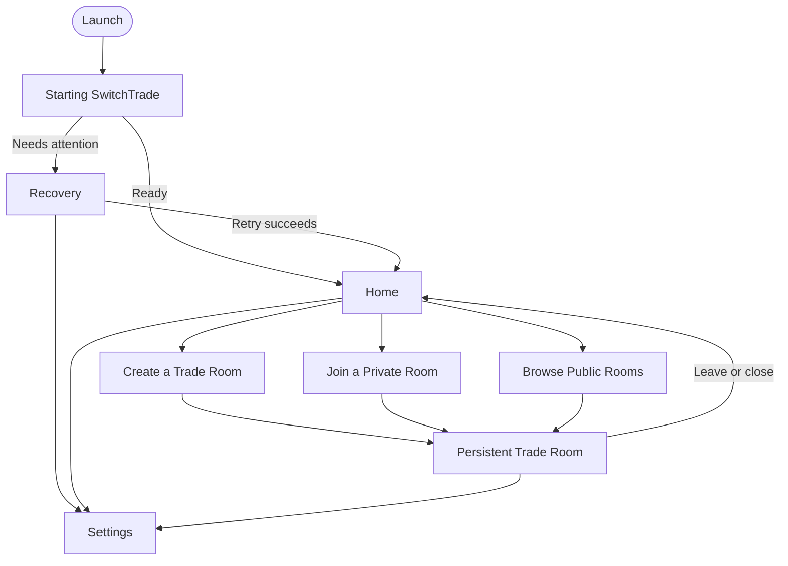
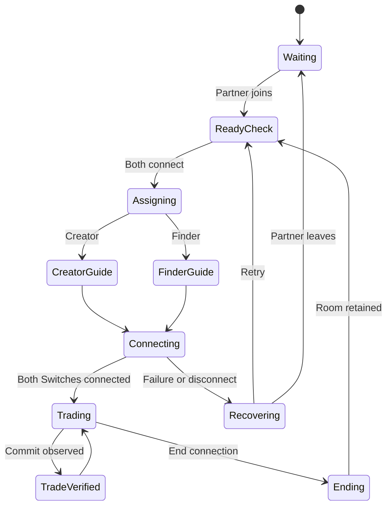

# SwitchTrade Stitch Dark UI — exact native integration handoff

**Prepared:** 2026-08-26
**Repository:** `mwl313/mwl-SwitchTrade`
**Branch:** `production-beta`
**Audited HEAD:** `f00726e17602ee867dee1eefa6a1bfe775179d02`
**Design package to attach beside this document:** `stitch_switchtrade_multiplayer_hub (1).zip`

This is an implementation brief for Codex. It is intentionally self-contained. Read it completely before editing the repository.

---

# 0. Mandatory Codex directive

Integrate the attached Google Stitch dark redesign into the current native Windows SwitchTrade application and reproduce its visual design as closely as WPF permits. This is not an HTML, WebView, Electron, or browser implementation. Translate the design into native WPF XAML, shared resources, view models, and the existing service architecture.

The export contains only eight static happy-path mockups. It is not a complete application and it is not functionally authoritative. Preserve the existing real product functionality, create every missing screen and state listed in this document using the same visual grammar, and correct every fabricated or contradictory item called out below.

The target is a **non-demo application**. Remove release-visible `Demo` and `Preview` labels and eliminate the release paths that generate local sample rooms or sample parties. However, do not make fixtures look live by changing their labels. Public Rooms may lose its demo labels only after it is backed by a real authoritative public directory, real publishing, real occupancy, and real joining. If that end-to-end capability cannot be completed safely, hide or capability-gate Public Rooms in the non-demo build and report the blocker. A cosmetically relabeled fixture directory is prohibited.

Do not regress the authoritative private-room service, automatic Switch-room role assignment, passive party observer, verified trade-commit reporting, hardware selection, diagnostics, support bundle, close/leave safety, High Contrast, reduced motion, keyboard support, DPI behavior, or persistent Trade Room ownership already present in `production-beta`.

Before editing:

1. Fetch and inspect the latest `production-beta`; do not assume the audited SHA is still HEAD.
2. Record the exact baseline SHA and any uncommitted user changes.
3. Preserve unrelated or overlapping user changes; do not reset the worktree.
4. Read the repository contracts and current implementation listed in section 2.
5. Extract and inspect all eight PNGs, all eight HTML files, and `DESIGN.md` from the attached ZIP.
6. Return a short baseline/gap report, then continue with the implementation unless a genuine product-contract or permission blocker exists.

Do not stop after restyling the eight represented screens. The task is complete only when the entire native app—including the missing states, dialogs, settings, failure paths, and responsive/accessibility variants—uses the new visual system and all visible data is truthful.

---

# 1. Outcome and non-negotiable principles

The finished application must feel like one coherent, polished Windows companion for connecting two players—not a generic AI dashboard, admin console, crypto product, developer tool, or web page placed inside a desktop window.

The required outcome is:

- the attached screenshots are recognizably reproduced in native WPF;
- the dark graphite palette, green action color, supporting blue, Linkline, typography, tonal depth, and compact geometry are retained;
- every current real function remains available;
- every missing screen/state is designed from the same system;
- every action is wired to real commands and authoritative state;
- public rooms are real or absent, never disguised fixtures;
- motion is reactive and polished but never distracting;
- the app remains fully usable at `960 × 700`, Windows 100–200% scaling, High Contrast, keyboard-only input, and reduced motion;
- no CDN, remote font, hotlinked image, browser runtime, or network-delivered UI asset is required.

## 1.1 Product character

Use these words to guide judgment:

- calm;
- precise;
- welcoming;
- modern;
- dark and refined;
- efficient;
- visually memorable;
- player-friendly;
- technically trustworthy;
- subtly reactive.

Do not optimize for “power users,” “laboratory instruments,” “high-density telemetry,” or “raw data.” Those phrases in the Stitch `DESIGN.md` are not product requirements. Technical detail belongs behind Settings, Help, or a collapsed Details disclosure.

## 1.2 Functional truth outranks literal mockup copy

Use this priority whenever sources conflict:

1. Security, privacy, and server authority.
2. The current repository contracts and real runtime behavior.
3. This handoff’s explicit corrections and missing-state requirements.
4. The PNG screenshots for visual composition.
5. `DESIGN.md` for design tokens.
6. The exported HTML for measurements and interaction hints.

The PNGs are the primary visual reference, but a screenshot is never permission to display invented state, credentials, latency, names, avatars, logs, or success.

## 1.3 Meaning of “replicate exactly”

Exact replication means:

- exact color tokens where this document gives a hex value;
- the same hierarchy, density, alignment, two-column relationships, whitespace rhythm, panel proportions, and visual emphasis as the reference PNG;
- the same typography families, sizes, weights, and line heights after local fonts are bundled;
- the same 4–8 DIP control geometry and restrained 1px outlines;
- the same role of green, blue, and You/Partner colors;
- the same 2 × 3 party-grid structure;
- the same Linkline visual motif;
- equivalent native icons and locally owned imagery;
- equivalent native behavior for hover, focus, pressed, loading, disabled, success, and error states.

It does **not** mean:

- shipping Tailwind, HTML, JavaScript, Google Fonts requests, Material Symbols requests, or a WebView;
- reproducing fake values or unsupported claims;
- copying browser scrollbars or inconsistent mockup title bars;
- breaking accessibility to achieve a pixel match;
- introducing copyrighted or hotlinked image assets that are not licensed and stored in the repository;
- splitting one persistent Trade Room into unrelated pages merely because Stitch exported separate snapshots.

---

# 2. Source authority and repository baseline

## 2.1 Required repository reading order

Codex must inspect the latest versions of:

1. `docs/54-native-ui-flow-and-runtime-structure-20260825.md`
2. `docs/58-authoritative-room-control-event-contract-v1-20260825.md`
3. `docs/59-party-snapshot-and-trade-commit-contract-v1-20260825.md`
4. `docs/60-external-consent-and-statistics-contract-v1-20260825.md`
5. `docs/61-private-beta-release-baseline-20260825.md`
6. `docs/64-second-native-ui-overhaul-implementation-report-20260825.md`
7. `docs/67-hardware-support-expansion-20260826.md`
8. `docs/69-repository-preflight-completion-and-relay-handoff-20260826.md`
9. `docs/70-private-beta-support-and-recovery-guide-20260826.md`
10. `apps/desktop/README.md`

Then inspect the current implementation, especially:

- `apps/desktop/SwitchTrade.Desktop/App.xaml`
- `apps/desktop/SwitchTrade.Desktop/MainWindow.xaml`
- `apps/desktop/SwitchTrade.Desktop/MainWindow.xaml.cs`
- `apps/desktop/SwitchTrade.Desktop/Models/AppModels.cs`
- `apps/desktop/SwitchTrade.Desktop/State/ActiveTradeRoomCoordinator.cs`
- `apps/desktop/SwitchTrade.Desktop/Services/ControlApiClient.cs`
- `apps/desktop/SwitchTrade.Desktop/Services/DesktopServices.cs`
- `apps/desktop/SwitchTrade.Desktop/Services/PublicRoomPreviewProvider.cs`
- all files under `apps/desktop/SwitchTrade.Desktop/ViewModels/`
- all files under `apps/desktop/SwitchTrade.Desktop/Views/`
- all files under `apps/desktop/SwitchTrade.Desktop/Themes/`
- `switchtrade/control.py`
- `switchtrade/party_observer.py`
- `relay/authority.py`
- `relay/server.py`
- relevant tests under `tests/`

## 2.2 Verified state at the audited SHA

At `f00726e17602ee867dee1eefa6a1bfe775179d02`, the application already has:

- a native `.NET 10` WPF desktop client;
- startup and typed recovery;
- Home, Create, Join Private, Public Rooms, a persistent Trade Room, and Settings;
- a four-axis readiness popover;
- authoritative two-member private Trade Rooms;
- exactly six-character alphanumeric room codes;
- owner/member close and leave semantics;
- both players using `Connect this Switch`, followed by authoritative automatic Creator/Finder role assignment;
- a coordinator-owned Trade Room that survives navigation to Settings;
- connection preparation, cancellation/stop, and recovery plumbing;
- passive party observation and checksum-qualified party projections;
- two 2 × 3 party grids and an inline selected-Pokémon detail panel;
- verified trade-commit events after save;
- USB Wi-Fi selection, support profiles, read-only diagnostics, and adapter repair;
- redacted support bundle generation;
- High Contrast, reduced-motion detection, keyboard navigation, and adaptive WPF layouts.

These are implementation assets to preserve and improve. Do not replace them with static mock behavior.

## 2.3 The important current limitation

Public Rooms is still a fixture-only preview at the audited SHA:

- `PublicRoomPreviewProvider` returns hard-coded `demo-*` rooms and sample parties;
- `PublicRoomsScreenViewModel` searches and sorts only that in-memory list;
- Refresh only reapplies local filters;
- public Create calls `OpenDemoRoom` instead of publishing;
- `ControlApiClient.CreateTradeRoomAsync` hardcodes `visibility = "private"`;
- `relay.server.CreateRoomPayload` accepts only `Literal["private"]`;
- the production authority has no public-directory listing/join route;
- legacy `/api/groups/public` is explicitly `local_demo` and is not a production foundation.

Therefore the non-demo UI cannot be completed by deleting words. Section 12 defines the required real Public Rooms capability.

---

# 3. Stitch package audit

The ZIP contains exactly eight standalone HTML mockups, eight matching PNGs, and one `DESIGN.md`. It contains no router, shared component library, local fonts, local icons, transition model, Settings, recovery screens, dialogs, or complete state set.

| Folder | PNG size | What it represents | What it actually implements |
|---|---:|---|---|
| `starting_switchtrade` | 1600 × 1280 | Startup/loading | Static snapshot only |
| `switchtrade_home_ready` | 1280 × 886 | Ready Home | Static; actions are inert |
| `create_a_trade_room` | 1280 × 701 | Create form | Toggle/counters only; submit is prevented |
| `join_a_private_room` | 1280 × 571 | Private code entry | Fake timed success simulation |
| `browse_public_rooms_demo` | 1600 × 1329 | Public list/details | Entirely static fixtures |
| `trade_room_waiting` | 1280 × 948 | Waiting room | Entirely static, fabricated data |
| `trade_room_creator_role` | 1280 × 839 | Creator guidance | Entirely static, fabricated log |
| `trade_room_connected` | 1280 × 637 | Connected parties | Entirely static, success fused incorrectly |

Create and Join are cropped references rather than complete normal-window layouts. The export does not provide the required default `1240 × 860` and compact `960 × 700` native views. Codex must create and capture those variants.

## 3.1 What to preserve from Stitch

- dark graphite tonal layering;
- compact native-utility geometry;
- strong Home hero and clear action priority;
- Create’s wide two-column composition;
- Join’s focused six-cell code presentation;
- Public Rooms’ list/details relationship;
- Waiting’s two-endpoint Linkline composition;
- Creator’s central Switch/network guidance card;
- Connected’s side-by-side 2 × 3 party grids;
- restrained green glow for genuine active state;
- Space Grotesk, Inter, and Space Mono hierarchy;
- You blue and Partner teal identity cues.

## 3.2 What must not be copied

- seven inconsistent shell/header implementations;
- fake custom window controls unless native behavior is fully implemented;
- HTML/Tailwind/JavaScript structure;
- inert controls;
- demo/sample behavior;
- fake diagnostics, environment, build, node, log, port, latency, friend code, avatar, or trainer values;
- `My Trades` or a permanent navigation bar;
- Host/Guest/Client terminology;
- unsupported games;
- unsupported security claims;
- continuous decorative animation in an idle state;
- remote Google-hosted fonts, icons, joystick image, or creature silhouettes;
- the broken `20mp` Material Symbols text;
- mobile sidebars, sheets, or a mobile application.

Also do not invent modules that neither the current product nor its contracts require. In particular, do not add `My Trades`, a trade-history dashboard, a desktop `Confirm Trade` action, wallet/transaction controls, analytics cards, a Privacy tab without a real setting, a standalone Hardware scene, raw log consoles, player profiles, avatars, Nintendo friend codes, chat, or social features. Hardware remains inside Settings → Connection/Advanced, and the actual trade is confirmed on the Switch—not in the desktop app.

---

# 4. Final information architecture

Use a single persistent native shell and focused scenes. No permanent sidebar is required.



Within the Trade Room, do not navigate through separate disposable pages. Project authoritative state into a stable shell:



Stable Trade Room regions must not disappear across those states:

- room name;
- Private/Public status;
- truthful occupancy/partner status;
- room code and copy/invitation actions where allowed;
- You and Partner endpoints;
- Linkline state;
- owner `Close Trade Room` or member `Leave Trade Room` action;
- Settings access;
- current recovery/safety context.

Only the central instruction, party area, status notice, and bottom action change with state.

---

# 5. Binding terminology and product voice

## 5.1 Required user-facing terminology

| Do not expose | Use instead |
|---|---|
| Group | Trade Room |
| Configuration | Settings |
| Host / Guest / Client | You / Partner |
| Host endpoint / Guest endpoint | Hide; describe the player action |
| Backend | SwitchTrade or online service |
| Radio and tunnel | Connection |
| Session ID | Hide; show only in technical details when needed |
| Certified | Supported |
| Experimental profile | Test-only adapter, inside Advanced/Connection only |
| Public Preview | Public room, only after real publishing exists |
| Preview Trade Room | Join Trade Room |
| Demo Preview | Remove from non-demo UI |

Distinguish:

- **Trade Room:** the two-person space inside SwitchTrade;
- **room on your Switch:** the room created or found inside the game.

## 5.2 Voice rules

- Write short, direct, calm sentences.
- Tell the player what happened and what to do next.
- Use technical nouns only in collapsed Details or Settings.
- Never blame the player.
- Never claim encryption, verification, availability, occupancy, identity, latency, or success without authoritative evidence.
- Do not use all caps for prose. Reserve the all-caps mono style for short labels of one to three words.
- Preserve Pokémon spelling and typographic apostrophes.
- Do not say `Trade verified` merely because the connection became active.

Examples:

- Good: `Your partner is reconnecting. We’ll keep their place.`
- Good: `Party details aren’t available right now. Trading can continue.`
- Good: `We couldn’t find that Trade Room. Check the code and try again.`
- Bad: `RFU TUNNEL ENDPOINT FAILURE`.
- Bad: `Initializing listener on port 49152` in normal UI.

---

# 6. Exact visual system

## 6.1 Color tokens

Create a default dark resource dictionary and use semantic brush names throughout XAML. Do not scatter literal colors through views.

| Semantic token | Hex | Required use |
|---|---:|---|
| `Canvas.Deepest` | `#0E0E0E` | Inset fields, deepest panels, overlay scrim foundation |
| `Canvas.Base` | `#131313` | Main window and scene background |
| `Surface.Low` | `#1C1B1B` | Low-emphasis sections |
| `Surface.Container` | `#201F1F` | Primary cards and work surfaces |
| `Surface.Elevated` | `#2A2A2A` | Hover/elevated surface |
| `Surface.Highest` | `#353534` | Selected or strong tonal state |
| `Surface.Bright` | `#3A3939` | Rare strongest dark surface |
| `Text.Primary` | `#E5E2E1` | Titles and body text |
| `Text.Secondary` | `#B9CCB2` | Descriptions and metadata |
| `Outline.Strong` | `#84967E` | Strong input/control boundary |
| `Outline.Muted` | `#3B4B37` | Standard 1px dividers/outlines |
| `Action.Green` | `#00E639` | Primary action, focus, genuine active state |
| `Action.GreenBright` | `#00FF41` | Rare emphasized active/brand signal |
| `Action.GreenSoft` | `#72FF70` | Light green accent on dark surfaces |
| `Action.OnGreen` | `#002203` | Text/icon on filled green controls |
| `Info.Blue` | `#ADC6FF` | Secondary navigation and technical support metadata |
| `Info.BlueContainer` | `#2C4677` | Blue tonal badge/container |
| `Info.OnBlueContainer` | `#D8E2FF` | Text on blue container |
| `Identity.You` | `#007BFF` | You endpoint, line segment, non-text marker |
| `Identity.Partner` | `#008080` | Partner endpoint, line segment, non-text marker |
| `Error.Text` | `#FFB4AB` | Error text/icon |
| `Error.Container` | `#93000A` | Error container |
| `Error.OnContainer` | `#FFDAD6` | Text on error container |

Rules:

- Use tonal shifts, not large drop shadows, for depth.
- Most boundaries are `1 DIP`.
- Primary green is scarce. It marks the single primary action, keyboard focus, connection activity, or verified success.
- Do not make every icon and label green.
- The Stitch Partner teal is insufficient for small text on the base background. Use a teal dot/bar plus `Text.Primary` or `Text.Secondary` for small labels; do not use `#008080` as 11px text.
- Empty-slot text must use a legible secondary color; do not reproduce the nearly invisible `#2A2A2A` text.
- All normal text and controls must meet WCAG 2.2 AA. Non-text state cues require at least 3:1 contrast.

## 6.2 Typography

Bundle all fonts locally in the application package with their licenses and attribution. Do not request them from Google at runtime.

| Style | Family | Size / line height | Weight | Tracking |
|---|---|---:|---:|---:|
| `Heading.XL` | Space Grotesk | 32 / 40 | 700 | `-0.02em` equivalent |
| `Heading.M` | Space Grotesk | 24 / 32 | 600 | `-0.01em` equivalent |
| `Heading.S` | Space Grotesk | 18 / 24 | 600 | normal |
| `Body.L` | Inter | 16 / 24 | 400 | normal |
| `Body.M` | Inter | 14 / 20 | 400 | normal |
| `Body.S` | Inter | 12 / 18 | 400 | normal |
| `Code.Data` | Space Mono | 14 / 20 | 400 | normal |
| `Label.Caps` | Space Mono | 11 / 16 | 700 | approximately `0.06em` |
| `Heading.Compact` | Space Grotesk | 24 / 32 | 700 | normal |

Use Space Mono only for room codes, short state labels, precise numeric values, and compact technical details. Do not turn body copy into a terminal. The Stitch “mobile” heading token becomes compact-desktop behavior; there is no mobile app in this scope.

If font licensing or packaging prevents these exact families, stop and report that specific blocker before silently substituting fonts. A fallback capture must be approved because it materially changes visual parity.

## 6.3 Geometry and spacing

The screenshots, not the contradictory radius prose in `DESIGN.md`, are authoritative.

| Token | Value |
|---|---:|
| Baseline unit | 4 DIP |
| Standard gutter | 16 DIP |
| Standard outer margin | 24 DIP |
| Compact outer margin | 12 DIP |
| Divider | 1 DIP |
| Minimum target | 44 × 44 DIP |
| Input/small control radius | 4–6 DIP |
| Standard button/panel radius | 8 DIP |
| Major Linkline/overlay radius | 12 DIP |
| Content maximum | 1080 DIP |
| Default window | 1240 × 860 DIP |
| Minimum supported window | 960 × 700 DIP |

Use a 12-column relationship for the wide Create form, approximately 7 columns for required Room Details and 5 columns for Trade Context. Use fixed column gaps based on 16/24 DIP, not percentage margins copied from the browser.

## 6.4 Elevation and glow

- Standard cards: `Surface.Container`, 1px `Outline.Muted`, 8px radius.
- Inset inputs: `Canvas.Deepest`, 1px muted/strong outline.
- Hover: raise one tonal tier, without moving surrounding layout.
- Active/focus: green outline and, only where useful, an 8px green glow at 20% opacity.
- Dialogs/popovers: tonal elevation plus a restrained shadow that remains readable in High Contrast.
- Never combine large blur, neon bloom, glass, gradients blobs, and glow.

## 6.5 Icons and imagery

The export does not bundle Material Symbols, the joystick image, creature silhouettes, or the startup background. Do not hotlink them.

- Implement a coherent local 20/24 DIP WPF vector icon set in `Themes/Icons.xaml` or an equivalent shared dictionary.
- Use 1.5–1.75 DIP rounded strokes and consistent optical sizing.
- Provide accessible names on icon-only controls.
- Use the repository’s approved SwitchTrade mark for branding. Do not use the financial `currency_exchange` glyph as the product logo.
- For party slots, use repository-owned and licensed sprites/silhouettes if they exist. Otherwise use a neutral original silhouette or typographic species initial that preserves the reference composition.
- Do not ship remote `googleusercontent.com` assets.
- Do not use emoji as icons.

## 6.6 Native window chrome

The mockups disagree about title bars. Use one implementation.

Preferred rule: keep correct native Windows chrome and place the consistent SwitchTrade shell inside the client area. This is an allowed visual exception because resize, system menu, Snap Layouts, keyboard behavior, DPI, and accessibility are more important than reproducing a fake browser title bar.

If custom chrome is retained, it must correctly support:

- dragging and double-click maximize/restore;
- resize borders and all resize cursors;
- Minimize, Maximize/Restore, Close;
- Windows 11 Snap Layouts;
- `Alt+Space` system menu;
- `Alt+F4` close handling;
- High Contrast;
- 100–200% scaling;
- correct hit testing and automation names.

Do not create decorative window buttons that are not native-functional.

---

# 7. Motion and reactive behavior

Motion should explain cause and state, not run as background decoration. The design must feel responsive without making the trading workflow tiring.

## 7.1 Motion tokens

| Token | Duration | Easing | Use |
|---|---:|---|---|
| `Motion.Instant` | 0 ms | none | Reduced Motion replacement |
| `Motion.Fast` | 90 ms | cubic-out | Pressed/hover color and 1 DIP translation |
| `Motion.Standard` | 160 ms | cubic-out | Focus, selection, inline reveal |
| `Motion.Scene` | 200 ms | cubic-out | Scene content transition |
| `Motion.Panel` | 220 ms | cubic-out | Details pane, popover, dialog |
| `Motion.Status` | 280 ms | cubic-in-out | Linkline state/color transition |

Use WPF easing equivalents and freeze completed animations so they do not continue consuming resources.

## 7.2 Required component reactions

Buttons:

- Hover: one tonal tier brighter and/or border stronger in 90 ms.
- Pressed: translate content down by 1 DIP, darken overlay, return immediately on release.
- Keyboard focus: 2 DIP visible focus ring outside the control, without changing size.
- Busy: keep the original label, add a 16 DIP spinner, disable duplicate invocation, preserve width.
- Disabled: no glow, normal arrow cursor, still readable, and explain why through adjacent copy or HelpText.

Cards and list rows:

- Hover/focus: raise one tonal tier and reveal the interactive boundary.
- Selected: persistent green/blue edge plus non-color selection indicator.
- Do not scale large cards on hover; it causes visual instability.

Scene changes:

- Fade and translate the new content by at most 6 DIP over 200 ms.
- Do not animate the persistent shell or Trade Room identity regions.
- Restore focus only after the transition completes.

Linkline:

- Idle/Waiting: static dashed or interrupted line; no endless travelling dash.
- Preparing/Connecting: a bounded moving highlight may run while the real state is pending.
- Connected: settle into a static or very subtle stable gradient; do not run a permanent 2-second sweep.
- Recovery: change to warning/error semantics and stop celebratory motion.

Success and copy feedback:

- Copy toast enters over 160 ms, remains long enough to read, then exits without shifting layout.
- Trade-verified notice appears only for a new commit event and may use one restrained checkmark reveal.
- Do not pulse the Ready status indefinitely.

## 7.3 Reduced Motion

When Windows animation settings indicate reduced motion:

- replace all spatial scene transitions with an immediate swap or short opacity change;
- remove spinners that rely only on rotation and pair any remaining progress indicator with text;
- stop dash, scanline, pulse, bounce, gradient, and glow animations;
- retain state changes through color, icon, text, and outline;
- never delay focus for an animation that no longer runs.

The export’s 1s spinner, 2s/3s pulses, 20s dash, 4s scanline, bounce dots, and 2s connected gradient are reference ideas only; do not copy them as permanent loops.

---

# 8. Persistent application shell

Create one shell shared by all normal scenes.

## 8.1 Top row

- Left: SwitchTrade wordmark/mark.
- Right: readiness status action, then Settings.
- Readiness is a status control, not an `I’m ready` action.
- Use the green status only when the aggregate readiness projection is genuinely ready.
- The header background is `Canvas.Base` or `Surface.Low`, with a 1px bottom divider.

## 8.2 Reserved navigation row

- Keep a reserved row beneath the header so scene content does not jump when Back appears.
- Back is hidden/disabled on Home and shown on safe subordinate scenes.
- `Alt+Left` invokes the same safe navigation behavior.
- Back must not abandon or implicitly close an active Trade Room.

## 8.3 Readiness popover

Create the missing Stitch-style dark popover using the same tonal surfaces and 8/12 DIP geometry. It must show:

- Control service;
- Online relay;
- Switch radio;
- Trade session.

Each row has a text status and non-color indicator. Do not expose endpoints, process IDs, ports, run counters, or raw exceptions. Provide a clear Settings/Check action when attention is required.

## 8.4 Active Trade Room ownership

The active room belongs to a long-lived coordinator/app state, not to whichever scene is visible. Opening Settings must not dispose it. Returning from Settings must restore the exact room phase, selected party state where safe, and pending operation.

Window close, Back, Close Room, Leave Room, and End Connection must all use the same authoritative teardown rules. There must be no path that bypasses confirmation merely by navigating to Settings first.

## 8.5 Adaptive behavior

At wide/default size:

- maximum content width 1080 DIP;
- content centered within available client width;
- Public Rooms uses list/detail split;
- Create uses 7/5 columns;
- party grids are side by side, You left and Partner right.

At `960 × 700` or equivalent compact content width:

- outer margin becomes 12–16 DIP;
- headings use `Heading.Compact` where necessary;
- Create columns stack with Room Details first;
- Public details open as an in-scene overlay/drawer and return focus to the selected row when closed;
- party grids stack with **Partner above You**, matching the established compact ownership rule;
- sticky primary actions remain visible without covering focused controls;
- no horizontal scroll is permitted;
- technical metadata may wrap or collapse into Details.

This is compact desktop behavior, not a mobile redesign.

---

# 9. Component system

Build shared WPF components/styles before restyling individual scenes.

## 9.1 Required shared components

Shell and navigation:

- `AppShell`
- `SceneHeader`
- `BackButton`
- `ReadinessButton`
- `ReadinessPopover`
- `ToastHost`
- `DialogHost`

Actions:

- `PrimaryButton`
- `SecondaryButton`
- `TextButton`
- `IconButton`
- `DangerButton`
- `AsyncButton`
- `NavigationActionCard`

Forms:

- `FieldShell`
- `TextField`
- `RoomCodeInput`
- `SearchField`
- `ComboField`
- `SegmentedControl`
- `FilterBar`
- `FilterDrawer`
- `CharacterCounter`
- `InlineValidation`

State and content:

- `StatusBadge`
- `InlineNotice`
- `LoadingState`
- `EmptyState`
- `RecoveryPanel`
- `DetailsDisclosure`
- `RoomListRow`
- `RoomDetailsPane`
- `RoomCodeCard`
- `LinklineControl`
- `PlayerEndpoint`
- `ConnectionStageCard`
- `PartyGrid`
- `PokemonSlot`
- `PokemonQuickSummary`
- `PokemonDetailsPanel`
- `TradeVerifiedNotice`

## 9.2 Required component states

Every interactive component must have a documented and testable state board for:

- rest;
- hover;
- keyboard focus;
- pressed;
- selected;
- busy/loading;
- disabled;
- validation error;
- success where applicable;
- High Contrast;
- Reduced Motion.

No screen may create a one-off button or field visual that bypasses the shared state system.

## 9.3 Focus and automation

- Minimum target: 44 × 44 DIP.
- `Tab` order follows visual order.
- `Enter`/`Space` activates controls.
- Every icon-only action has `AutomationProperties.Name`.
- Status changes use polite live announcements; blocking failures use assertive announcements once.
- Polling must not make a screen reader repeat unchanged state.
- Disabled actions expose a reason via adjacent text or `AutomationProperties.HelpText`.
- Hover-only information must also be available by keyboard focus and click/Enter.

---

# 10. Screen-by-screen implementation specification

## 10.1 Starting SwitchTrade

Visual target: reproduce `starting_switchtrade/screen.png`—centered product mark, large title, restrained explanatory line, and a precise loading indicator on the dark layered canvas.

Required corrections:

- Replace the financial `currency_exchange` icon with the approved SwitchTrade mark.
- Remove the nonexistent `url('placeholder')` background or replace it with a repository-owned, very subtle texture that does not reduce contrast.
- Remove `v2.4.1-beta (build 8492)`, `env: production`, and `node: st-ny-edge-01`.
- Do not show `SYSTEM_STATUS Ready` while the title says Starting.
- Bind visible progress to the actual readiness stages.
- Use one native window/chrome implementation.

Recommended truthful copy:

- Title: `Starting SwitchTrade`
- Body: current stage, such as `Preparing the local SwitchTrade service…`
- Optional stage labels only when real: `Starting local service`, `Connecting online`, `Checking your Wi-Fi adapter`.

Behavior:

- Transition to Home only when required readiness is satisfied.
- Transition to Startup Recovery on a typed terminal failure or bounded timeout.
- Do not flash Home before recovery.
- Announce only stage changes.

## 10.2 Startup Recovery — missing design

Create this screen from the Startup palette and card grammar.

Layout:

- same centered max-width and quiet canvas as Startup;
- error/warning icon inside a compact tonal badge;
- `SwitchTrade couldn’t start` as the H1;
- one-sentence cause;
- one primary recovery action;
- optional secondary action to Settings → Connection when the failure is adapter/radio-related;
- collapsed `Technical details` disclosure;
- support code and Copy only for actionable fatal errors.

Required variants:

| Failure | Main copy | Primary action |
|---|---|---|
| Local service unavailable | `The installed SwitchTrade service didn’t respond.` | `Try again` or `Repair setup` according to the contract |
| Version mismatch | `SwitchTrade and the installed service need the same version.` | `Update SwitchTrade` / contract action |
| Relay unavailable | `Online rooms are temporarily unavailable.` | `Try again` |
| Adapter problem | `SwitchTrade needs a supported Wi-Fi adapter.` | `Open Connection settings` |
| Session problem | `The last connection needs attention before another trade can start.` | Contract-provided recovery action |

Remove the release action `View interface preview`. A recovery screen must never enter a fake usable product route.

## 10.3 Home — Ready

Visual target: preserve the Home hero and its clear three-action hierarchy.

Required structure:

- H1: `Trade Pokémon with another trainer`.
- Supporting sentence: `Create a Trade Room, share a code, and connect both Switches.`
- Primary large action: `Create a Trade Room`.
- Secondary action: `Browse Public Rooms`, only when `publicDirectory.v1` is truly available.
- Separate secondary action: `Join a Private Room`.

Corrections:

- Remove `Demo Preview`.
- Remove the accidental `20mp` element.
- Do not embed a text input inside the Join action card.
- Do not show the eight-character placeholder `1234-5678`.
- Clicking Join navigates to the dedicated Join scene.
- `Ready` in the header remains a status/popover action, not a room-readiness command.
- Avoid infinite idle pulse.

## 10.4 Home — Needs Attention

Create the missing degraded variant with the same composition.

- Keep the hero visible.
- Show one inline warning beneath it with the actual failed readiness axis.
- Disable only actions that cannot work.
- Public Rooms may remain available only if its required services are available independently and the contract permits it.
- Provide one emphasized remedy: `Try again`, `Open Settings`, or `Repair setup` according to the typed recovery action.
- Do not route to a preview UI.

## 10.5 Create a Trade Room

Visual target: reproduce the wide Stitch 7/5 form composition, dark inset fields, segmented Private/Public control, section icons, character counters, and bottom action.

Required fields:

- Room name — required, max 22 unless the latest contract intentionally changes it;
- Trainer display name — required, max 20 unless the latest contract intentionally changes it;
- Game — required, FireRed or LeafGreen;
- Language — required, English/Japanese/French/Italian/German/Spanish;
- Offering — optional, max 80;
- Looking for — optional, max 80;
- Short note — optional, max 120.

Initial selection rules:

- Private is selected by default.
- Game and Language begin unselected unless a persisted user preference is explicitly supported.
- The primary action stays disabled until required fields are valid.

Private mode:

- Label: `PRIVATE`.
- Submit: `CREATE TRADE ROOM` or sentence-case equivalent consistent with the reference component.
- Room is unlisted and joined by a six-character code.
- Offering, Looking for, and Note may be used in copied invitation text as currently contracted; do not imply public publication.

Public mode:

- Label: `PUBLIC`, never `PUBLIC (PREVIEW)`.
- Submit: `CREATE TRADE ROOM`.
- Explain that the room name, trainer display name, game, language, offering, wanted, and note fields shown in the public directory will be published.
- Do not display the private-only sentence `They are not published publicly` in Public mode.
- Submit calls the real public publishing path defined in section 12.
- Do not allow Public selection if the server capability is unavailable; hide or disable it with truthful HelpText.

Validation/busy/error:

- Validate after interaction and on submit; do not start with a wall of errors.
- Character counters turn error-colored only when the limit is exceeded, not merely when it is reached.
- Busy keeps the submit label and adds a spinner.
- Preserve all entered data after a recoverable error or navigation to Settings.
- Put the error near the action and focus the first invalid field or error summary.
- The sticky action bar must not cover fields at 200% scaling.

## 10.6 Join a Private Room

Visual target: keep the focused six-cell code composition from Stitch, with the main card centered and visually quiet.

Implement it as one logical accessible room-code control even if six visual cells are used.

Behavior:

- Normalize uppercase.
- Remove spaces and hyphens on input/paste.
- Accept exactly six ASCII alphanumeric characters.
- Allow typing continuously without requiring manual per-cell focus.
- Backspace crosses cells naturally.
- Pasting into any cell fills from the start.
- Provide a visible `Paste` action.
- The entire code has one accessible name and value; screen readers must not hear six unrelated unlabeled fields.
- `Join Trade Room` enables only when the normalized value is six characters and the required service is available.

Remove:

- `Private rooms are end-to-end encrypted.` The current system does not establish that claim.
- fake timed success;
- any eight-character example.

Required states/copy:

| State | Required behavior/copy |
|---|---|
| Incomplete | Neutral cells; Join disabled |
| Valid local shape | Green focus/valid treatment; Join enabled |
| Busy | Input locked, original label plus progress, duplicate submit blocked |
| Not found | `We couldn’t find that Trade Room. Check the code and try again.` |
| Full | `This Trade Room already has two players.` |
| Closed/expired | `This Trade Room is no longer available.` |
| Relay unavailable | `Online rooms are temporarily unavailable.` |
| Local service unavailable | Direct player to Recovery/Settings |
| Timeout | Preserve code and offer `Try again` |

After failure, focus the error summary and then allow a single Tab back to the code control. Never silently reserve a seat merely by resolving a code; only the authoritative join action should join.

## 10.7 Browse Public Rooms

Visual target: retain the dark master/detail layout, compact result rows, filter controls, and proposal hierarchy from Stitch. Replace every sample value with real directory data.

Wide layout:

- Header and short explanatory copy.
- Search field and `Search by` selector.
- Filter/sort row.
- Left results pane.
- Right selected-room details pane.
- Primary action: `Join Trade Room`.

Search by:

- Any field;
- Room name;
- Trainer display name;
- Pokémon offered;
- Pokémon wanted.

Filters:

- Availability: Open only / All;
- Game: Any / FireRed / LeafGreen;
- Language: Any plus supported languages;
- optional broad region only when supplied with explicit user consent and privacy-safe granularity;
- Sort: Best match / Recently opened;
- Lowest latency only when a real, defined, current measurement exists. Otherwise remove it.

Each result row may show only authoritative or explicitly supplied fields:

- Open / Full / Connecting where the directory contract supports it;
- room name;
- trainer display name;
- FireRed/LeafGreen;
- language;
- Offering and Looking for;
- privacy-safe broad region, if opted in;
- `1 of 2` or `2 of 2` authoritative occupancy;
- recent/opened time if returned by the service.

Remove:

- `Demo Preview`;
- the sample-data notice;
- `Preview Trade Room`;
- `My Trades`;
- the extra Home/Browse navigation strip;
- `24 Active Rooms` unless it equals a real server result count;
- fake `42ms`, `120ms`, or any latency value without a real measurement;
- `Relay Node: us-east-1`;
- Emerald;
- fake room/trainer data.

Required states:

- initial loading skeleton/progress;
- refreshing while preserving the current list;
- loaded with results;
- loaded with no results;
- server unavailable with Retry;
- stale selected result;
- room became full during join;
- room closed during join;
- join in progress;
- join succeeded and opens the persistent Trade Room;
- compact filter drawer;
- compact room-details overlay.

Keyboard:

- `Ctrl+K` focuses search;
- Up/Down moves through results;
- Enter opens/joins according to the currently focused action;
- Escape closes details/filter overlays before navigating back;
- focus returns to the originating result row.

## 10.8 Settings — missing Stitch screens

Create Settings in the same dark tonal system. Keep the existing three sections and behavior.

Wide layout may use a compact left section rail or top tabs; compact layout uses a space-efficient tab/selector. Do not create a permanent app sidebar.

### Connection

- aggregate local setup state;
- detected USB Wi-Fi adapter selector;
- support/test-only/quarantined status with plain-language explanation;
- `Use selected adapter`;
- hardware profiles;
- collapsed technical details;
- diagnostic profile;
- `Run read-only diagnostics`;
- diagnostic result/path;
- `Check again`;
- adapter repair entry when contract-provided.

Do not put raw USB IDs in the normal primary row when a friendly name exists. Technical identifiers belong in Details.

### Support

- purpose text for a redacted support file;
- `Create support file` busy/success/error states;
- resulting file location;
- `Copy location` with toast;
- Issues/support link;
- About SwitchTrade with version derived from assembly/package metadata;
- contract versions where useful.

The actual `0.2.0-beta.1` label may remain while the product is truly a beta. `Beta` is a release channel, not a Demo/Preview tag. Do not hardcode a fake future version.

### Advanced

- warning for test-only hardware;
- read-only host/AP engine and runtime information;
- unavailable/in-development items clearly non-selectable;
- no permanent logs or terminal simulation;
- normal trading should not require this section.

Opening Settings during an active room or connection must retain the active state and must not create a close-confirmation bypass.

## 10.9 Persistent Trade Room — foundation

Use `trade_room_waiting/screen.png` as the visual foundation, corrected as follows:

- bind the room name; do not use `Alpha Sapphire Trade` unless it is actual user input, and do not imply unsupported games;
- show `Private` or `Public` from authoritative state;
- bind truthful occupancy/status;
- show the real six-character code, for example `A7K9Q2`, not `TRD-9021-X`;
- show `You` and `Partner`, not fake personas;
- remove avatar and Nintendo friend-code assumptions;
- keep Copy code and Copy invitation functional;
- show owner `Close Trade Room` and member `Leave Trade Room` appropriately;
- the Linkline changes state without replacing the entire scene;
- the body copy must agree with endpoint status.

Do not show `Both trainers are in this Trade Room` while the Partner endpoint is absent.

## 10.10 Waiting for Partner

- You endpoint: online/present with non-color identity marker.
- Partner endpoint: `Waiting for a player`.
- Linkline: incomplete/interrupted.
- Main message: `Share the room code with the other trainer.`
- Primary action is not yet connection start if only one member exists.
- Code and invitation copy remain visible.
- If the owner closes, use the owner confirmation dialog.

## 10.11 Partner Present / Ready Check

This state is missing from Stitch.

- Both endpoints appear.
- Each has authoritative Online and Connect/Ready status.
- Main instruction: both players can press `Connect this Switch`.
- Pressing the button sets local readiness and starts/joins the authoritative attempt according to the existing contract.
- It must not present a manual `Who creates?` selector if the current contract assigns roles automatically.
- While local request is pending, keep the room shell and show progress in the action.
- If waiting for the partner, say so plainly and allow safe cancellation only where the contract permits.

## 10.12 Automatic role assignment / Preparing

This state is missing from Stitch.

- Do not surface a race or error if both players press simultaneously.
- Show a bounded preparing state while authority assigns Creator/Finder.
- Keep both endpoints and the Linkline.
- Never expose internal host/guest endpoint roles.
- If the role request fails, retain room membership and show one recovery action.

## 10.13 Creator Guide

Use the visual center card and Switch-to-network illustration from `trade_room_creator_role/screen.png`, but insert it inside the persistent Trade Room foundation.

Required copy:

- Heading: `Create the room on your Switch`.
- Body: `Open Direct Connection in the game and create a room. Keep it open while SwitchTrade looks for it.`
- Status: a non-button progress row such as `Looking for your Switch room…` only while that is the real phase.

Remove:

- `Step 1 of 2` unless it maps exactly to an authoritative step model;
- System Log;
- port 49152;
- discovery packets;
- “local host” language;
- permanent scanline, bounce, spin, and pulse decoration.

Provide Help as an actual accessible disclosure or navigation target, not inert text.

## 10.14 Finder Guide — missing design

Create the visual counterpart to Creator using the exact same container, proportions, device/network illustration style, spacing, and typography.

Required copy:

- Heading: `Find your partner’s room`.
- Body: `Open room search in Direct Connection and keep the results open. SwitchTrade will make your partner’s room appear nearby.`
- Status progresses from preparing to waiting/searching according to the authoritative attempt phase.

Use Partner teal to indicate the remote creator path and You blue for the local finder endpoint. Do not expose host/guest/client terminology.

## 10.15 Connecting and local radio states

Create missing variants within the same room:

- preparing local adapter;
- waiting for the other player;
- discovering the real room;
- advertising the mirrored room;
- connecting both Switches;
- local Switch ready;
- partner reconnecting;
- recoverable adapter/radio error.

Show only the current player action and a short status. Put raw phase names and identifiers in collapsed Details if genuinely useful.

## 10.16 Connected / Trading

Use `trade_room_connected/screen.png` for the party layout, not for its fabricated state.

Stable top region:

- room name;
- Private/Public;
- Connected status only when the session is active;
- owner/member action;
- Linkline and You/Partner endpoints.

Party region:

- exactly two 2 × 3 grids;
- You on the left, Partner on the right at wide width;
- Partner above You at compact width;
- each slot shows a locally owned sprite/silhouette/initial, nickname, species, level, and held-item indicator when data exists;
- empty slots say `Empty slot` with sufficient contrast and are not selectable;
- the grid can render zero, one, or two available parties without inventing the other party;
- party failure never blocks trading.

Remove:

- `YOU (HOST)` and `PARTNER (CLIENT)`;
- fake party members;
- remote creature images;
- default `Trade verified` success on connection;
- `VERIFIED LIVE DATA` unless the observer record is checksum-valid and current.

Connection action:

- `End connection` ends the Switch connection but retains the Trade Room unless the user separately closes/leaves it.
- Pending end uses the original label plus progress.
- On successful end, return to the room’s ready state.

## 10.17 Party unavailable / partial party — missing designs

Required nonblocking notice:

`Party details aren’t available right now. Trading can continue.`

Variants:

- neither party available;
- only You available;
- only Partner available;
- stale/invalid snapshot;
- observer reconnecting.

Never fill a missing grid with sample Pokémon. Preserve the grid region or use a calm empty panel so the layout does not jump excessively.

## 10.18 Pokémon details — incomplete in Stitch

Support both pointer and keyboard:

- Hover/focus: concise quick summary.
- Click/Enter: pinned detail panel/popover.
- Escape closes the topmost detail layer.
- Arrow keys move through the six slots.
- The overlay repositions inward at window edges.

Details include only fields the decoder provides:

- Summary;
- party stats;
- IVs;
- EVs;
- up to four moves and PP when available;
- Nature;
- held item;
- Trainer/OT and ID, with sensitive identifiers collapsed by default;
- provenance: `Read from game`, `Calculated`, or `Unavailable`;
- `Verified live data` only for a checksum-valid complete record.

Unknown values are `Unavailable`; never synthesize them.

## 10.19 Trade verified — separate event state

Connection success is not trade success.

Show `Trade verified` only after a new authoritative commit record indicates the trade completed and was verified after saving. The notice is transient but recoverable in an activity summary if the current product contract supports it. Deduplicate by commit ID so polling does not replay animation or announcements.

For `committed_with_teardown_error`, communicate both truths:

- the trade was saved/verified;
- cleanup still needs attention.

Do not downgrade the verified trade to failure merely because teardown is uncertain.

## 10.20 Recovery, ending, and terminal room states

Create missing states for:

- partner reconnecting;
- relay failure;
- radio/adapter failure;
- session failure;
- ending connection;
- connection ended, room retained;
- partner left;
- room closing;
- room closed;
- room expired;
- local membership lost;
- uncertain teardown.

Recovery principles:

- retain room identity and membership whenever the contract says they remain valid;
- show one emphasized primary action;
- never erase the party view/list while a refresh retry is pending;
- never close the room merely because the session ended;
- raw exceptions live in Details;
- use a support code only when generated by the system.

---

# 11. Dialogs, toasts, and destructive actions

Use dark elevated overlays with a subtle scrim, 12 DIP radius, correct focus trap, and focus restoration.

## 11.1 Owner Close Trade Room

- Title: `Close Trade Room?`
- Explain that closing ends the room for both players.
- Primary destructive action: `Close Trade Room`.
- Secondary: `Keep Room Open`.
- If a connection is active, explain that it will also end.

## 11.2 Member Leave Trade Room

- Title: `Leave Trade Room?`
- Explain that the partner remains unless the authority contract says otherwise.
- Primary destructive action: `Leave Trade Room`.
- Secondary: `Stay`.

## 11.3 End Connection

- If ending is expected and reversible to the room, a lightweight confirmation is acceptable according to current owner decision.
- Copy must clarify that the Trade Room remains open.

## 11.4 Uncertain teardown

When SwitchTrade cannot confirm cleanup:

- Title: `SwitchTrade couldn’t finish closing`.
- Preserve the truthful recovery message.
- Actions: `Try again`, `Keep SwitchTrade open`, and a clearly dangerous `Close anyway` only where the existing contract permits.
- Do not silently dispose local state.

## 11.5 Copy toasts

Provide non-layout-shifting toasts for:

- `Room code copied`;
- `Invitation copied`;
- `Support file location copied`.

On clipboard failure, announce a truthful error and keep the source value visible for manual copy.

---

# 12. Real non-demo Public Rooms contract

This section is required because the user explicitly wants the Demo/Preview boundary removed from the final app. Implement the capability end to end; do not reuse the local demo routes as if they were production.

## 12.1 Capability boundary

Introduce an explicit service capability such as `public-directory.v1`. The desktop shows Public Create and Browse only when the installed runtime and online authority both advertise a compatible capability.

Release behavior:

- capability available: show the full non-demo Public flow;
- capability unavailable: hide the Home Public action and Public visibility choice, or show a non-interactive unavailable explanation in an explicitly owner-approved build;
- never fall back to fixture rooms in a production build;
- test/design-time fixtures may remain only behind dependency injection or a test build and must not be reachable through release navigation.

## 12.2 Authority data model

Extend the authoritative room model deliberately rather than storing a second contradictory room object.

Required public metadata:

- opaque public listing ID;
- authoritative room ID internally;
- visibility: `private` or `public`;
- room name;
- owner trainer display name;
- game: FireRed or LeafGreen;
- language;
- offering text;
- wanted text;
- optional note;
- availability/state safe for directory display;
- authoritative occupancy, maximum two;
- created/updated timestamp;
- optional privacy-safe broad region only with explicit consent;
- directory revision/version for stale-result handling.

Never return in the directory:

- member token;
- reconnect token;
- room credentials;
- IP address;
- relay host/node;
- precise location;
- USB/hardware identifiers;
- raw network/session identifiers;
- private room code unless the security design explicitly requires and approves it.

## 12.3 Suggested API surface

Adapt names to the current repository conventions, but preserve these semantics:

### Create

`POST /v1/trade-rooms`

- accepts `visibility` as `private | public`;
- accepts validated public metadata;
- creates the same authoritative two-member room model;
- returns owner credentials only to the owner;
- creates a directory projection only for `public`.

### List/search

`GET /v1/public-trade-rooms`

Parameters:

- `query`;
- `search_by=any|room_name|trainer|offering|wanted`;
- `availability=open|all`;
- `game=any|firered|leafgreen`;
- `language`;
- `sort=best_match|recently_opened`;
- cursor/page size with a strict maximum;
- optional directory revision or ETag.

The server performs filtering/sorting or returns a bounded dataset with explicitly documented client behavior. Do not claim global counts if the service returns only a page without a total.

### Details

`GET /v1/public-trade-rooms/{public_listing_id}`

- returns sanitized current metadata and occupancy;
- returns Gone/Not Found when stale;
- never returns credentials.

### Atomic join

`POST /v1/public-trade-rooms/{public_listing_id}:join`

- joins the authoritative room atomically;
- rejects full, closed, expired, stale, or incompatible rooms with typed errors;
- returns member/reconnect credentials only to the joining runtime;
- stores those credentials through the same safe local authority path used by private join;
- removes or updates the directory entry immediately when occupancy/state changes.

Do not expose a public room code merely to reuse the private form. Public selection should join by an opaque listing reference.

## 12.4 Directory behavior

- Creating a Public room publishes it only after authority creation succeeds.
- Closing/expiring a room removes it.
- Leaving and occupancy changes update it.
- A room that is Connecting/Full may remain visible only if the selected availability filter allows it.
- Joining is atomic under concurrent requests; one second member wins, later requests get a typed Full response.
- Search text is normalized and length-limited.
- Public text fields are sanitized for transport/display without corrupting legitimate Unicode.
- Apply reasonable rate limits and page limits.
- Do not log room credentials or private user content.
- Preserve the existing private-room behavior unchanged.

## 12.5 Latency and region

The Stitch mockup’s latency and relay node are fabricated.

- Remove latency values and Lowest latency sorting unless the team defines and implements a real end-to-end measurement with freshness and semantics.
- Never derive or expose a precise player location from IP.
- A broad region is optional and must be explicitly user-supplied/consented, not inferred silently.
- Never expose relay node names to normal users.

## 12.6 Desktop migration

Replace release use of:

- `PublicRoomPreviewProvider`;
- `PublicRoomPreview`;
- `PreviewAvailability`;
- `OpenDemoRoom`;
- `IsDemoPreview`;
- `IsPublicPreview`;
- sample-party constructors;
- `DemoBadge` where it exists only for fixtures.

Introduce typed live models and commands, for example:

- `PublicRoomSummary`;
- `PublicRoomDetails`;
- `PublicRoomAvailability`;
- `IPublicRoomDirectory` / gateway methods;
- `LoadAsync`, `RefreshAsync`, `JoinSelectedAsync`;
- cancellation, stale request suppression, and typed error mapping.

Do not rename `PokemonPreviewViewData` mechanically if “preview” means a UI projection rather than a demo. Rename it only where that improves clarity. The prohibited meaning is sample/demo provenance, not the general presentation-model concept.

## 12.7 Public feature tests

Add tests for:

- private rooms never appear in the directory;
- public create/list/details;
- search by every supported field;
- game/language/availability filters;
- recent/best sorting;
- pagination/cursor behavior;
- safe directory projection with no tokens or addresses;
- occupancy transition 1/2 → 2/2;
- atomic simultaneous joins;
- full, closed, expired, stale, and unavailable responses;
- owner close and member leave updates;
- reconnect without creating a duplicate listing;
- desktop cancellation and stale response suppression;
- capability-gated UI;
- zero release-visible fixture data.

---

# 13. State-to-UI projection rules

Never infer a reassuring UI state from an incomplete lower-level flag. Project the authoritative room, attempt, readiness, session, party, and commit contracts into a typed presentation state.

| Authoritative condition | UI state | Primary user action |
|---|---|---|
| No room, app ready | Home Ready | Create / Join / Browse |
| One member | Waiting for Partner | Copy invitation |
| Two members, not both ready | Ready Check | Connect this Switch |
| Local ready, partner not ready | Waiting for Partner action | Cancel if contract permits |
| Both ready, no assigned role yet | Preparing | None; bounded progress |
| Local role Creator | Creator Guide | Follow Switch steps |
| Local role Finder | Finder Guide | Follow Switch steps |
| Attempt pending | Connecting | Cancel/help as permitted |
| Session active, no party | Connected + Party Unavailable | End connection |
| One valid party | Connected + partial party | End connection |
| Two valid parties | Trading / Party View | End connection |
| New commit | Trade Verified notice over Trading | Continue |
| Connection ends normally | Room retained / Ready Check | Connect again |
| Partner reconnecting | Recovery in room | Wait / Retry as contract says |
| Recoverable local failure | Recovery in room | Typed primary action |
| Owner closes | Closing → Home | None during pending close |
| Member leaves | Leaving → Home | None during pending leave |
| Teardown uncertain | Blocking uncertainty dialog | Try again |

Rules:

- `Connected` requires the actual session/attempt state, not a button click.
- `Verified live data` requires checksum-valid observer data.
- `Trade verified` requires a new commit record.
- Online/Ready/occupancy come from room authority.
- Never show an old selected Pokémon after its snapshot is invalidated.
- Suppress duplicate announcements when a polled version does not change.
- Ignore stale responses from canceled or superseded requests.

---

# 14. Accessibility, keyboard, scaling, and system modes

## 14.1 Keyboard map

Global:

- `Tab` / `Shift+Tab`: logical traversal;
- `Enter` / `Space`: activate;
- `Alt+Left`: safe Back;
- `Ctrl+,`: Settings;
- `F5`: refresh the current reloadable state;
- `Escape`: close topmost transient layer first.

Dismissal priority for Escape:

1. Pokémon quick/pinned details;
2. compact room details;
3. filter drawer;
4. readiness popover;
5. non-destructive dialog where cancellation is allowed;
6. no automatic Trade Room exit.

Public Rooms:

- `Ctrl+K`: focus search;
- Up/Down: move results;
- Left/Right only where a control advertises that navigation;
- Enter: select/open primary action;
- focus returns to the originating row after details close.

Party grid:

- arrows move spatially through 2 × 3 slots;
- Home/End may move to first/last slot;
- Enter pins details;
- Empty slots are skipped or announced as non-actionable, but navigation remains predictable.

## 14.2 Focus management

- On scene entry, focus the H1 for screen-reader context or the first primary field according to Windows conventions.
- On validation error, focus the error summary/first invalid field.
- On dialog close, return focus to the invoking control.
- On asynchronous refresh, do not steal focus.
- On room-state transition, announce the stage change without resetting keyboard position unless the current control disappeared.
- Focus rings must remain visible on green, dark, and High Contrast surfaces.

## 14.3 High Contrast

Keep and expand the existing High Contrast dictionary.

- Use system colors for foreground, background, highlight, disabled, and borders.
- Do not rely on tonal surface differences alone.
- Replace glow and shadow with explicit borders.
- Preserve You/Partner differentiation using labels and distinct shapes/patterns, not color alone.
- Ensure icons are vector strokes/fills bound to system brushes.
- Capture every major screen and dialog in a Windows High Contrast theme.

## 14.4 DPI and resizing

- Validate 100%, 125%, 150%, 175%, and 200% Windows scaling.
- Do not hardcode pixel values that bypass WPF DIP scaling.
- Use layout rounding and device-pixel snapping for 1 DIP dividers where appropriate.
- No clipped headings, fields, buttons, dialogs, or party data.
- No horizontal scrollbar at the supported minimum.
- Focused controls must scroll into view above sticky action bars.

## 14.5 Localization growth

Even if the first release copy remains English:

- avoid fixed text widths where wrapping is safe;
- allow at least 30% growth for button labels and metadata;
- do not build sentences from separately bound word fragments;
- store copy centrally where practical;
- preserve Pokémon and code fields without forced locale formatting.

---

# 15. WPF implementation map

Adapt to the latest branch rather than following names blindly. Keep the existing separation of shell, state coordinator, services, view models, views, and theme dictionaries.

## 15.1 Theme work

Create/update:

- `Themes/Colors.Dark.xaml` — exact default palette;
- `Themes/HighContrast.xaml` — system-color overrides;
- `Themes/Tokens.xaml` — spacing, radius, size, and motion tokens;
- `Themes/Typography.xaml` — bundled font families and styles;
- `Themes/Icons.xaml` — local vector icons;
- `Themes/Controls.Buttons.xaml` — reactive button templates;
- `Themes/Controls.Inputs.xaml` — fields, segmented control, code input;
- `Themes/Controls.Content.xaml` — surfaces, notice, status, toast, dialog, list rows;
- `App.xaml` — correct merge order and Dark default.

Remove the default Light palette from the active merge chain for this design. It may remain only if there is an intentional supported theme switch; do not let it alter the reference captures.

## 15.2 Shell and state

Update:

- `MainWindow.xaml` / `.xaml.cs` for the unified dark shell and adaptive client content;
- `MainViewModel` for release removal of interface-preview routes and capability-gated public navigation;
- `ActiveTradeRoomCoordinator` only as needed to project all visual states without changing protocol truth;
- scene transition presenter for bounded motion and reduced-motion swaps;
- dialog/toast services for native overlays and automation.

## 15.3 Views

Restyle existing:

- `StartupView`;
- `RecoveryView`;
- `HomeView`;
- `CreateTradeRoomView`;
- `JoinPrivateRoomView`;
- `PublicRoomsView`;
- `TradeRoomView`;
- `SettingsView`.

Create missing reusable view/state content rather than eight disconnected full pages:

- `ReadinessPopover`;
- `TradeRoomWaitingContent`;
- `TradeRoomReadyContent`;
- `TradeRoomPreparingContent`;
- `TradeRoomCreatorContent`;
- `TradeRoomFinderContent`;
- `TradeRoomConnectingContent`;
- `TradeRoomTradingContent`;
- `TradeRoomRecoveryContent`;
- `PokemonDetailsPanel`;
- `ConfirmationDialog` variants;
- `ToastHost`;
- `LoadingState`, `EmptyState`, and `RecoveryPanel`.

Names may differ if the current structure supports DataTemplates cleanly. The requirement is stable state ownership and reusable visuals, not a particular folder count.

## 15.4 Services/models

- Extend `IControlGateway` and `ControlApiClient` for public capability/list/details/atomic join.
- Replace fixture public models with live typed DTO/domain/presentation models.
- Keep tokens and credentials outside presentation models.
- Map API errors to typed user-facing errors; raw detail remains diagnostic.
- Preserve cancellation tokens and dispose scene-specific requests.
- Ensure polling/event updates are versioned and idempotent.
- Keep all UI-thread collection mutations on the dispatcher.

## 15.5 Back end

- Extend `relay/authority.py` and `relay/server.py` with the public model and routes in section 12.
- Extend `switchtrade/control.py` as the safe local proxy that owns credentials.
- Do not revive `local_demo` group routes as production behavior.
- Preserve private room authority, two-seat limit, reconnection, role assignment, attempt phases, and event sequencing.
- Update deployment documentation for any schema migration, feature capability, and compatibility behavior.

## 15.6 Local assets

- Add fonts under a clear repository asset path and include them as WPF Resources.
- Add font licenses/notices.
- Add local SVG/path/icon sources or XAML geometries.
- Add only repository-owned or appropriately licensed party imagery.
- Ensure self-contained publish includes every asset.
- The app must render offline after installation.

---

# 16. Ordered implementation plan

## Phase 0 — Revalidate and protect the baseline

- Fetch latest `production-beta`.
- Record SHA and dirty files.
- Read current contracts and implementation.
- Run the existing non-hardware test suite and WPF build/publish checks available in the environment.
- Capture the current UI at 1240 × 860 and 960 × 700.
- Produce a gap table against this document.

Exit: baseline is reproducible and no user work is at risk.

## Phase 1 — Establish the dark native design system

- Bundle fonts/licenses.
- Add Dark/High Contrast tokens.
- Build vector icons.
- Implement button, input, card, notice, toast, dialog, status, and list-row states.
- Implement motion tokens and reduced-motion behavior.
- Build a component-state gallery or test view not reachable in production.

Exit: components visually match the ZIP and pass keyboard/contrast/state review.

## Phase 2 — Unify shell and navigation

- Implement one header, readiness action/popover, Settings action, and reserved Back row.
- Keep native window semantics.
- Apply dark canvas and 1080 DIP content model.
- Validate active-room persistence and close safety.
- Remove release `View interface preview` route.

Exit: every scene renders inside the same shell without state loss.

## Phase 3 — Reproduce non-room screens

- Startup + all Recovery variants.
- Home Ready + Needs Attention.
- Create with Private/Public capability behavior.
- Join with accessible six-cell input and typed errors.
- Settings Connection/Support/Advanced.

Exit: screen captures match the visual reference and all existing real commands work.

## Phase 4 — Implement real Public Rooms

- Add authority schema/capability/API.
- Add control proxy and desktop gateway.
- Replace preview provider and demo route.
- Implement loading/search/filter/sort/details/atomic join/recovery.
- Remove all Public Demo/Preview strings only after live integration passes.
- Hide/capability-gate the feature if server support is absent.

Exit: no fixture can appear in a release flow, and live public create/list/join passes concurrency/privacy tests.

## Phase 5 — Rebuild the persistent Trade Room presentation

- Apply Waiting foundation.
- Add partner-present/ready/preparing states.
- Insert Creator and new Finder cards.
- Add connecting/radio/session/recovery projections.
- Apply connected 2 × 3 grids.
- Add partial/unavailable party states and Pokémon details.
- Separate commit success from connection status.
- Add end/retain, partner-left, close/leave, and uncertain teardown behavior.

Exit: every authoritative room/attempt/session/party/commit state has a truthful same-shell presentation.

## Phase 6 — Adaptive, accessibility, and motion hardening

- Validate 1240 × 860 and 960 × 700.
- Validate 100–200% DPI.
- Validate keyboard-only and screen reader automation.
- Validate High Contrast and Reduced Motion.
- Check focus restoration across every overlay and asynchronous state change.
- Remove idle infinite animation and layout-shifting feedback.

Exit: no clipping, horizontal scrolling, inaccessible action, or motion violation.

## Phase 7 — Visual regression and release cleanup

- Capture all eight reference equivalents.
- Capture all newly designed missing states.
- Compare geometry, color, typography, and hierarchy against the ZIP.
- Run a repository-wide release-string/fixture audit.
- Run tests, build, and self-contained publish.
- Update docs and write an implementation report with remaining external gates.

Exit: Definition of Done in section 18 is satisfied.

---

# 17. Verification plan

## 17.1 Automated functional tests

At minimum, cover:

- navigation and Back safety;
- Settings round trip during active room and active connection;
- window close from each room state;
- Create validation and input preservation;
- six-character code normalization and paste;
- join not-found/full/closed/timeout/service errors;
- real public create/list/search/filter/sort/details/join;
- public concurrent join race;
- no credentials in public payloads or logs;
- room owner/member close/leave behavior;
- both-player Connect and role assignment;
- Creator and Finder projection;
- room retention after End Connection;
- party unavailable/partial/full projections;
- checksum/provenance label rules;
- commit-event deduplication;
- uncertain teardown;
- support bundle and adapter workflows;
- canceled async request cannot mutate a later scene;
- release build cannot instantiate public/sample fixtures.

## 17.2 Visual capture matrix

Capture at both `1240 × 860` and `960 × 700`, plus 200% scaling where feasible:

- Startup;
- each Startup Recovery category;
- Home Ready;
- Home Needs Attention;
- Create Private;
- Create Public;
- Create validation/error/busy;
- Join empty/valid/busy/not-found/full;
- Public loading/results/selected/empty/error/compact details/filter;
- Settings Connection/Support/Advanced;
- Trade Room waiting;
- partner present;
- preparing;
- Creator;
- Finder;
- connecting;
- connected without party;
- connected with one party;
- connected with both parties;
- Pokémon quick and pinned details;
- trade verified;
- recovery;
- ending/ended;
- owner Close dialog;
- member Leave dialog;
- uncertain teardown;
- readiness popover;
- copy toast;
- High Contrast equivalents;
- Reduced Motion state snapshots.

## 17.3 Visual parity tolerances

Use the reference PNGs as golden composition targets, normalized for native window chrome and the specified client size.

- Token colors: exact hex unless High Contrast overrides them.
- Major panel/column edges: within 4 DIP of the intended grid.
- Text baseline/vertical alignment: within 2 DIP where font rendering permits.
- Radius, border, and target sizes: exact token values.
- No missing fonts/icons/assets.
- No clipped or overlapping content.
- No unintended scrollbar at reference/default size.
- No more than one dominant green primary action per task region.
- Any intentional visual divergence must be listed with its accessibility, platform, data-truth, or licensing reason.

Automated pixel diffs are useful, but compare semantic regions and mask native font rasterization/window chrome differences. Do not accept a high diff caused by wrong layout as “font rendering.”

## 17.4 Repository-wide release audit

Search release code and accessible strings for:

- `Demo Preview`;
- `Public Preview`;
- `Preview Trade Room`;
- `Sample rooms`;
- `Sample preview`;
- `PREVIEW` room code;
- `View interface preview`;
- `OpenDemoRoom`;
- `IsDemoPreview`;
- `IsPublicPreview`;
- `PublicRoomPreviewProvider`;
- fake host/client labels;
- fake relay node/latency/log strings;
- external font/icon/image URLs;
- accidental Material Symbols text such as `20mp`.

Test fixtures may contain explicit sample terms only in test/design-time assemblies that cannot be navigated to in the published app.

## 17.5 Build and publish

Run all repository-supported tests that do not require physical Switch hardware. At minimum:

- Python unit/integration tests documented by the repository;
- WPF build with warnings as errors;
- Windows self-contained publish through `apps/desktop/Publish.ps1` in a suitable Windows environment;
- packaged-asset verification for fonts/icons/images;
- startup/offline smoke test;
- real service smoke test;
- two-client public authority tests;
- two-client private room tests.

Do not claim physical two-Switch or WAN qualification unless it was actually performed and evidenced.

---

# 18. Definition of Done

The work is done only when all of the following are true.

## Visual

- [ ] The eight supplied Stitch screens are recognizably and closely reproduced in native WPF after the specified corrections.
- [ ] The exact dark token palette is active by default.
- [ ] Space Grotesk, Inter, and Space Mono are locally packaged and used correctly.
- [ ] All normal screens use one shell.
- [ ] Waiting, Creator, Finder, Connected, and Recovery look like states of one Trade Room.
- [ ] Missing screens use the same spacing, type, surface, outline, and Linkline grammar.
- [ ] No browser, Tailwind, remote font, Material Symbols request, or hotlinked image is required.
- [ ] No unlicensed or unexplained asset is shipped.

## Functional truth

- [ ] Existing private rooms remain server-authoritative and limited to two members.
- [ ] Both players’ Connect flow and automatic Creator/Finder assignment remain intact.
- [ ] Public Rooms is real and authoritative, or hidden when capability is absent.
- [ ] No fixture/sample data is presented as a live user, room, party, latency, or status.
- [ ] Party display is passive and nonblocking.
- [ ] `Verified live data` and `Trade verified` appear only under their contract conditions.
- [ ] End Connection retains the Trade Room.
- [ ] Close/Leave/uncertain teardown semantics remain safe.
- [ ] Settings, diagnostics, adapter repair, and support bundle remain functional.

## Interaction and accessibility

- [ ] All actions are wired; no inert mockup control remains.
- [ ] Hover, focus, pressed, loading, disabled, success, and error states exist.
- [ ] Motion is bounded and Reduced Motion works.
- [ ] High Contrast works without relying on color alone.
- [ ] Keyboard and focus behavior matches section 14.
- [ ] Screen-reader announcements are accurate and deduplicated.
- [ ] The app works at 960 × 700 and 100–200% scaling without horizontal scroll or clipped actions.

## Non-demo release cleanup

- [ ] Home has no Demo badge.
- [ ] Create has no Preview visibility or behavior.
- [ ] Browse has no sample notice or Preview action.
- [ ] Trade Room has no demo/sample path.
- [ ] Recovery has no interface-preview route.
- [ ] Release code cannot instantiate `PublicRoomPreviewProvider` or an equivalent fixture provider.
- [ ] The actual beta version may remain in About only while the package is truly beta.

## Evidence

- [ ] Baseline and final SHAs are recorded.
- [ ] Tests/build/publish commands and results are recorded.
- [ ] Reference and final captures are provided side by side.
- [ ] Intentional deviations are documented.
- [ ] Remaining external hardware/WAN/signing gates are reported honestly.

---

# 19. Exact strings to remove or correct

Remove from the non-demo release UI/code path:

- `Demo Preview`
- `PUBLIC (PREVIEW)`
- `Public room — Preview`
- `Sample rooms in this build. Search and filters work locally; no trainer is contacted.`
- `Preview Trade Room`
- `Sample preview`
- `PREVIEW` as a room code
- `View interface preview`
- `My Trades`
- fake `24 Active Rooms`
- fake `42ms`, `120ms`, and `us-east-1`
- `Game: Emerald`
- `Private rooms are end-to-end encrypted.`
- `YOU (HOST)`
- `PARTNER (CLIENT)`
- `Step 1 of 2` unless contract-backed
- `System Log` and fake port/discovery messages
- fake Nintendo friend code
- fake `Alpha Sapphire` data
- fake `AshKetchum` identity/avatar
- fake startup build/environment/node values
- `20mp`
- a desktop `Confirm Trade` button

Replace where applicable:

| Exported text | Final text/behavior |
|---|---|
| `PUBLIC (PREVIEW)` | `PUBLIC`, only with live capability |
| `Preview Trade Room` | `Join Trade Room` |
| `YOU (HOST)` | `YOU` or `You` |
| `PARTNER (CLIENT)` | `PARTNER` or `Partner` |
| `TRD-9021-X` | real six-character room code |
| `Searching for Room...` | truthful current phase copy |
| default connected `Trade verified` | show only on a new commit event |

Retain when truthful:

- `Private`;
- `Public`;
- `Ready`;
- `Connected`;
- `Verified live data`;
- actual package version including `beta` while it is genuinely beta.

---

# 20. Final Codex execution prompt

Copy the prompt below into Codex and attach both this Markdown file and `stitch_switchtrade_multiplayer_hub (1).zip`.

```text
You are implementing the final non-demo native UI integration for SwitchTrade.

Inputs:
1. The attached `switchtrade-stitch-dark-ui-codex-integration-handoff-20260826.md`.
2. The attached `stitch_switchtrade_multiplayer_hub (1).zip` containing eight PNG references, eight HTML mockups, and DESIGN.md.
3. The current `production-beta` branch of https://github.com/mwl313/mwl-SwitchTrade.

Read the handoff completely before editing. Fetch and inspect the latest production-beta and record its SHA; the handoff audit baseline was f00726e17602ee867dee1eefa6a1bfe775179d02, but the branch may have advanced. Preserve all unrelated user changes and do not reset the worktree.

Implement the Stitch redesign as native .NET 10 WPF. Do not use HTML, Tailwind, Electron, WebView2, a browser, CDN fonts, remote Material Symbols, or hotlinked images. Treat the PNGs as the primary visual composition reference, DESIGN.md as the token source, and the HTML only as a measurement/interaction hint. Bundle fonts, local vector icons, and licensed/local imagery.

Replicate the supplied design closely: dark graphite tonal surfaces, exact documented hex colors, Space Grotesk/Inter/Space Mono hierarchy, 4px rhythm, compact 4–8 DIP geometry, restrained green action/glow, supporting blue, You blue, Partner teal, Linkline, the wide Create layout, focused six-cell Join control, Public master/detail layout, and two 2×3 party grids.

Preserve every real current feature: authoritative private two-member rooms; exactly six-character codes; both players pressing Connect this Switch; automatic Creator/Finder assignment; persistent Trade Room state; passive checksum-qualified party observer; verified commit reporting; end-connection room retention; close/leave and uncertain teardown safety; adapter selection/diagnostics/repair; support bundle; readiness popover; keyboard, High Contrast, Reduced Motion, and 100–200% DPI support.

The ZIP is incomplete. Create all missing screens and states listed in the handoff using the same design grammar. In particular, add Startup Recovery variants, Home Needs Attention, readiness popover, Create validation/busy/error, full Join error states and Paste, live Public loading/empty/error/filter/details/join states, all three Settings sections, Partner Present, Ready/Preparing, Finder Guide, all connection phases, party unavailable/partial states, Pokémon quick and pinned details, Trade Verified as a separate event state, room recovery/ending/ended/partner-left states, owner/member/uncertain-teardown dialogs, copy toasts, component state boards, High Contrast, Reduced Motion, and 1240×860 plus 960×700 layouts.

Use one persistent application shell. Use the Waiting design as the persistent Trade Room foundation. Insert Creator, the new Finder counterpart, connection/recovery content, and Connected party grids into that foundation; do not discard room name, code, membership, endpoints, Settings access, or Close/Leave safety during state transitions.

Remove all release-visible Demo/Preview labels and routes listed in the handoff. This is not permission to make fixtures look live. Current Public Rooms is hard-coded sample data. Implement a real authoritative public-directory capability end to end—public publishing, sanitized list/search/filter/sort/details, authoritative occupancy, atomic join, typed stale/full/closed errors, privacy protections, local control proxy, desktop gateway, capability gating, concurrency tests, and release removal of PublicRoomPreviewProvider/OpenDemoRoom/sample parties. If the real service capability is unavailable in a build, hide or capability-gate Public Rooms. Never relabel fixtures as trainers.

Correct all fabricated Stitch content: no My Trades, Emerald, fake active counts, fake latency/relay node, fake avatars/friend codes, Alpha Sapphire assumptions, host/client labels, fake logs/ports, unsupported encryption claim, remote creature images, fake startup metadata, PREVIEW code, or success before authoritative evidence.

Work in the ordered phases in the handoff. First report the current SHA, dirty-worktree status, current-vs-handoff gap, intended file map, public-directory contract plan, and test plan. Then implement unless a genuine contract/permission blocker requires owner input. Do not stop after a plan or after restyling only the eight exported scenes.

Validate with repository tests, WPF warnings-as-errors build, self-contained Windows publish when the environment supports it, authority/privacy/concurrency tests, keyboard/focus checks, High Contrast, Reduced Motion, DPI, and visual captures. Capture all reference-equivalent and missing states at 1240×860 and 960×700. Compare against the PNGs, document intentional native/accessibility/data-truth/licensing deviations, and deliver a final implementation report with changed files, commands/results, captures, remaining external gates, and final SHA.

The work is complete only when every Definition of Done item in the handoff is satisfied.
```

---

# 21. Final implementation test

Before declaring completion, answer these questions with evidence:

1. Can a release user encounter any fake public room or sample party?
2. Can a Public label appear when the live directory capability is missing?
3. Can Settings navigation dispose or hide an active Trade Room?
4. Can any path leave/close a room without the correct owner/member safety behavior?
5. Can Connected or Trade Verified appear before authoritative evidence?
6. Can invalid/stale party data be labeled Verified?
7. Can a room-code control accept anything other than six normalized alphanumeric characters?
8. Can a keyboard-only user reach every action and dismiss every layer?
9. Does the 960 × 700, 200%-scale layout avoid clipping and horizontal scroll?
10. Does Reduced Motion eliminate continuous decorative animation?
11. Does High Contrast retain every state distinction without color alone?
12. Does the published app work without network-delivered UI assets?
13. Do all eight supplied visual references have a final native counterpart?
14. Do all missing screens/states listed in this document have final captures?
15. Are Public Room credentials, IPs, relay nodes, precise location, and private codes absent from directory payloads/logs?

Any `No`, unverified assumption, or missing evidence is an open item—not a completed implementation.
