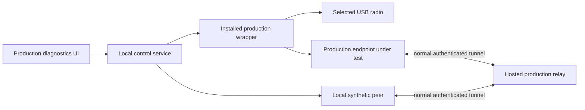
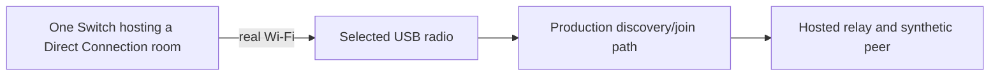
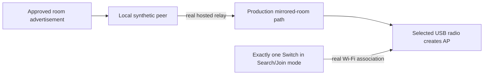

# Production debug menu design — 2026-08-28

> Status: implemented in source; installed-runtime and physical qualification remain required.
> UI location: **Settings → Advanced → Production diagnostics**.
> Contract: `production-diagnostic.v1`.
> Architecture authority: this menu must project the P0/A/B/C/D gates in
> `80-abc-connection-architecture-20260829.md`; that document controls wherever this earlier design
> uses broader or older readiness wording.
> Prerequisite: fix the critical false-start and repeated-launch defects documented in
> `FUTURE_TODO.md` before using this design as qualification evidence.

## 1. Decision summary

SwitchTrade will expose a production-path debug menu from Advanced Settings. It will let one PC test
its own installed wrapper, selected USB radio, hosted-relay connection, Switch-room discovery, and AP
association before the two PCs and two Switches are physically separated.

The menu must exercise the same installed wrapper and production transports used by a normal trade.
It must not contain a second mock wrapper or a local fake relay. A small synthetic peer may replace the
remote PC, but it must connect through the hosted relay with the normal room authority, credentials,
WebSocket tunnel, and envelope codec.

The menu provides three evidence levels:

1. **Automated production path** — one PC and its selected adapter; no Switch required.
2. **Guided Switch room detection** — one PC, its selected adapter, and one Switch hosting a room.
3. **Guided AP association** — one PC, its selected adapter, and exactly one active Switch searching
   for a room.

Passing all three is **local prequalification**, not proof of an end-to-end trade. The final
two-PC/two-Switch test remains required for RFU forwarding, movement, trading, reconnect, and soak.

## 2. Goals

The debug menu must answer these questions with recorded evidence:

- Did one explicit action launch exactly one copy of the installed production wrapper?
- Did the wrapper prepare the selected Windows/WSL USB device and pass the real radio health gate?
- Did the endpoint initialize and connect to the real hosted relay with the correct attempt identity?
- Can both Switch role policies reach their production initialization boundary?
- Can the production discovery path observe and join a room created by a physical Switch?
- Can the production AP path create the mirrored room and accept a physical Switch association?
- Did Stop, Cancel, failure, timeout, and normal completion restore the adapter and remove every child,
  interface, lock, temporary credential, and private relay room?
- If anything failed before Python started, does the report retain the wrapper exit code and bounded,
  redacted output?

The workflow must be repeatable first on PC A and then on PC B without changing code or editing local
configuration by hand.

## 3. Non-goals and truth boundaries

The debug menu does not:

- claim that software-only checks prove over-air beacon visibility or Switch association;
- claim that local AP association proves the remote RFU data path or a completed trade;
- allow two active Switches during the AP association test;
- expose room/member tokens, passcodes, raw RFU frames, captures, keys, MAC addresses, or Pokémon data;
- bypass the normal hardware matrix, selected-device policy, relay authentication, role policy, or
  wrapper health gate;
- add user-selectable host/AP engines;
- automatically retry a failed launch;
- launch or mutate state from a status GET request.

The existing `hardware-diagnostic.v1` report remains the hardware capability check. The proposed
`production-diagnostic.v1` report composes that evidence with wrapper, relay, and guided physical
stages; it does not replace the existing report.

## 4. Valid test topologies

### 4.1 Automated production path



The synthetic peer uses no radio and cannot make a physical test pass. Its only job is to occupy the
other private room seat and verify the normal relay/tunnel path.

### 4.2 Guided Switch room detection



No second Switch is needed. The test exercises internal `switch_room_role=creator`: the local Switch
is the Group Leader, so the endpoint must discover and join the real room.

### 4.3 Guided AP association



This test exercises internal `switch_room_role=finder`: the local Switch is Joining, so the endpoint
must create the mirrored AP that the Switch can discover.

**A second active Switch hosting the same room invalidates this test.** The Switches could associate
directly and bypass SwitchTrade. The debug UI must tell the user to stop every other hosted room before
continuing. The result is scoped to the selected adapter, but reports retain no BSSID or other hardware
address.

The primary AP input is a versioned, known-good advertisement fixture sent by the synthetic peer
through the real relay. A live capture from another Switch may be used only after that Switch has
stopped hosting and cannot be the association target. Reusing the searching Switch's own earlier room
advertisement is not qualification evidence until same-console identity behavior has been validated.

## 5. Advanced Settings change

The current Advanced Settings content is implementation-oriented and must be replaced when the debug
menu is implemented.

Remove these user-facing items:

- `Host/AP engines`
- `HostTransport + ldn.create_network() — Available and default`
- `hostapd AP engine — In Development (not selectable)`
- `direct nl80211 AP engine — In Development (not selectable)`
- the generic explanation that driver, USB, and runtime details appear in Advanced Settings

Do not replace them with another engine selector or engine status list. `HostTransport` remains the
only production engine and is an implementation detail.

The experimental-adapter warning is already presented beside adapter selection in **Connection**.
Remove its duplicate from Advanced Settings so the Advanced tab contains one clear purpose.

Proposed Advanced Settings content:

```text
Advanced

Production diagnostics
Test this PC's installed wrapper, relay connection, selected Wi-Fi adapter,
Switch-room detection, and AP association before a two-PC test.

[ Open debug menu ]

These tests temporarily take control of the selected USB Wi-Fi adapter.
No public Trade Room is created.
```

Selecting **Open debug menu** navigates to a dedicated production-diagnostics screen with normal Back,
Escape, and Alt+Left behavior. It must not open a modal dialog because guided tests can take several
minutes and require multiple instructions.

The existing **Connection → Run read-only diagnostics** action may remain only for checks that do not
change attachment or radio state. If it needs to attach the selected adapter, load a driver, create an
interface, or run actual RX, route it into the production-diagnostics lifecycle and label the action
**Run adapter check** rather than read-only. The production debug menu owns the deeper workflow and its
mandatory cleanup.

## 6. Debug menu information architecture

The screen header shows:

- **Production diagnostics**
- selected adapter friendly name, USB ID, Windows bus, and current attachment state;
- whether a normal Trade Room or another diagnostic currently owns the radio;
- a short warning that a physical pass still does not replace the two-PC test.

The initial menu contains these actions:

| Action | Equipment | Result boundary |
|---|---|---|
| **Run automated system check** | PC and selected adapter | Wrapper, hardware gate, endpoint initialization, real relay exchange, cleanup |
| **Detect a Switch room** | One Switch hosting | Real room observation and join evidence |
| **Test Switch AP association** | Exactly one active Switch searching | App-created AP and physical association evidence |
| **Run recommended local suite** | Same equipment, guided sequentially | All available local prequalification stages |

Each action opens a run screen containing:

- a numbered stage list with `Waiting`, `Running`, `Passed`, `Failed`, `Skipped`, or `Not tested`;
- one primary action appropriate to the current state;
- **Cancel and clean up** while a run is active;
- the stable failure code and plain-language corrective action after failure;
- **Create support file** after a terminal result;
- **Run again** only after cleanup has reached a terminal state.

The UI must never display a spinner without the current factual stage and timeout. User instructions
are explicit checkpoints; status polling cannot advance them.

## 7. Preconditions

A run is rejected before acquiring the adapter when:

- a normal Trade Room connection attempt is active;
- another diagnostic owns the global diagnostic/radio lock;
- no adapter is selected or the selected physical device no longer matches the saved identity;
- the profile is quarantined for the requested mutating stage;
- the installed control, wrapper, endpoint, or relay contract is incompatible;
- cleanup from a previous run is incomplete.

Experimental adapters may run only the stages allowed by the existing hardware policy and must retain
their experimental label. Debug mode is not a bypass around quarantine.

## 8. Run lifecycle and invariants

One persisted run record exists beneath the current control run directory. A single control-owned
lock prevents overlapping production diagnostics and normal endpoint launches.

```text
created
  → preflight
  → running
  ↔ awaiting_user
  → cleaning
  → passed | partial | failed | canceled
```

Non-negotiable lifecycle rules:

1. One user Start action creates one diagnostic run ID and one authoritative attempt ID.
2. One attempt may automatically launch the production wrapper at most once.
3. `wrapper_acquired` is not endpoint success.
4. `radio_gate_passed` is not endpoint success.
5. `endpoint_initialized` requires matching run, attempt, launch nonce, and live PID evidence.
6. A child exit before initialization is a terminal attempt failure; only an explicit new run retries.
7. Ending a terminal failed run must retire its authoritative attempt (or record a local terminal
   acknowledgement that room/status projection honors). Subsequent polling must not rehydrate the
   failed run, reactivate End, or alternate between competing failure messages.
7. GET status requests are read-only.
8. Cancel is idempotent and always enters bounded cleanup.
9. Passed, partial, failed, and canceled are published only after cleanup finishes.
10. Cleanup failure forces the final outcome to failed, even if the functional stage passed.
11. Desktop close requests cancellation. If the desktop crashes, per-stage and global deadlines still
    force control-owned cleanup without depending on desktop stdout/stderr pipes.

## 9. Automated production-path flow

The automated check runs both production Switch-role policies sequentially.

For each role:

1. Validate the selected physical device and acquire the radio/diagnostic lock.
2. Run or import the mutating stages of `hardware-diagnostic.v1` through the same attach helper used by
   a normal connection. Record Windows shared, USB/IP attached, Linux sysfs enumerated, expected driver
   bound, PHY/interface ready, actual RX, and local LDN lifecycle as separate ordered gates. Do not treat
   `usbipd` `ClientIPAddress` as Linux readiness: wait within a bounded deadline for the matching VID:PID
   sysfs device and expected driver/interface. Preserve bounded redacted attach and radio-gate stderr and
   restore the adapter's prior attachment/interface state in cleanup.
3. Create a normal **private** authoritative room. Use the ordinary create/join APIs to occupy both
   seats with diagnostic-scoped local client identities. Tokens remain in control-owned temporary
   files and never enter WPF.
4. Mark both seats ready, create one attempt, and assign complementary roles through the normal room
   contract.
5. Start the synthetic peer with the existing `TunnelClient` and one seat credential.
6. Launch the device under test through `run-beta-endpoint.sh` with the other seat credential, selected
   USB ID, attempt ID, role, and diagnostic run ID.
7. Require ordered evidence for wrapper acquisition, radio gate, Python endpoint initialization,
   authenticated relay connection, and peer readiness.
8. Exchange unpredictable per-run nonces in both directions using normal tunnel envelopes. Record
   counts, hashes, ordering, and round-trip time, not payload content.
9. Stop both peers, close the private room, release the device, remove temporary credentials, and prove
   no child, lock, interface, or room ownership remains.
10. Repeat using the other Switch-role policy only after the first role's cleanup passes.

The endpoint may accept a narrowly scoped diagnostic checkpoint that exits after the real hardware and
relay initialization boundary. That flag must not skip the wrapper, radio gate, endpoint construction,
authentication, tunnel codec, or cleanup path. It cannot be used by a normal Trade Room request.

No new relay diagnostic protocol is required. The hosted service's existing private room, attempt, and
authenticated tunnel paths are the subject of the test. The room is explicitly closed in `finally`;
normal private-room expiry is only crash fallback.

## 10. Guided Switch room detection flow

1. Complete automated preflight for the discovery role.
2. Show: **On the only active Switch, open FireRed/LeafGreen Direct Connection and create the room.
   Do not have another Switch join it.**
3. Wait for the user to select **The room is open**.
4. Launch the production discovery/join path once.
5. Record separate evidence levels:
   - radio scan received frames on the expected channel range;
   - a compatible Switch room was identified;
   - its advertisement parsed successfully;
   - the endpoint associated/joined;
   - Nintendo control-port activity was observed.
6. Hash identifiers in exported evidence. Do not store a raw capture in the normal report or support
   bundle.
7. Ask the user to close the Switch room, then tear down and restore the adapter.

`room_detected` and `room_joined` are distinct results. A detected room followed by join failure is not
reported as a complete pass.

## 11. Guided AP association flow

1. Complete automated preflight for the mirrored-room role.
2. Start the synthetic peer in the private diagnostic room.
3. The synthetic peer sends the approved, versioned advertisement through the hosted relay using the
   normal production envelope.
4. Launch the production AP path once and wait for AP-ready evidence from the actual selected adapter.
5. Show the following blocking instruction:

   ```text
   Stop every other Switch-hosted room.
   On exactly one Switch, choose Search/Join.
   Then select “The Switch is searching.”
   ```

6. Pass `ap_started` only after the expected interface, channel, BSSID, and engine-ready state exist.
7. Pass `switch_associated` only when the selected adapter's station/LDN evidence identifies a new
   physical association to that exact AP. A button click or elapsed timer is not evidence.
8. Record `control_port_observed` separately if the Nintendo control exchange begins. Do not require a
   full trade or remote data-plane simulation for the AP-association result.
9. Stop the AP, synthetic peer, and relay room; restore the adapter and verify cleanup.

If another compatible Switch room is visible during the test, mark the run **invalid**, not failed, and
instruct the user to remove the competing host before starting a new run. This prevents direct
Switch-to-Switch association from producing a false result.

## 12. Local control API

Keep the API specific to this workflow rather than introducing a generic background-job framework.

### Start

```http
POST /api/v1/production-diagnostics
```

```json
{
  "test": "automated | room_detection | ap_association | recommended",
  "usb_id": "0bda:818b"
}
```

Returns `202 Accepted` with `run_id` and the initial projection.

### Read status

```http
GET /api/v1/production-diagnostics/{run_id}
```

This endpoint is strictly side-effect free. Polling may observe state but may not launch, retry,
continue, cancel, or extend a deadline.

### Continue a user checkpoint

```http
POST /api/v1/production-diagnostics/{run_id}/continue
```

The request includes the current checkpoint ID. A stale or duplicate checkpoint is idempotent and
cannot launch an additional process.

### Cancel

```http
DELETE /api/v1/production-diagnostics/{run_id}
```

Cancel returns the run in `cleaning` or its existing terminal state. **Run again** creates a new run;
it does not mutate or relaunch the previous attempt.

## 13. `production-diagnostic.v1` projection

The WPF-facing projection contains no credentials or raw radio data.

```json
{
  "contract_version": "production-diagnostic.v1",
  "run_id": "0199...",
  "test": "ap_association",
  "status": "awaiting_user",
  "current_stage": "switch_search_prompt",
  "checkpoint_id": "0199...",
  "started_at": "2026-08-28T10:00:00Z",
  "deadline_at": "2026-08-28T10:08:00Z",
  "selected_adapter": {
    "usb_id": "0bda:818b",
    "friendly_name": "RTL8192EU",
    "bus_id": "4-18",
    "attached": true
  },
  "stages": [
    {
      "name": "ap_started",
      "status": "passed",
      "code": "DIAG_AP_READY",
      "message": "The selected adapter created the test room."
    }
  ],
  "result_level": "ap_started",
  "limitations": [
    "Switch association has not yet been observed.",
    "A two-PC end-to-end trade is not tested."
  ],
  "cleanup": {
    "status": "pending"
  }
}
```

Allowed top-level status values are `preflight`, `running`, `awaiting_user`, `cleaning`, `passed`,
`partial`, `failed`, and `canceled`.

Result levels are cumulative but factual:

```text
hardware_gate_passed
endpoint_initialized
relay_exchange_passed
switch_room_detected
switch_room_joined
ap_started
switch_associated
control_port_observed
local_prequalification_passed
```

`full_trade_passed` is deliberately absent. Only the separated two-PC/two-Switch qualification may
make that claim.

## 14. Stable failure codes

At minimum, the implementation must distinguish:

| Code | Meaning |
|---|---|
| `DIAG_NORMAL_SESSION_ACTIVE` | A normal connection currently owns the runtime |
| `DIAG_ADAPTER_NOT_SELECTED` | No exact physical adapter is selected |
| `DIAG_ADAPTER_CHANGED` | Saved adapter identity no longer matches the physical device |
| `DIAG_RADIO_GATE_FAILED` | Production radio preparation or health gate failed |
| `DIAG_RELAY_UNREACHABLE` | Hosted relay health or authenticated request failed |
| `DIAG_PRIVATE_ROOM_FAILED` | Private room/attempt setup failed |
| `DIAG_SYNTHETIC_PEER_FAILED` | The local non-radio peer failed |
| `DIAG_WRAPPER_EARLY_EXIT` | Wrapper exited before endpoint initialization |
| `DIAG_DUPLICATE_LAUNCH` | More than one PID was observed for one attempt |
| `DIAG_ENDPOINT_INIT_TIMEOUT` | Matching endpoint state did not arrive in time |
| `DIAG_RELAY_EXCHANGE_FAILED` | Bidirectional nonce exchange failed |
| `DIAG_SWITCH_ROOM_NOT_FOUND` | No compatible physical Switch room was observed |
| `DIAG_SWITCH_ROOM_JOIN_FAILED` | Room was observed but join/control failed |
| `DIAG_FIXTURE_INVALID` | AP advertisement fixture is missing or incompatible |
| `DIAG_AP_START_FAILED` | Production AP did not reach ready state |
| `DIAG_COMPETING_SWITCH_HOST` | Another physical host invalidated AP association evidence |
| `DIAG_SWITCH_NOT_ASSOCIATED` | No Switch associated with the app-created AP before timeout |
| `DIAG_CONTROL_PORT_NOT_OBSERVED` | Association occurred but Nintendo control activity did not |
| `DIAG_CLEANUP_FAILED` | A child, lock, interface, credential, room, or adapter state remained |

Every failure includes a user message, technical stage, recoverability, and one primary action. Later
relay teardown must not overwrite a more specific local radio or wrapper failure.

## 15. Evidence and support bundles

Each run writes one `production-diagnostic-report.json` plus bounded stage logs under the current
control run. The normal support bundle includes the latest bounded set of production diagnostic runs,
including attempts that failed before Python initialized.

Record:

- diagnostic run ID, attempt ID, launch nonce, PID, parent PID, start/exit timestamps, and exit code;
- bounded redacted stdout/stderr from the wrapper and radio gate;
- selected Windows device identity, WSL USB path, driver, PHY/interface names, and restoration result;
- relay room/attempt correlation identifiers in hashed or non-secret form;
- tunnel connect time, nonce counts, ordering, hashes, and round-trip summaries;
- fixture ID and checksum, never its sensitive payload;
- hashed discovery/AP identity, channel, association timestamp, and evidence source;
- every cleanup action and its result.

Never record or upload bearer tokens, room passcodes, raw captures, RFU frames, encryption material,
precise MAC addresses, trainer identity, or Pokémon data. Existing redaction remains mandatory before
files are written, not only during bundle creation.

## 16. Timeouts and user control

Initial defaults:

| Stage | Timeout |
|---|---:|
| Adapter/radio gate | 60 seconds |
| Wrapper initialization | 20 seconds after the gate |
| Relay peer and nonce exchange | 20 seconds |
| Switch room discovery | 90 seconds |
| AP startup | 30 seconds |
| Switch association | 120 seconds |
| Cleanup | 30 seconds |
| Whole diagnostic | 10 minutes |

Timeouts are failure evidence, not permission to launch another endpoint. The user may cancel at any
time. Physical timing values should remain centralized because real adapters and Switch behavior may
require later calibration.

## 17. Acceptance criteria

### 17.1 Automated regression

- One Start produces one wrapper PID per role and one terminal record per PID.
- One hundred repeated status GETs produce zero launches and zero mutations.
- Radio-gate failure, early shell exit, endpoint initialization failure, relay loss, peer loss, and
  nonce corruption each preserve the first specific failure.
- Cancel during every stage reaches terminal cleanup and can be repeated safely.
- Desktop close/reopen cannot orphan the backend on dead output pipes.
- No run leaves a process, interface, lock, token file, private room, or changed adapter state.
- The support bundle contains the failure even when Python never starts.

### 17.2 Physical room detection

- One Switch hosts while no other Switch joins.
- The selected adapter observes the room and the production endpoint parses it.
- `room_detected` and `room_joined` evidence are independently correct.
- A nonexistent room times out once without relaunch.

### 17.3 Physical AP association

- Exactly one active Switch is in Search/Join mode.
- No real Switch is hosting the advertised test room.
- The synthetic peer supplies the fixture only through the hosted relay.
- The selected adapter creates the expected BSSID/channel and becomes AP-ready.
- Association evidence names the app-created AP as the target.
- Competing-host evidence invalidates the run rather than passing it.
- AP teardown restores the adapter.

### 17.4 Local qualification gate

PC A and PC B must each complete 30 consecutive automated runs of both roles plus guided room and AP
checks, expected-failure checks, cancellation, and application restart with zero duplicate launches,
orphan processes, stale locks, or altered adapter state. Only then resume the physically separated
two-PC/two-Switch trade test.

## 18. Implementation order

1. Fix premature wrapper acknowledgement, status-GET launch side effects, inherited desktop output
   pipes, and missing pre-Python evidence.
2. Add the persisted `production-diagnostic.v1` run record and control-owned cleanup.
3. Add the synthetic peer by reusing the existing private room authority and `TunnelClient`.
4. Implement and regress the automated production-path test.
5. Replace the Advanced Settings content and add the dedicated diagnostics screen. Do not ship a dead
   navigation button before the backend contract exists.
6. Add guided room detection with physical evidence.
7. Add guided AP association with the one-active-Switch validity rule.
8. Run the per-PC qualification gate, then perform the separated end-to-end test.

The implementation should add one workflow-specific orchestrator rather than a generic test framework.
Existing hardware diagnostics, process launching, relay client, tunnel client, radio transports,
redaction, RunLogger, and support-bundle code remain the sources of truth.
