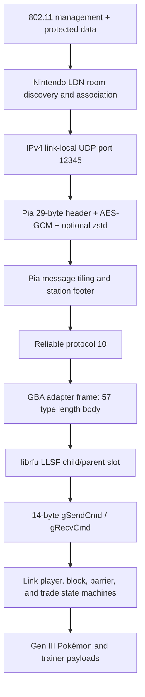

# FireRed/LeafGreen Communication Protocol

## 1. Scope, evidence, and confidence labels

This document specifies the communication stack used by the Nintendo Switch FireRed/LeafGreen
Direct Connection feature and the subset implemented by SwitchTrade. It is intended for protocol
engineers, test authors, and future agents working on the endpoint.

Every important claim uses one of these confidence labels:

- **Observed** — decoded from a native two-Switch capture or a successful live interaction.
- **Source-confirmed** — matched to the decompiled FireRed/LeafGreen or upstream LDN/Pia source.
- **Implemented** — represented in the current endpoint and protected by deterministic tests.
- **Inferred** — consistent with evidence but not yet isolated by a dedicated experiment.

The decisive method was not ordinary Wi-Fi traffic inspection. The project combined:

1. simultaneous channel-aware 802.11 capture;
2. the exact LDN room identity and session keys;
3. Pia AES-GCM authentication and decompression;
4. message-by-message comparison with `pret/pokefirered` link state machines;
5. a native two-Switch fixed-channel reference handshake;
6. iterative live gates in which the PC endpoint progressed from room visibility to a complete,
   saved trade and clean return to the trade menu.

The maintained implementation is under `bridge/frlgsim/`. Tests under `bridge/tests/` and `tests/`
are the executable specification.

## 2. Protocol stack



The relay is below none of these layers: it forwards endpoint RFU envelopes and does not interpret
the game protocol. All emulation described here runs at each local endpoint.

## 3. Discovery and LDN room identity

### 3.1 Exact room fields

The Switch filters LDN advertisements before showing a room. The following identity was observed and
is implemented:

| Field | Value | Confidence |
| --- | --- | --- |
| Local communication ID | `0x01006FA0233F8000` | Observed, implemented |
| Scene ID | `22287` | Observed, implemented |
| LDN protocol | `3` | Observed, implemented |
| LDN structure version | `4` | Observed |
| Security mode | `1` | Observed |
| Application version | `88` (`0x58`) | Observed, implemented |
| Accept policy | `0` in native advertisements; host opens acceptance while serving | Observed, implemented behavior |
| Maximum participants | `6` | Observed, implemented |
| Application data length | `122` bytes | Observed, implemented |
| Pia application header prefix | `00 5c 16 00 58` | Observed, implemented |

`bridge/frlgsim/advert_check.py` is the executable field validator. A visible SSID or ordinary beacon
is not sufficient; the Nintendo Vendor Action advertisement must decode to this identity.

### 3.2 Channel behavior

**Observed:** native rooms have appeared on 2.4 GHz channels 1, 6, and 11. A room recreated by the same
console can move from channel 11 to channel 1. Prior project notes also recorded a Switch choosing one
of the supported 5 GHz LDN channels.

Therefore:

- a fixed channel-6 capture cannot prove that no LDN exchange occurred;
- scanning only channels 1/6/11 is a fast non-overlapping 2.4 GHz strategy, not a statement that the
  other 2.4 GHz channel numbers are physically impossible;
- a rigorous diagnostic scan may hop all channels permitted by the radio/regulatory domain, but it
  must record the channel for every packet and dwell long enough to catch periodic advertisements;
- a production session must stop hopping and remain on the selected room's channel;
- the current beta hardware policy is 2.4 GHz. A 2.4 GHz-only adapter cannot discover a room created
  on 5 GHz; recreating the room may cause the Switch to select 2.4 GHz.

The project's earlier “the Switches sent no local traffic” conclusion was invalid because it was based
on a single channel while the room could be elsewhere.

### 3.3 Application data and RFU search record

The 122-byte application payload contains a 0x5C-byte Pia LDN system-property header followed by a
custom-base85 encoding of one 24-byte RFU record.

Decoded record layout:

| Offset | Size | Meaning |
| --- | ---: | --- |
| `0x00` | 2 | Trainer ID, little-endian |
| `0x02` | 8 | FireRed/LeafGreen encoded player name, `0xFF` terminated/padded |
| `0x0A` | 2 | RFU session ID, little-endian |
| `0x0C` | 8 | Partner/search information |
| `0x14` | 4 | Trade species word, species in the upper 16 bits |

**Observed and implemented:** a non-zero word within partner information was required for the PC-hosted
room to pass the Switch's room filter. `HostTransport` currently supplies a profile-derived non-zero
stub and advertises a session-specific RFU ID. `beacon.py` contains the inverse name/base85 encoders.

### 3.4 SSID, BSSID, and association

The SSID is a 16-byte session identifier represented as hexadecimal by the Linux interface layer. The
BSSID selects the actual room owner. Two consoles can advertise the same title identity and channel;
joining by SSID/channel alone can associate with the wrong console. The join path therefore supports
BSSID pinning to the address from the selected advertisement.

**Source-confirmed:** the LDN library's old association path did not always pass BSSID to nl80211.
**Observed:** this caused the kernel to attach to the wrong Switch when two eligible rooms were nearby.

## 4. LDN network and Pia station setup

### 4.1 Link-local network

The room uses link-local IPv4 and UDP port `12345`. In the two-station reference:

- host: `169.254.x.1:12345`, ranking 0;
- joiner: `169.254.x.2:12345`, ranking 1;
- unused participant records have ranking `0xFF` and zero address/port.

The `x` octet is session-derived. Do not hard-code it from a previous room.

### 4.2 Constant and variable station IDs

Pia uses two different identities:

- **constant ID:** an 8-byte permutation of a six-byte LDN MAC plus two zeros;
- **variable ID:** a 16-bit ID assigned for the current session and learned from Pia packet headers.

The constant-ID transform is:

```text
mac[2], mac[4], mac[5], mac[3], mac[1], mac[0], 00, 00
```

The variable ID is not derived from the MAC. Reference values `0x7620` and `0xC493` are useful replay
fixtures, not universal station IDs. Live code must learn destination and source IDs from the incoming
header and use the destination/recipient ID in the message footer.

### 4.3 Connection exchange

The fixed-channel native handshake established this order:

1. host Net protocol type `0x11` connection request;
2. joiner Net type `0x12` response echoing the request sequence;
3. Session protocol type `0` join request;
4. host Session type `2` join response;
5. host Session type `5` two-station update;
6. joiner Session type `6` finalize.

The host Net `0x11` contains a fixed section plus six 22-byte station records. The four unused records
must still be present when `max_participants` is six. A mid-session Net `0x50` update is acknowledged
with `0x51`, echoing its sequence. RTT protocol type 0 requests receive type 1 responses.

**Observed and implemented:** failing to echo the live sequence or omitting Session-new messages made
the host retransmit indefinitely and prevented the in-game “OK” gate.

## 5. Pia packet protection and message tiling

### 5.1 Packet header

Encrypted Pia UDP datagrams use a 29-byte clear header:

| Offset | Size | Meaning |
| --- | ---: | --- |
| `0x00` | 4 | Magic `32 AB 98 64` |
| `0x04` | 1 | Encryption/version byte, normally `0x90` |
| `0x05` | 1 | Transport flags |
| `0x06` | 2 | Destination variable station ID, big-endian |
| `0x08` | 2 | Source variable station ID, big-endian |
| `0x0A` | 2 | Per-channel packet ID, big-endian |
| `0x0C` | 1 | Footer length |
| `0x0D` | 8 | Header nonce |
| `0x15` | 8 | Truncated AES-GCM tag |
| `0x1D` | variable | Ciphertext |

Packet IDs are maintained per Pia destination channel and skip zero after rollover. Establishing
exchange packets may force packet ID zero as observed.

### 5.2 Session key and nonce

For this title's Pia game layer:

```text
session_key = AES-ECB(FRLG game key, 16-byte SSID)
network_id  = CRC32(SSID[1:16])
nonce       = big_endian(network_id XOR sender_ipv4) || header_nonce[8]
AAD         = empty
tag         = first 8 bytes of AES-GCM tag
```

**Observed:** this recipe validates the GCM tag on reference packets. A valid plaintext is optionally
a zstd frame. The Switch's zstd output is reproduced with level 4, no content size/checksum, and the
observed 8 KiB window descriptor. Ciphertext input is padded as required by the surrounding Pia path.

### 5.3 Message blob

After authentication and optional decompression, the application blob is a sequence of Pia messages,
then a station-recipient footer and optional `0xFF` padding. Presence bits let later messages inherit
header fields from the previous message. Protocol 10 carries the reliable stream used by the GBA
adapter.

## 6. Pia Reliable protocol 10

### 6.1 Frame semantics

The eight-byte reliable sub-header contains 16-bit wrap-aware sequence/window fields and flags. The
used flag bits are:

| Bit | Name | Meaning |
| ---: | --- | --- |
| `0x01` | AppData | carries application bytes |
| `0x02` | MsgStart | first fragment |
| `0x04` | MsgEnd | last fragment |
| `0x08` | Initialized | opens/seeds the stream |

A complete GBA application message uses `0x07`; the first initialized payload uses `0x0F`; a bulk ACK
control message uses `0x00`.

The implementation begins at sequence `0xFFF0` because that is the verified title behavior. Sequence
comparison uses 16-bit serial arithmetic.

### 6.2 Opening metadata

The reliable INIT payload starts:

```text
4A 00 2A 00 58 01 00 4C 65 61 66 47 72 65 65 6E 5F 65 ...
```

It identifies the application/version (`LeafGreen_e` in the reference fixture). It is an INIT payload
whose first byte is `0x4A`; it is not a normal `57 4A ...` GBA wrapper.

### 6.3 Bulk acknowledgement

The one-entry ACK payload is:

```text
stream_id:u8 | entry_count=1:u8 | next_expected:u16 BE | selective_mask:16 bytes
```

Every sequence below `next_expected` is cumulatively acknowledged. Bit `i` of the little-endian
128-bit mask acknowledges `next_expected + 1 + i`. The native logical maximum in flight is 128.

The console-faithful retransmit timeout is:

```text
33 ms + 1.4 * median(last up to 7 clean RTT samples)
```

The internet endpoint exposes explicit divergence knobs for jitter margin, duplicate-NACK threshold,
ceiling, backoff, bootstrap timeout, and a smaller live in-flight window. These do not change wire
format. They compensate for WAN latency and game save pauses and must remain covered by loss/reorder
tests.

## 7. GBA adapter frames

Normal adapter messages use:

```text
57 | type:u8 | body_length:u16 LE | body
```

| Type | ASCII | Purpose |
| ---: | --- | --- |
| `0x43` | C | child connect request containing its two-byte connection ID |
| `0x41` | A | parent accept: host session ID, echoed child connection ID, two zero bytes |
| `0x47` | G | parent group-state notification |
| `0x54` | T | timestamped RFU slot carrier |
| `0x4B` | K | acknowledgement of a unique parent T timestamp |
| `0x44` | D | disconnect |

Child T body:

```text
timestamp:u32 LE | 00 | slot_length:u8 | 00 00 | slot padded to 4 bytes
```

Parent T body differs by one byte:

```text
timestamp:u32 LE | slot_length:u8 | 00 00 00 | slot padded to 4 bytes
```

Parent `slot_length <= 1` is an idle poll but must still receive a K. K is exactly:

```text
57 4B 0C 00 | k_sequence:u32 LE | message_index:u32 LE | acknowledged_parent_timestamp:u32 LE
```

One K is generated per unique parent T timestamp; retransmitted T frames are deduplicated.

## 8. librfu link-layer subframes

### 8.1 Child header

The two-byte little-endian child LLSF is:

```text
state<<10 | ack<<9 | n<<7 | phase<<5 | size(5 bits)
```

### 8.2 Parent header

The three-byte little-endian parent LLSF is:

```text
state<<14 | bitmap_slot<<18 | ack<<13 | n<<11 | phase<<9 | size(9 bits)
```

States are `NULL=0`, `NI_START=1`, `NI=2`, `NI_END=3`, and `UNI=4`.

For child UNI, a 14-byte command produces header word `(4<<10)|14 = 0x100E`, encoded `0E 10`.
Parent UNI carries up to five 14-byte command rows after its three-byte header. Row 0 is the parent's
command and row 1 reflects the child's command with the rolling tag stripped; unused rows are zero.

NI is a bidirectional segmented handshake. Each side acknowledges the peer's state/n/phase. The parent
must complete both the child's NI and its own NI sequence before ordinary UNI exchange.

## 9. Fourteen-byte RFU command slot

Each slot is seven little-endian 16-bit words. The high byte of word 0 is the opcode. For a child
non-idle command, bits 5–7 of the low byte carry a rolling tag that increments modulo eight. Idle does
not advance it. More than four invalid IDs makes the native parent fail the link.

Known opcodes:

| Opcode | Name | Direction/use |
| ---: | --- | --- |
| `0x0000` | IDLE | either |
| `0x2F00` | SEND_PACKET | game packet path |
| `0x5F00` | READY_CLOSE_LINK | barrier close |
| `0x6600` | READY_EXIT_STANDBY | standby barrier |
| `0x7700`, `0x7800` | SEND_PLAYER_IDS | parent identity broadcast |
| `0x8800` | SEND_BLOCK_INIT | announce fragment count/owner |
| `0x8900` | SEND_BLOCK | 12-byte block fragment |
| `0xA100` | SEND_BLOCK_REQ | parent requests a typed block |
| `0xBE00` | SEND_HELD_KEYS | link-player movement/state input |
| `0xED00` | DISCONNECT | child disconnect |
| `0xEE00` | DISCONNECT_PARENT | parent disconnect |

Block fragment index is the low five bits of word 0. Words 1–6 carry 12 payload bytes. The tag and
fragment index must be masked independently.

## 10. Connection, room entry, and movement

The high-level opening sequence is:

1. Pia Net/Session setup completes.
2. Reliable INIT and bulk ACK establish both streams.
3. Child sends C; parent sends A with the advertised RFU session ID.
4. Child NI and parent NI complete.
5. Parent sends G state 0, then identity/status traffic, then G state 1.
6. Both sides enter UNI command exchange.
7. `SEND_PLAYER_IDS` establishes the two link players.
8. `SEND_HELD_KEYS` carries link-player movement and room-state signals each VBlank.

The FireRed/LeafGreen logic uses key codes including empty keepalive `0x11`, D-pad down `0x12`, ready
`0x16`, exit room `0x17`, idle `0x1A`, and exit seat `0x1D`. Corresponding player states include idle
`0x80`, busy `0x81`, ready `0x82`, and exiting room `0x83`.

Movement does not require decoding every possible controller input at the internet relay. Once the
RFU connection is open, endpoint command rows carry the game's input/state stream. Smooth motion does,
however, depend on correct one-command-per-VBlank cadence and WAN buffering. The implemented cadence
is `1000/59.727` ms and uses absolute scheduling to avoid accumulated timer drift.

## 11. Trade-room entry state machine

The implemented phases are:

1. `P0_WARP_QUIESCE_1`
2. `P1_CARD_EXCHANGE`
3. `P2_SEAT_BARRIER`
4. `P3_WARP_QUIESCE_2`
5. `P4_TRADE_MENU`
6. `P5_IN_TRADE`

After both players enter the room, trainer-card and link-player blocks are exchanged. Sitting at the
chair triggers `READY_EXIT_STANDBY` barriers. The round count in word 1 matters: the child echoes the
current parent count, and close counts continue from the standby sequence rather than restarting.

Block request size codes map to 200, 200, 100, 220, and 40-byte logical buffers. Actual RFU transfer
uses 12-byte fragments; common counts are 9 fragments for a 100-byte trainer card, 17 for a 200-byte
party buffer, 19 for mail, and 4 for gift ribbons.

**Observed and implemented:** merely replying to barriers was insufficient. At several seams the child
game itself initiates a standby, so the emulated partner must initiate the matching round at the same
state boundary.

## 12. Trade command state machine

Link commands used by the complete trade cycle are:

| Value | Name | Meaning |
| ---: | --- | --- |
| `0xAABB` | READY_TO_TRADE | peer is ready |
| `0xDDDD` | SET_MONS_TO_TRADE | leader fixes selected slots |
| `0xBBBB` | INIT_BLOCK | confirmation/block transition |
| `0xCCDD` | START_TRADE | start animation/exchange |
| `0xABCD` | READY_FINISH_TRADE | peer animation complete |
| `0xDCBA` | CONFIRM_FINISH_TRADE | leader confirms finish |
| `0xEEAA` | REQUEST_CANCEL | request cancel |
| `0xBBCC` | READY_CANCEL_TRADE | peer ready to cancel |
| `0xDDEE` | PLAYER_CANCEL_TRADE | leader cancel |
| `0xEEBB` | BOTH_CANCEL_TRADE | both cancel |
| `0xEECC` | PARTNER_CANCEL_TRADE | partner cancel |

The full successful path is selection → confirmation → party/block transfer → trade animation → finish
agreement → multiple save/standby barriers → swapped party proof → return to the trade menu. A native
error during the animation can roll the game back; observing the animation alone is not proof of a
committed trade.

**Observed:** after the timing/barrier fixes, a trade completed, saved, and returned to the menu. The
received Pokémon remained after neutral return. This is the project's strongest live success gate.

## 13. Pokémon and trainer payloads

`SEND_BLOCK_INIT` supplies fragment count and owner. `SEND_BLOCK` supplies indexed 12-byte chunks.
Reassembly is keyed by owner/ordinal and completes only when every expected fragment is present.

Gen III Pokémon records are encrypted structures with checksums. The maintained tools support the
80-byte boxed record and the 100-byte party record. The party observer emits only validated, typed
projections and hashes; malformed or incomplete data does not become UI state.

A successful-trade observer is fail-closed. It requires:

1. valid pre-trade party snapshots for both members;
2. the expected ready/start/finish command sequence;
3. the save-barrier sequence;
4. valid post-trade snapshots showing the selected records swapped;
5. idempotency so re-observation cannot publish a second commit.

The relay does not receive or store these records in the beta.

## 14. Teardown

Native room termination is still a live protocol interval. After a successful trade or explicit exit,
both games exchange close/standby state while the avatars leave and the room UI returns. Stopping LDN
as soon as the first termination dialog resolves can produce native error `2318-0006` after an
otherwise successful exit.

The endpoint therefore separates:

- game-level close barriers;
- RFU disconnect acknowledgement;
- avatar/scene grace period;
- local radio cleanup;
- server-authority leave/close.

Local cleanup is idempotent and must succeed even if the relay is temporarily unavailable. A relay
failure during server membership cleanup must not be presented as proof that the local RFU teardown
failed.

## 15. What the project learned from the captures

### Corrected conclusion: infrastructure data was not the whole session

The first large capture contained many frames to/from a household access point and at least one
randomized client MAC. It proved the radio could receive Switch-originated frames, but it did not prove
the Direct Connection session used that router. The capture observed only channel 6 while native LDN
rooms could be on channel 1, 11, or 5 GHz.

### Corrected conclusion: absence on one channel is not absence on air

The card was not categorically deaf to Switch traffic. Known Switch probe traffic and thousands of
client frames were received. The missing local exchange was a capture-coverage problem until a
fixed-channel native room was deliberately created and both sides were captured on that same channel.

### Hardware and protocol failures must be separated

An adapter can enumerate, create an interface, and capture ordinary traffic while still failing the
LDN control-port association or entering receive death under AP+monitor concurrency. Every protocol
experiment therefore begins with a receive health gate and records channel, driver, phy, and interface
state.

## 16. Remaining unknowns and extension method

The complete Direct Connection trade cycle is implemented, but the following remain open:

- exact native channel-selection policy across environments;
- production behavior with two independent RTL8192EU endpoints across varied WAN paths;
- feature-specific command/barrier sequences for battles and Union Room;
- 5 GHz qualification;
- stable RTL8188EU AP+monitor behavior.

The surest method for a new feature is:

1. use two real Switch consoles and force a known channel/band;
2. capture both directions with a separately health-gated observer;
3. preserve room lifecycle timestamps and human actions;
4. decrypt LDN/Pia and reconstruct ordered Reliable/GBA/LLSF/RFU records;
5. align records with the corresponding `pret/pokefirered` state machine;
6. implement the smallest missing state transition;
7. lock it with replay/loss/reorder tests;
8. advance one live visible gate at a time;
9. finish with a full native-to-native comparison, long soak, and teardown test.

Do not infer a protocol field from one session-specific value, and do not interpret a missing frame
until channel coverage and receiver health are proven.

## 17. Primary implementation references

- `bridge/frlgsim/advert_check.py` — discovery identity validation.
- `bridge/frlgsim/beacon.py` — LDN application-data encoder.
- `bridge/frlgsim/transport.py` — LDN join/host, BSSID selection, and UDP transport.
- `bridge/frlgsim/crypto.py` — Pia AES-GCM and zstd.
- `bridge/frlgsim/pia_connect.py` — Net, RTT, and Session-new exchange.
- `bridge/frlgsim/reliable.py` — Reliable protocol 10.
- `bridge/frlgsim/gbaframe.py` — GBA C/A/G/T/K/D wrappers.
- `bridge/frlgsim/rfu.py` and `ni.py` — LLSF and RFU command slots.
- `bridge/frlgsim/linkplayer.py`, `linkstate.py`, and `block.py` — player state and block exchange.
- `bridge/frlgsim/barrier.py` and `trade.py` — room/trade state machines.
- `bridge/frlgsim/sim.py` — timing, packet scheduling, retransmission, and integration.

External projects acknowledged in the application Credits:

- [tornadus/frlg-ldn-trade](https://github.com/tornadus/frlg-ldn-trade)
- [kinnay/LDN](https://github.com/kinnay/LDN)
- [kinnay/NintendoClients](https://github.com/kinnay/NintendoClients)
- [pret/pokefirered](https://github.com/pret/pokefirered)
- [GB-Link](https://github.com/GB-Link)
