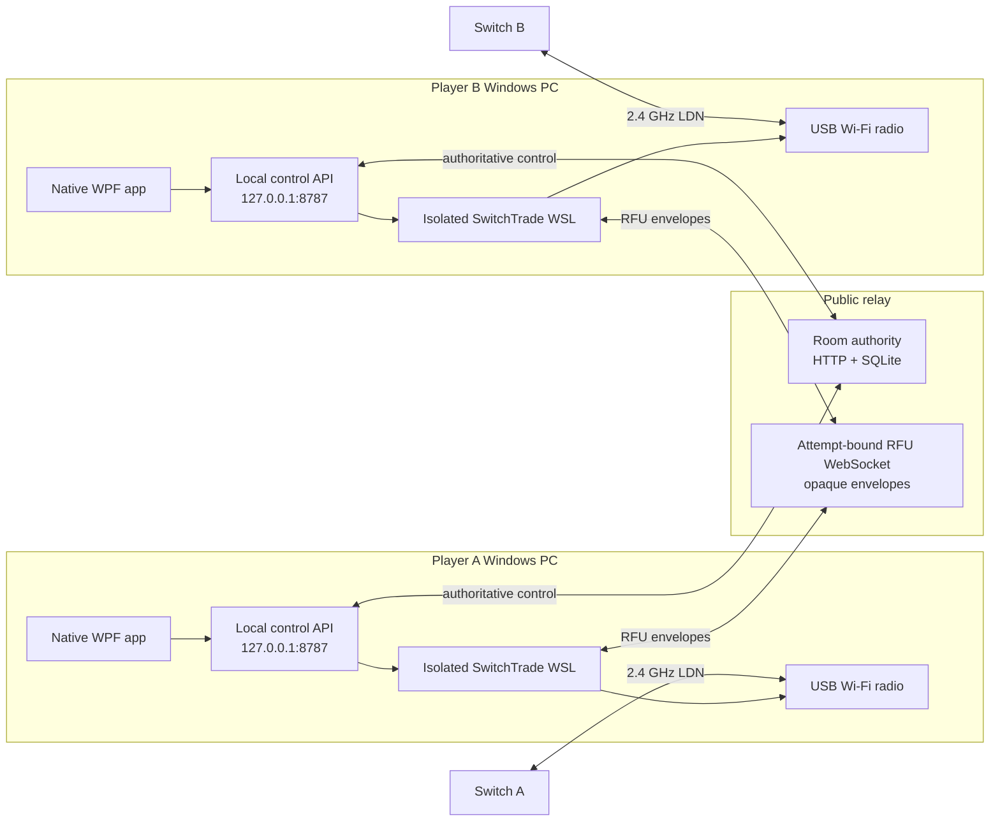
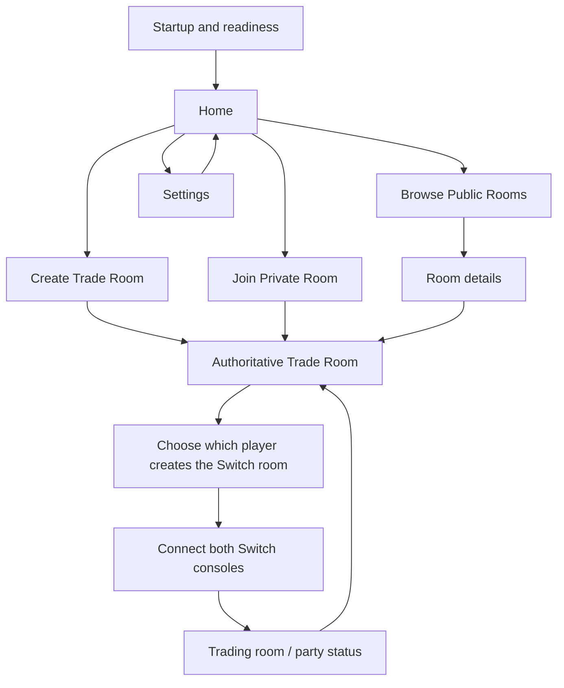

# SwitchTrade Technical Guide

## 1. Purpose and current boundary

SwitchTrade is a Windows application that lets two stock Nintendo Switch consoles run the
FireRed/LeafGreen Direct Connection trade flow over the internet. Each player runs one Windows
client and connects one compatible USB Wi-Fi adapter. The client coordinates an online two-member
room, assigns complementary radio roles, and transports the RFU stream between the two endpoints.

The `0.2.0-beta.1` product boundary is intentionally narrow:

- native Windows WPF client;
- Windows 10 22H2 x64 build 19045 or Windows 11 x64 with current Microsoft Store WSL 2;
- isolated `SwitchTrade` WSL distribution and a verified custom WSL kernel bundle;
- one USB Wi-Fi adapter per endpoint;
- server-authoritative private and public rooms with exactly two active member seats;
- FireRed/LeafGreen Direct Connection trading;
- opaque, authenticated RFU relay transport;
- structured local diagnostics and a redacted support bundle;
- one explicitly selected adapter from the executable external-USB hardware matrix.

Battles, Union Room, 5 GHz operation, analytics, automatic updates, and retired/quarantined adapter
paths are not beta capabilities. They are tracked in [Future TODO](FUTURE_TODO.md).

For the byte-level protocol, read the
[FireRed/LeafGreen Communication Protocol](FRLG_PROTOCOL.md). This guide covers only where that
protocol fits into the product.

## 2. System architecture



The three primary boundaries are:

1. **Windows client.** Presentation, user actions, local orchestration, status, and recovery.
2. **Local WSL endpoint.** Radio ownership, LDN/Pia/RFU protocol work, tunnel endpoint, and hardware
   diagnostics.
3. **Relay service.** Two-seat room authority and opaque bidirectional RFU forwarding. It does not
   emulate the game or decode Pokémon data.

Control and data are deliberately separate. The HTTP authority decides who may connect and what the
current attempt is. The WebSocket data path forwards validated envelopes only for that authorized
attempt.

## 3. Repository map

| Path | Responsibility |
| --- | --- |
| `apps/desktop/` | Native WPF client, view models, API client, launcher, theme, and UI tests. |
| `bridge/` | LDN/Pia/RFU implementation and the FireRed/LeafGreen endpoint. |
| `config/` | Versioned hardware policy, LDN key input, and runtime configuration. Never print key values. |
| `installer/` | Native setup bootstrapper, WSL lifecycle scripts, integrity checks, and package builder. |
| `legal/` | Third-party notice inventory used by the package builder. |
| `payload/` | Release configuration, including the default public relay URL. |
| `relay/` | FastAPI authority, SQLite persistence, RFU WebSocket relay, container files, and hosting smoke. |
| `scripts/` | Runtime radio preparation, health gate, endpoint launcher, and reproducible kernel tooling. |
| `switchtrade/` | Local control API, relay client, tunnel framing, diagnostics, hardware policy, and observer. |
| `tests/` | Cross-layer unit/integration tests and safe deterministic fixtures. |
| `tools/` | Maintained protocol and Pokémon payload analysis utilities. |

There is no browser frontend in the beta. Internal captures, dated research notes, design archives,
and agent handoffs are excluded by `.gitignore`.

## 4. Windows desktop application

The desktop project is `apps/desktop/SwitchTrade.Desktop`. It targets the Windows 10 build 19041 SDK
surface and publishes one self-contained x64 `SwitchTrade.exe`; Setup enforces the qualified build
19045 product minimum. It does not require Electron, WebView2, or an external browser.

The application follows a view-model-driven screen flow:



`MainViewModel` owns navigation and product state. `ControlApiClient` is the typed localhost client.
`BackendLauncher` starts the installed WSL launcher when the control service is absent. Views render
only real API state; they do not substitute sample rooms, readiness, trainers, or parties.

On a confirmed desktop close, `BackendLauncher` asks the local control service to shut down and waits
for the launcher it owns. If graceful shutdown misses its bounded deadline, only that tracked process
tree is terminated. Endpoint launcher stdout/stderr never inherits the desktop's pipes; it is written
to backend-owned evidence files so an abnormal desktop exit cannot break a later radio gate write.

Important UI invariants:

- the room authority, not the UI, decides membership and attempt state;
- member A/member B remain stable identities during a room;
- each member explicitly selects Group Leader/creator or Joining/finder for every attempt;
- the authority starts only one complementary creator/finder pair and never infers it from room ownership;
- leave and close are idempotent user operations;
- public browsing is unavailable when the relay does not advertise `public-directory.v1`;
- errors must provide a recovery action rather than exposing command output;
- Credits remain reachable from the bottom-left application shell.

## 5. Installation and runtime lifecycle

`SwitchTradeSetup.exe` is a native bootstrapper contained in the release ZIP. It verifies the package
manifest before running a mutating action. The normal install path is:

1. Verify all payload hashes and reject missing or unexpected files.
2. Require Windows 10 22H2 x64 build 19045 or Windows 11 x64 and reject Server/ARM64 hosts.
3. Enable WSL prerequisites, update legacy inbox WSL to current Microsoft Store WSL, and resume after
   restart through a non-secret RunOnce entry when required.
4. Install the pinned `usbipd-win` prerequisite when required.
5. Import or update the isolated WSL distribution named `SwitchTrade`.
6. Install the bundled kernel and modules under `%ProgramData%\SwitchTrade\kernel`.
7. Back up and merge the SwitchTrade kernel settings into the user's global `.wslconfig` after explicit
   consent.
8. Stage and self-check `/opt/switchtrade` before replacing the active runtime.
9. Install the native app and launcher under the SwitchTrade application directory.
10. Start the local control service and verify readiness.

The endpoint resolves its required LDN key input from `/opt/switchtrade/config/prod.keys` in the
installed application root. It must be included by the source archive/package builder and must never
be copied into logs or support bundles.

The custom kernel setting is global to WSL2 because Windows does not support selecting a WSL kernel
per distribution. Setup preserves the complete previous configuration and restores it on failed
kernel start or explicit rollback. The distro itself remains isolated from the user's other WSL
distributions.

The extracted ZIP is only needed for Setup, Update, Repair, Rollback, or Uninstall. A successful daily
launch uses the installed app and installed WSL runtime. Uninstall does not unregister the distro
unless purge is explicitly selected.

The package manifest records the source commit as `release_id`. Release packages must be built from a
clean committed tree; `installer/Build-Package.ps1` refuses a dirty workspace.

## 6. Local control API

The local service is FastAPI on `127.0.0.1:8787`. It is never intended as a network-facing service.
The maintained v1 surface is:

| Area | Endpoints |
| --- | --- |
| Readiness | `GET /api/v1/app/readiness`, `POST /api/v1/app/retry`, `POST /api/v1/app/repair`, `POST /api/v1/app/shutdown` |
| Rooms | `POST /api/v1/trade-room`, `POST /api/v1/trade-room/join`, `GET /api/v1/trade-room`, `GET /api/v1/trade-room/events` |
| Public directory | `GET /api/v1/public-trade-rooms`, details and join under the same prefix |
| Connection | `POST /api/v1/trade-room/connect`, `POST /api/v1/session/start`, `POST /api/v1/session/stop` |
| Membership | `DELETE /api/v1/trade-room/members/me`, `DELETE /api/v1/trade-room` |
| Hardware | `GET /api/v1/hardware/devices`, `POST /api/v1/hardware/selection`, `POST /api/v1/hardware/diagnostics` |
| Observation | `GET /api/v1/trade-room/parties` |
| Support | `POST /api/v1/support-bundle` |

The service exposes four separate readiness dimensions: local control, relay, radio, and trade
session. Do not collapse them into a single generic “offline” state; each has different recovery.

### Endpoint launch invariant

One authoritative connection attempt permits at most one automatic endpoint launch. The room-status
`GET` may reconcile observed authority state but is launch-free. A launch is authorized only by an
explicit connection `POST` after the user has selected a Switch role; when the complementary role is
locked later, the desktop performs one explicit `POST` reconciliation for that prior user action.
After a failed start, another process requires the explicit Retry endpoint.

Control writes a durable `launching` state before spawning the wrapper and serializes all launches.
The wrapper acquires its process lock, prepares the selected radio, and passes the actual-RX health
gate before writing a nonce-bound `radio_gate_passed` acknowledgement. Control publishes
`session_started` only after it has both that acknowledgement and a nonce-, attempt-, session-, PID-,
and process-start-matched Python `rfu-endpoint` state. An early exit or startup deadline becomes one
terminal, user-visible failure rather than an absent state that polling can replace. Stop increments a
cancellation generation before teardown, so a concurrent hardware attach or initialization cannot
spawn or adopt an endpoint afterward.

Every launch has a small JSON record plus separate stdout/stderr files under the control run's
`endpoint-launches` directory. Support bundles include bounded and redacted copies, including failures
that happen before Python starts. The launcher uses file-backed standard streams whose lifetime is
independent of the WPF process.

Legacy `/api/groups*` and `/api/session*` aliases remain only for compatibility during the beta.
New client work should use `/api/v1`.

## 7. Server-authoritative room model

The relay authority lives in `relay/authority.py` and persists rooms and credential hashes in SQLite.
The production server must run one worker and one replica because live WebSocket peers are
process-local.

Room properties:

- exactly two stable seats: `member_a` and `member_b`;
- six-character room code and separate opaque internal room ID;
- private or public visibility;
- required room name, trainer display name, game, and language;
- versioned room document with ordered events;
- ready, online, reconnecting, and left member states;
- short-lived member bearer credentials and rotating reconnect credentials stored only as SHA-256
  hashes;
- a single active connection attempt at a time.

Each member first opens the matching in-game Direct Connection screen, then explicitly submits
Group Leader/creator or Joining/finder. Attempt creation atomically requires and locks exactly one of
each choice before Switch discovery/advertising, connection, trading room, recovery, closing, and a
terminal completed/canceled/failed state. Online-room ownership and stable member seat remain
independent from this per-attempt Switch role.

Mutations require idempotency/command identifiers and optimistic room-version checks. An expired or
stale attempt cannot mutate a new attempt. Active transport is disconnected before a member is
removed or a room is closed.

See `relay/DEPLOYMENT.md` for TLS, storage, metrics, backup, rate-limit, and hosting requirements.

## 8. RFU tunnel and protocol boundary

`switchtrade/rfu_tunnel.py` defines the binary envelope. A client connects to the credentialed,
attempt-bound WebSocket using its member bearer token. The relay checks direction, kind, size,
attempt, membership, heartbeat, and peer availability, then forwards the envelope without decoding
its RFU payload.

The local endpoint performs the feature-specific work:

- creates or discovers the LDN room;
- establishes Pia and reliable transport;
- maps the FireRed/LeafGreen RFU parent/child behavior;
- maintains VBlank cadence, retransmission, barriers, and teardown;
- exchanges opaque endpoint state needed to keep the two sides synchronized.

This separation allows the relay to remain game-agnostic, but it does not automatically make every
game feature supported. A new mode still needs endpoint-side proof that its setup, barriers, game
commands, and teardown are compatible. The complete known stack is documented in
`FRLG_PROTOCOL.md`.

## 9. Hardware policy and diagnostics

`config/wsl-radio-hardware.tsv` is the source of truth. A profile separates USB identity, driver
strategy, allowed drivers, required firmware, allowed roles, host engine, automatic-selection policy,
and internal evidence. Core control, ABC+D orchestration, and UI code do not special-case product IDs.

Current status:

| Adapter | Driver | Status | Beta behavior |
| --- | --- | --- | --- |
| Realtek RTL8192EU (`0bda:818b`) | in-kernel `rtl8xxxu` | physically proven beta profile | Auto-eligible for host, guest, and relay. Passed real room join, full trade, and 30-minute RX soak; final two-endpoint acceptance remains. |
| MT7610U (`0e8d:7610`) | in-kernel `mt76x0u` | internal upstream evidence | Auto-eligible for all production roles; SwitchTrade physical certification remains. |
| MT7612U (`0e8d:7612`) | in-kernel `mt76x2u` | internal driver evidence | Auto-eligible for all production roles; SwitchTrade physical certification remains. |
| RT2770/3070/3572 (`148f:2770/3070/3572`) | in-kernel `rt2800usb` | internal driver evidence | Auto-eligible for all production roles; exact-device certification remains. |
| RTL8821CU (`0bda:c811`) | in-kernel `rtw88_8821cu` | internal driver evidence | Auto-eligible for all production roles; SwitchTrade physical certification remains. |

Every capture and session workflow must pass `scripts/radio-health-gate.sh` first. The gate verifies
USB presence, WSL attachment, kernel/driver binding, phy/interface state, channel configuration, and
real receive activity. A stale interface that merely exists is not healthy.

Windows hardware onboarding is deliberately separate from software installation. The control API
reports `detected`, `shared`, and `attached` independently. Selecting a new card causes the native
client to elevate the installed provisioner for one non-forced `usbipd bind`; the helper resolves the
saved Windows InstanceId to its current bus ID immediately before mutation and verifies the final
shared state. Normal connection then performs an unprivileged attach to the active isolated runtime.
Linux-only diagnostics cannot infer a driver defect when the preceding USB-visible gate failed.

The staged diagnostic pipeline is in `switchtrade/hardware_diagnostics.py`. It redacts MAC addresses,
tokens, and common secret fields. Candidate maturity remains internal; user-visible state is limited to
selection/authorization, current gate, stable failure, recommended action, and support-log export.

### When a custom kernel rebuild is required

Rebuild the kernel only when the required driver, kernel configuration, firmware-loading support, or
WSL patch is absent from the bundled kernel. A new profile for an already-present in-kernel driver
does not require a rebuild. Firmware-only additions may require a package/kernel-bundle update but
not a kernel compilation. Keep driver-specific choices in the hardware matrix and preparation layer.

## 10. Diagnostics and data handling

`RunLogger` creates structured per-run events and a readable log. Support bundles include a runtime
summary, event log, current configuration, and a privacy manifest. Redaction covers fields named like
tokens/passwords/secrets, MAC addresses, and common inline credential forms.

User-requested hardware reports and support ZIPs are exported atomically to the current Windows
Desktop. After local creation, the control service makes a best-effort upload to the relay's
`diagnostic-upload.v1` endpoint. The relay validates type and size, generates its own filename, stores
the artifact outside the room database, and records only a hashed installation identifier. Relay
unavailability never turns a successful local export into a failure.

Rules for new diagnostics:

- log state transitions and stable error codes, not secrets or raw bearer headers;
- cap command output before including it in a bundle;
- never store raw RFU payloads or Pokémon records in the relay;
- never commit support bundles, packet captures, or live player data;
- make diagnostic failures non-destructive and keep Repair explicit;
- make every logged error map to one user-safe recovery action.
- treat a launch acknowledgement as a stage marker, never as proof that the endpoint initialized;
- preserve launch nonce, authoritative attempt ID, launcher PID, endpoint PID, and terminal exit state.

The passive party observer is fail-closed. It publishes a safe projection only after complete,
checksum-valid records. A trade commit requires the expected link-command sequence, save barriers,
and swapped post-trade party evidence. The current relay has no analytics or committed-trade ingestion
endpoint.

## 11. Build, test, and package workflow

### Python tests

```powershell
python -m unittest discover -s tests -p "test_*.py"
```

Run the bridge suite from its Linux/WSL dependency environment because it includes sysfs and nl80211
compatibility tests:

```bash
cd bridge
PYTHONPATH=. ./.venv/bin/python -m unittest discover -s tests -p 'test_*.py'
```

### Native client

```powershell
powershell -NoProfile -ExecutionPolicy Bypass `
  -File .\apps\desktop\Publish.ps1 `
  -Output .\artifacts\native\SwitchTrade
```

The published executable supports the internal `--self-test` path used by release QA.

### Relay

```bash
docker compose -f relay/compose.yaml build --pull
docker compose -f relay/compose.yaml up -d
curl --fail http://127.0.0.1:8788/health
python -m relay.smoke https://relay.example.com
```

### Distribution package

The package builder requires a committed clean tree plus the rootfs, desktop executable, custom
kernel, module archive, kernel manifest, pinned `usbipd-win` MSI, notices, and a public HTTPS relay
URL. Use `-UnsignedPrivateBeta` for the owner-approved beta path or `-Release` with signing inputs for
a signed release. Exact commands and integrity rules are in `installer/README.md`.

Before publishing:

1. Run both Python suites and the native self-test.
2. Run the setup package `audit --allow-unsigned-package` and require exit code zero.
3. Inspect the ZIP manifest and SHA-256 sidecar.
4. Confirm the package `release_id` equals the `main` commit.
5. Upload only the ZIP and checksum generated from that commit.

## 12. Extension boundaries

### Add a radio

Add a hardware profile, ensure its in-kernel module/firmware is present, add deterministic diagnostic
coverage, and qualify observe → join → host → soak before promotion. Avoid product-ID branches in the
UI or endpoint.

### Add a game feature

Keep the relay envelope unchanged unless the transport itself needs a new capability. Add a separate
endpoint feature module for the mode-specific RFU commands, blocks, barriers, and teardown; add replay
fixtures and fail-closed state tests; then run native two-Switch captures and end-to-end qualification.

### Add UI state

Extend the local v1 contract first, then the typed client/view model, then the view. Never infer room
authority from local button history. New real-time state should be ordered and reconnectable.

### Scale the relay

SQLite persistence alone does not make multiple workers safe. Horizontal scaling requires shared
presence, live-peer routing, ordered event delivery, distributed rate limits, and a tested failover
model before increasing worker or replica count.

## 13. Troubleshooting and recovery

| Symptom | First distinction | Safe action |
| --- | --- | --- |
| App cannot start | local control absent vs WSL startup failure | Retry once; then run Setup Repair. Do not manually unregister WSL. |
| Public rooms unavailable | relay unreachable vs missing directory capability | Check readiness and relay `/health`; a private room cannot repair relay availability. |
| No USB adapter | detected vs authorized/shared vs attached vs WSL-visible | Open Settings, select the exact adapter, approve **Authorize adapter**, then run diagnostics. Do not manually reuse an old bus ID. |
| Room not visible on Switch | wrong band/channel vs failed LDN advertisement | Pass health gate, recreate the Switch room, scan all supported 2.4 GHz channels for diagnosis. |
| Adapter stops receiving | driver/phy receive death | Stop the session, free the radio, reattach, and rerun health gate. Do not continue from stale monitor state. |
| Leave/close reports relay unavailable | local teardown vs authority result conflated | Local cleanup must finish idempotently; relay failure is reported separately and can be retried. |
| Native error after successful exit | radio ended before the final room animation | Preserve the teardown grace period; do not treat completed game exit as a failed trade. |

Setup Repair is the supported recovery entry point for installed runtime failures. Manual WSL reset,
distro unregister, or global `.wslconfig` edits can destroy rollback evidence and should not be the
first response.

## 14. Handoff checklist for developers and AI agents

Before changing the project:

1. Read this guide, `FRLG_PROTOCOL.md`, and the relevant component README.
2. Confirm the current branch, clean/dirty state, and exact `main` ancestry.
3. Reproduce with a unit, replay, API, or package audit before requiring a live Switch.
4. Keep room identity, per-attempt radio role, and RFU parent/child role as separate concepts.
5. Keep the relay opaque; do not move protocol emulation or Pokémon decoding into it.
6. Keep WSL isolated and preserve the global kernel rollback contract.
7. Pass the radio health gate before interpreting a capture as protocol evidence.
8. Update maintained docs and `FUTURE_TODO.md` in the same commit.
9. Do not restore retired web UI, dated docs, captures, prod keys, backups, or agent handoffs to the
   public tree.
10. Build release artifacts only from a clean `main` commit and publish their checksum.

When protocol evidence changes, document what was observed, on which channel/role, how it was
decrypted or decoded, and which prior conclusion it replaces. One-channel absence is never proof of
radio silence.
